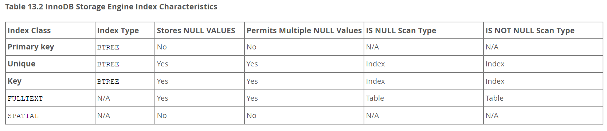

MySQL 学习笔记  
      
# 学习资源  
> w3schools: [MySQL Tutorial](https://www.w3schools.com/mysql/mysql_intro.asp)  
> [MySQL 官网](https://dev.mysql.com/doc/refman/8.0/en/)  
> 数据库基础知识书籍：MySQL 必知必会  
> [牛客刷题](https://www.nowcoder.com/exam/intelligent?questionJobId=10&tagId=21014)  
> 查漏补缺：[MySQL 是怎样运行的：从根儿上理解 MySQL](https://github.com/Relph1119/mysql-learning-notes)  
> 梳理知识：[图解MySQL介绍](https://xiaolincoding.com/mysql/)  
> 极客时间学习：[MySQL 实战 45 讲](https://time.geekbang.org/column/intro/100020801?tab=catalog)  
> 进阶书：MySQL 技术内幕 InnoDB 存储引擎  
      
      
电子书：[百度网盘](https://pan.baidu.com/s/10H6WjGEsOjaKqDRH3ekndA?pwd=vsio)  
      
# 数据的分类  
## 结构化数据  
- 固定格式和有限长度  
- 如表格  
- 适合放到数据库中  
      
## 半结构化数据  
> [WHAT IS SEMI-STRUCTURED DATA?](https://www.snowflake.com/guides/semi-structured-data-101)  
      
- 如 xml、html 格式文件  
      
      
## 非结构化数据  
- 不定长，无固定格式  
- 如图片、视频  
- 一般放到硬盘  
      
# Database DBMS DMA  
## Database  
- 数据库是保存有组织的数据的容器（通常是一个文件或一组文件）  
- 通常不会直接查看数据库，而是通过 DBMS 来使用数据库  
      
## 数据库管理系统（datebase management system）  
> 常用 DBMS 排名：[DB-Engines Ranking](https://db-engines.com/en/ranking)  
      
## DBMS  
- database software  
- Database software is actually called the Database Management System (or DBMS).  
      
## DBA  
- Database Administrator  
- 数据库管理人员  
      
      
# DBMS 的数据模型  
> [Data Models in DBMS](https://www.scaler.com/topics/dbms/data-models-in-dbms/)  
> [What is Data Model in DBMS and what are its types?](https://afteracademy.com/blog/what-is-data-model-in-dbms-and-what-are-its-types/)  
      
## 层次型数据模型  
- 可能有重复造成资源浪费  
- 条理清晰  
      
## 网状行数据模型  
- 数据库过多后混乱  
      
## E-R 模型  
- Entity-Relationship Model  
      
## 关系型数据模型  
> [Relational Database](https://www.codecademy.com/resources/docs/general/relational-database?page_ref=catalog)  
      
- 二维表  
      
      
# 去 IOE  
> [去 ioe 是什么意思](https://worktile.com/kb/ask/8190.html)  
      
      
# 表（Tables）  
- A structured list of data of a specific type.  
- The key here is that the data stored in the **table is one type of data or one list**.  
      
- 结构化的文件，用来存储某种特定类型的数据  
- 例如将资料放到抽屉中是将资料分类后装在不同的文件袋中  
      
# 表名 Table Name  
- 一个数据库中的不能有重复的表名  
      
# 模式（schema）  
- 描述表的一些特性，用于定义数据在表中如何存储，存储什么数据，数据如何分解，各部分如何命名等  
- 模式可以描述数据库中特定的表，也可以描述整个数据库。  
- 关于数据库和表的布局及特性的信息  
      
      
# 列（column）  
- 每个列有相应的数据类型（datatype）  
- 数据类型限制了可存储在列中的数据种类  
- 数据类型还帮助正确地分类数据  
- 数据类型在优化磁盘使用方面起重要作用  
- 也称属性，字段（field）  
      
# 行（row）  
- 每条记录存储在自己的行中  
- 一行即一条记录（record）  
      
# 主键（primary key）  
- 主键用于唯一标识表中行  
- 可以有多列作为主键，此时多列的组合必须唯一  
- 一张表最多一个主键  
- 主键不能为 NULL  
      
非必须但建议：  
- 最好不更新主键中的值  
- 不重用主键中的值  
      
      
# 唯一键（Unique Key）  
> [13.1.15 CREATE INDEX Statement](https://dev.mysql.com/doc/refman/8.0/en/create-index.html#create-index-unique)  
      
- 一个表中可以有多个唯一键  
- 唯一键的字段可以为 NULL，且允许多个列值为 NULL  
- 唯一确定一个记录，非空记录唯一  
      
  
      
      
# 外键（foreign key）  
> [3.6.6 Using Foreign Keys](https://dev.mysql.com/doc/refman/8.0/en/example-foreign-keys.html)  
      
- 用在多个有关系的表中  
- 如一个表的某列来自另一个表（如父表）的某列，则可以将该列作为父表的外键  
- 使用外键可以避免一些出错，不一致的情况  
      
      
      
# 域（domain）  
- 字段的值取值范围  
      
      
# 数据库范式  
> [What is Normalization in SQL and what are its types?](https://www.edureka.co/blog/normalization-in-sql/)  
      
      
- 数据库规范化  
- 共有六种范式  
- 后面范式的前提是前面范式满足  
- 理论参考，可能根据实际情况为了提高性能违反范式  
      
## 第一范式 1NF  
- 无重复列  
      
## 第二范式 2NF  
- 非主键需要与整个主键直接相关  
- 非主键不能依赖部分主键  
      
## 第三范式 3NF  
- 非主键字段之间不能有从属关系  
      
      
# MySQL 特性  
- 开源免费  
- 插件式存储引擎  
存储引擎可以变化  
- 单进程，多线程  
```sql  
[root@rocky8-3 1286]$ systemctl status mysqld.service  
mysqld.service - MySQL 8.0 database server  
   Loaded: loaded (/usr/lib/systemd/system/mysqld.service; enabled; vendor preset: disabled)  
   Active: active (running) since Thu 2023-05-04 09:52:43 CST; 7h ago  
  Process: 2324 ExecStartPost=/usr/libexec/mysql-check-upgrade (code=exited, status=0/SUCCESS)  
  Process: 1148 ExecStartPre=/usr/libexec/mysql-prepare-db-dir mysqld.service (code=exited, status=0/SUCCESS)  
  Process: 1098 ExecStartPre=/usr/libexec/mysql-check-socket (code=exited, status=0/SUCCESS)  
 Main PID: 1286 (mysqld)  
   Status: "Server is operational"  
    Tasks: 39 (limit: 11047)  
   Memory: 40.7M  
   CGroup: /system.slice/mysqld.service  
           └─1286 /usr/libexec/mysqld --basedir=/usr  
      
May 04 09:52:24 rocky8-3 systemd[1]: Starting MySQL 8.0 database server...  
May 04 09:52:43 rocky8-3 systemd[1]: Started MySQL 8.0 database server.  
```  
```sql  
[root@rocky8-3 cron.hourly]$ pstree -u 1286 | head -n5  
mysqld(mysql)---38*[{mysqld}]  
```  
      
- 工作在 C/S 模式  
使用专有协议通信，服务端持续监听特定端口  
客户端发送查询语句到服务端，服务端查询后将结果返回给客户端  
      
- 自带 CLI 接口  
在后端开发语言中，使用相应编程语言下的数据库驱动来与数据库服务端的通信  
      
- 可以运行在多个系统上，跨平台  
      
- 提供大量的测试组件和诸多的扩展  
      
      
# MySQL 安装  
> [2.5 Installing MySQL on Linux](https://dev.mysql.com/doc/refman/5.7/en/linux-installation.html)  
      
## 包管理器安装  
### rocky8.6  
- 安装服务端 `mysql-server` 会自动装上客户端  
```sql  
[root@Rocky8 lx]# yum install -y mysql-server  
```  
```sql  
[root@Rocky8 lx]# yum list mysql mysql-server  
Last metadata expiration check: 2:34:54 ago on Fri 14 Apr 2023 01:43:01 PM CST.  
Available Packages  
mysql.x86_64        8.0.30-1.module+el8.6.0+1057+4d6a1721  appstream  
mysql-server.x86_64 8.0.30-1.module+el8.6.0+1057+4d6a1721  appstream  
```  
- 可以手动下载其他版本来安装  
- 初始默认用户为 root (mysql 用户，非系统 root)，密码为空  
```sql  
[root@rocky8-2 network-scripts]$ mysql  
Welcome to the MySQL monitor.  Commands end with ; or \g.  
Your MySQL connection id is 8  
Server version: 8.0.30 Source distribution  
      
Copyright (c) 2000, 2022, Oracle and/or its affiliates.  
      
Oracle is a registered trademark of Oracle Corporation and/or its  
affiliates. Other names may be trademarks of their respective  
owners.  
      
Type 'help;' or '\h' for help. Type '\c' to clear the current input statement.  
      
mysql> select user();  
+----------------+  
| user()         |  
+----------------+  
| root@localhost |  
+----------------+  
1 row in set (0.01 sec)  
      
mysql>  
```  
- 开启服务并加入开机自启  
```sql  
[root@Rocky8 lx]# systemctl status mysqld.service  
● mysqld.service - MySQL 8.0 database server  
   Loaded: loaded (/usr/lib/systemd/system/mysqld.service; disabled>  
   Active: inactive (dead)  
      
[root@Rocky8 lx]# systemctl enable --now mysqld.service  
Created symlink /etc/systemd/system/multi-user.target.wants/mysqld.service → /usr/lib/systemd/system/mysqld.service.  
      
[root@Rocky8 lx]# systemctl status mysqld.service  
● mysqld.service - MySQL 8.0 database server  
   Loaded: loaded (/usr/lib/systemd/system/mysqld.service; enabled;>  
   Active: active (running) since Fri 2023-04-14 16:31:44 CST; 4s a>  
  Process: 10316 ExecStartPost=/usr/libexec/mysql-check-upgrade (co>  
  Process: 10186 ExecStartPre=/usr/libexec/mysql-prepare-db-dir mys>  
  Process: 10160 ExecStartPre=/usr/libexec/mysql-check-socket (code>  
 Main PID: 10270 (mysqld)  
   Status: "Server is operational"  
    Tasks: 39 (limit: 11047)  
   Memory: 471.1M  
   CGroup: /system.slice/mysqld.service  
           └─10270 /usr/libexec/mysqld --basedir=/usr  
      
Apr 14 16:31:39 Rocky8.6 systemd[1]: Starting MySQL 8.0 database se>  
Apr 14 16:31:39 Rocky8.6 mysql-prepare-db-dir[10186]: Initializing >  
Apr 14 16:31:44 Rocky8.6 systemd[1]: Started MySQL 8.0 database ser>  
```  
- 安装后自动创建 mysql 系统账户  
- 一个主机不同时装 mysql 和 MariaDB  
- 如果主机安装的系统镜像仓库中没有想要的版本，可以手动下载想要的版本 rpm 包安装，  
  注意可能有依赖关系，因此选择装 bundle 包或者配置 yum 仓库  
- 有的版本初始 root 账户没有有一个随机初始密码，到日志中查找，日志在 `/var/log/mysqld.log`  
### ubuntu22.04  
- 先用 `sudo apt update` 更新  
- 再搜索 mysql 的包版本，看是否满足要求  
- 满足要求则直接安装，如果要安装 mysql-server，则安装 `amd64` 版本，安装时会同时安装客户端  
- ubuntu22.04 安装的 mysql8.0.34 默认安装后服务开启，但仅监听本机，如果要远程主机登录，需要修改配置文件  
```sql  
[root@ubuntu22-c0 ~]$ vim /etc/mysql/mysql.conf.d/mysqld.cnf  
```  
```sql  
# Instead of skip-networking the default is now to listen only on  
# localhost which is more compatible and is not less secure.  
bind-address		= 127.0.0.1  
mysqlx-bind-address	= 127.0.0.1  
```  
将 `bind-address` 这行注释或改为 `0.0.0.0` 则可监听全部主机  
      
```sql  
[root@mysql ~]$ apt list mysql*  
Listing... Done  
mysql-client-8.0/jammy-updates,jammy-security 8.0.33-0ubuntu0.22.04.2 amd64  
mysql-client-core-8.0/jammy-updates,jammy-security 8.0.33-0ubuntu0.22.04.2 amd64  
mysql-client/jammy-updates,jammy-security 8.0.33-0ubuntu0.22.04.2 all  
mysql-common/jammy 5.8+1.0.8 all  
mysql-router/jammy-updates,jammy-security 8.0.33-0ubuntu0.22.04.2 amd64  
mysql-sandbox/jammy 3.2.05-1 all  
mysql-server-8.0/jammy-updates,jammy-security 8.0.33-0ubuntu0.22.04.2 amd64  
mysql-server-core-8.0/jammy-updates,jammy-security 8.0.33-0ubuntu0.22.04.2 amd64  
mysql-server/jammy-updates,jammy-security 8.0.33-0ubuntu0.22.04.2 all  
mysql-source-8.0/jammy-updates,jammy-security 8.0.33-0ubuntu0.22.04.2 amd64  
mysql-testsuite-8.0/jammy-updates,jammy-security 8.0.33-0ubuntu0.22.04.2 amd64  
mysql-testsuite/jammy-updates,jammy-security 8.0.33-0ubuntu0.22.04.2 all  
mysqltcl/jammy 3.052-3ubuntu1 amd64  
mysqltuner/jammy 1.7.17-1 all  
[root@mysql ~]$ apt install -y mysql-server-8.0  
```  
      
- 安装完后查看自动安装上客户端  
```sql  
[root@mysql ~]$ apt list mysql*  
Listing... Done  
mysql-client-8.0/jammy-updates,jammy-security,now 8.0.33-0ubuntu0.22.04.2 amd64 [installed,automatic]  
mysql-client-core-8.0/jammy-updates,jammy-security,now 8.0.33-0ubuntu0.22.04.2 amd64 [installed,automatic]  
mysql-client/jammy-updates,jammy-security 8.0.33-0ubuntu0.22.04.2 all  
mysql-common/jammy,now 5.8+1.0.8 all [installed,automatic]  
mysql-router/jammy-updates,jammy-security 8.0.33-0ubuntu0.22.04.2 amd64  
mysql-sandbox/jammy 3.2.05-1 all  
mysql-server-8.0/jammy-updates,jammy-security,now 8.0.33-0ubuntu0.22.04.2 amd64 [installed]  
mysql-server-core-8.0/jammy-updates,jammy-security,now 8.0.33-0ubuntu0.22.04.2 amd64 [installed,automatic]  
mysql-server/jammy-updates,jammy-security 8.0.33-0ubuntu0.22.04.2 all  
mysql-source-8.0/jammy-updates,jammy-security 8.0.33-0ubuntu0.22.04.2 amd64  
mysql-testsuite-8.0/jammy-updates,jammy-security 8.0.33-0ubuntu0.22.04.2 amd64  
mysql-testsuite/jammy-updates,jammy-security 8.0.33-0ubuntu0.22.04.2 all  
mysqltcl/jammy 3.052-3ubuntu1 amd64  
mysqltuner/jammy 1.7.17-1 all  
```  
      
- 安装 mycli 来操作 mysql  
```sql  
[root@mysql ~]$ apt list mycli*  
Listing... Done  
mycli/jammy 1.24.3-1 all  
[root@mysql ~]$ apt install -y mycli  
```  
      
- 安装完后直接用 root 账号（mysql 的虚拟账号，非 linux 的 root 账号）  
```sql  
[root@mysql ~]$ mycli -uroot  
Connecting to socket /var/run/mysqld/mysqld.sock, owned by user mysql  
MySQL 8.0.33  
mycli 1.24.3  
Home: http://mycli.net  
Bug tracker: https://github.com/dbcli/mycli/issues  
Thanks to the contributor - jbruno  
MySQL root@(none):(none)> select user, host from mysql.user;  
+------------------+-----------+  
| user             | host      |  
+------------------+-----------+  
| debian-sys-maint | localhost |  
| mysql.infoschema | localhost |  
| mysql.session    | localhost |  
| mysql.sys        | localhost |  
| root             | localhost |  
+------------------+-----------+  
5 rows in set  
Time: 0.017s  
MySQL root@(none):(none)>  
```  
      
## 二进制包安装  
- 常见安装方式  
- 官网下载二进制包，最好下载打包并压缩的包  
- 安装的位置固定（因为已经编译好的包）  
      
### rocky8.6  
      
### ubuntu22.04  
> [Chapter 3 Installing MySQL on Unix/Linux Using Generic Binaries](https://dev.mysql.com/doc/mysql-installation-excerpt/5.7/en/binary-installation.html)  
      
1. 官网下载二进制包  
> [MySQL Product Archives](https://downloads.mysql.com/archives/community/)  
      
      
2. 解压缩到指定目录  
二进制包已经是编译过的包，要装在指定目录中，即 `/usr/local` 目录  
      
3. 创建 Mysql 用户  
```sql  
[root@VM-ubuntu22 src]$ useradd -r -s /sbin/nologin mysql  
[root@VM-ubuntu22 src]$ id mysql  
uid=998(mysql) gid=998(mysql) groups=998(mysql)  
```  
      
4. 修改解压后的文件属性  
解压后将文件夹改为 `mysql`，目录中的文件 owner 和 group 改为 root：  
```sql  
[root@VM-ubuntu22 local]$ chown root.root -R mysql/  
```  
      
5. 将 mysql 文件夹中 bin 目录加入环境变量  
```sql  
[root@VM-ubuntu22 local]$ echo 'PATH=/usr/local/mysql/bin:$PATH' > /etc/profile.d/mysql.sh  
[root@VM-ubuntu22 local]$ cat /etc/profile.d/mysql.sh  
PATH=/usr/local/mysql/bin:$PATH  
[root@VM-ubuntu22 local]$ . /etc/profile.d/mysql.sh  
[root@VM-ubuntu22 local]$ echo $PATH  
/usr/local/mysql/bin:/usr/local/sbin:/usr/local/bin:/usr/sbin:/usr/bin:/sbin:/bin:/usr/games:/usr/local/games:/snap/bin  
```  
      
6. 安装启动脚本  
```sql  
cp /usr/local/mysql/support-files/mysql.server /etc/init.d/mysqld  
```  
      
ubuntu22.04 没有 chkconfig，用 `update-rc.d` 代替  
```sql  
update-rc.d mysqld defaults  
```  
      
7. 安装时出现错误，缺少库，按照下面步骤装上  
This error occurs when the MySQL server is unable to find the shared library `libtinfo.so.5`. This library is used by the MySQL client to connect to the server and perform various operations.  
解决方案：  
- Check if the `libtinfo.so.5` library is installed on your system. You can do this by running the following command in the terminal:  
```bash  
sudo find / -name libtinfo.so.5  
```  
If the library is not found, you can install it using the package manager for your system. For example, on Ubuntu, you can use the following command:  
```bash  
sudo apt-get install libncurses5  
```  
- If the library is already installed, then you may need to update the library path so that the MySQL server can find it. You can do this by adding the directory containing the `libtinfo.so.5` library to the `LD_LIBRARY_PATH` environment variable. For example:  
```bash  
export LD_LIBRARY_PATH=/usr/local/lib:$LD_LIBRARY_PATH  
```  
This will add the directory `/usr/local/lib` to the beginning of the library search path.  
      
- After updating the library path, restart the MySQL server to ensure that it loads the updated library.  
      
8. 从日志中获取随机密码登录  
在 `/etc/my.cnf` 配置文件中指定的日志文件的路径 `/data/mysql/mysql.log` 中可以找到一个临时密码  
```sql  
A temporary password is generated for root@localhost: Izw>;dS  
```  
      
## 源码编译安装  
      
## docker 中安装  
      
      
# MySQL 的主要组成  
> mariadb 工具说明：[mariadb](https://mariadb.com/kb/en/configuring-mariadb-with-option-files/#tool-specific-option-groups)  
      
      
## 服务端主要组成  
> 服务端程序：[4.3 Server and Server-Startup Programs](https://dev.mysql.com/doc/refman/8.0/en/programs-server.html)  
> 相关的程序：[4.4 Installation-Related Programs](https://dev.mysql.com/doc/refman/8.0/en/programs-installation.html)  
      
服务端查询，名字为 mysql-server  
```sql  
[root@rocky8-3 1286]$ rpm -q mysql-server  
mysql-server-8.0.30-1.module+el8.6.0+1057+4d6a1721.x86_64  
```  
```sql  
[root@rocky8-3 1286]$ rpm -ql mysql-server | grep -Ei "\/usr\/[s]?bin"  
/usr/bin/ibd2sdi  
/usr/bin/innochecksum  
/usr/bin/my_print_defaults  
/usr/bin/myisam_ftdump  
/usr/bin/myisamchk  
/usr/bin/myisamlog  
/usr/bin/myisampack  
/usr/bin/mysql_migrate_keyring  
/usr/bin/mysql_secure_installation  
/usr/bin/mysql_ssl_rsa_setup  
/usr/bin/mysql_tzinfo_to_sql  
/usr/bin/mysql_upgrade  
/usr/bin/mysqld_pre_systemd  
/usr/bin/mysqldumpslow  
/usr/bin/perror  
/usr/sbin/mysqld  
```  
      
      
## 客户端主要组成  
> 客户端的程序：[4.5 Client Programs](https://dev.mysql.com/doc/refman/8.0/en/programs-client.html)  
      
      
MySQL 客户端程序查询时名字为 mysql  
```sql  
[root@rocky8-3 1286]$ rpm -qa | grep -i "mysql"  
php-mysqlnd-7.2.24-1.module+el8.4.0+413+c9202dda.x86_64  
mysql-common-8.0.30-1.module+el8.6.0+1057+4d6a1721.x86_64  
mysql-8.0.30-1.module+el8.6.0+1057+4d6a1721.x86_64  
mysql-server-8.0.30-1.module+el8.6.0+1057+4d6a1721.x86_64  
mysql-errmsg-8.0.30-1.module+el8.6.0+1057+4d6a1721.x86_64  
```  
```sql  
[root@rocky8-3 1286]$ rpm -q mysql  
mysql-8.0.30-1.module+el8.6.0+1057+4d6a1721.x86_64  
```  
包管理器查询客户端生成的文件，可执行的程序放在 /usr/bin 下，搜索该目录  
```sql  
[root@rocky8-3 1286]$ rpm -ql mysql | grep -Ei "\/usr\/[s]?bin"  
/usr/bin/mysql  
/usr/bin/mysql_config_editor  
/usr/bin/mysqladmin  
/usr/bin/mysqlbinlog  
/usr/bin/mysqlcheck  
/usr/bin/mysqldump  
/usr/bin/mysqlimport  
/usr/bin/mysqlpump  
/usr/bin/mysqlshow  
/usr/bin/mysqlslap  
```  
      
- mysql  
交互式 CLI 工具  
- mysqldump  
备份工具  
- mysqladmin  
服务端管理工具  
- mysqlimport  
数据导入工具  
      
      
# MySQL 使用  
> [4.2.1 Invoking MySQL Programs](https://dev.mysql.com/doc/refman/8.0/en/invoking-programs.html)  
      
- 可以在命令行界面用 `-` 或 `--` 来指定选项  
- 第一个没有指定 leading dash 的参数会被解析为数据库的名字  
      
      
      
# 启动选项  
> [17.2.2.3 Startup Options and Replication Channels](https://dev.mysql.com/doc/refman/8.0/en/channels-startup-options.html)  
> [第2章 MySQL的调控按钮-启动选项和系统变量](https://relph1119.github.io/mysql-learning-notes/#/mysql/02-MySQL的调控按钮-启动选项和系统变量)  
      
      
- 程序启动时指定的选项，可以控制程序启动后的行为  
      
## 指定配置文件  
> [--defaults-file](https://dev.mysql.com/doc/refman/8.0/en/server-options.html#option_mysqld_defaults-file)  
      
- `--defaults-file=file_name`  
      
      
# 命令行选项 (Options)  
> [4.2.2 Specifying Program Options](https://dev.mysql.com/doc/refman/8.0/en/program-options.html)  
> [第2章 MySQL的调控按钮-启动选项和系统变量](https://relph1119.github.io/mysql-learning-notes/#/mysql/02-MySQL的调控按钮-启动选项和系统变量)  
      
- 很多选项同时支持短选项（-） 和长选项（--）的格式，如 `-?` 和 `--help`  
- 选项名是 case-sensitive  
如 `-v` 表示 `--verbose`，`-V` 表示 `--version`  
      
- 有些选项有值  
   - 有值的长选项用 `=` 分隔选项名和值  
   如 `-h localhost` 和 `--hostname=localhost`  
   - 有值的短选项，值可以立即跟在选项名后面，或者间隔一个空格  
   如 `-hlocalhost` 和 `-h localhost` 等价  
   - 密码的选项是特殊情况  
   `--password=pass_val` 直接写出密码值  
   `--password` 或 `-p` 则交互式写密码  
   `-ppass_val` 密码和 `-p` 没有空格，密码可以双引号引起来  
   `-p pass_val` 则不会将 `pass_val` 看作密码，而是作为一个参数，即数据库名字  
   然后认为没有输入密码，从而交互式输入密码  
   ```sql  
   [root@rocky8-3 ~]$ mysql -uroot -p 123456  
   Enter password:  
   ERROR 1049 (42000): Unknown database '123456'  
   ```  
      
- 很多选项名中 dash 和 underscore 可以替换  
> Within option names, dash (-) and underscore (_) may be used interchangeably in most cases,  
> although the leading dashes cannot be given as underscores.  
> For example, --skip-grant-tables and --skip_grant_tables are equivalent.  
      
但也有例外，如 `--log-bin and --log_bin` 就不是相同的意思  
system variables 只能用 underscore 不能用 dash  
      
- 选项的值有数值情况  
> For options that take a numeric value, the value can be given with a suffix of K, M, or G  
      
```sql  
mysqladmin --count=1K --sleep=10 ping  
```  
      
- 选项的值有空格时用引号包围  
可以用单引号或双引号  
如双引号中的值有双引号需要转义，或用单引号包围值  
      
# 配置文件  
      
## 查看配置文件  
      
### rocky8  
- 客户端没有配置文件  
```sql  
[root@localhost lx]$ rpm -qc mysql  
```  
      
- 查看服务端配置文件  
```sql  
[root@localhost lx]$ rpm -qc mysql-server  
/etc/logrotate.d/mysqld  
/etc/my.cnf.d/mysql-default-authentication-plugin.cnf  
/etc/my.cnf.d/mysql-server.cnf  
/var/log/mysql/mysqld.log  
```  
      
### ubuntu22.04  
      
```sql  
[root@ubunut22:~]$ dpkg -L mysql-common  
/.  
/etc  
/etc/mysql  
/etc/mysql/conf.d  
/etc/mysql/conf.d/mysql.cnf  
/etc/mysql/conf.d/mysqldump.cnf  
/etc/mysql/my.cnf.fallback  
/usr  
/usr/share  
/usr/share/doc  
/usr/share/doc/mysql-common  
/usr/share/doc/mysql-common/changelog.gz  
/usr/share/doc/mysql-common/copyright  
/usr/share/doc/mysql-common/frozen-mode  
/usr/share/doc/mysql-common/frozen-mode/README  
/usr/share/doc/mysql-common/frozen-mode/downgrade  
/usr/share/lintian  
/usr/share/lintian/overrides  
/usr/share/lintian/overrides/mysql-common  
/usr/share/mysql-common  
/usr/share/mysql-common/configure-symlinks  
```  
      
      
      
## 配置文件执行顺序  
> [Option File Processing Order](https://dev.mysql.com/doc/refman/5.7/en/option-files.html#option-file-order)  
> [Including Option File Directories](https://mariadb.com/kb/en/configuring-mariadb-with-option-files/#including-option-file-directories)  
      
      
- 如果多个文件中有同一个选项设置，则以最后一个设置为准  
- 可以在命令行中指定 `--defaults-file=file_name` 来指定使用的配置文件  
      
### Ubuntu22.04  
- `mysql --help | less` 查看  
      
```sql  
Default options are read from the following files in the given order:  
/etc/my.cnf /etc/mysql/my.cnf ~/.my.cnf  
```  
      
### ubuntu20.04  
      
```sql  
[22:22:29 root@ubuntu2004 /etc/mysql]#mysql --version  
mysql  Ver 8.0.33-0ubuntu0.20.04.2 for Linux on x86_64 ((Ubuntu))  
```  
      
`mysql --help | less` 查看配置文件加载顺序  
```sql  
Default options are read from the following files in the given order:  
/etc/my.cnf /etc/mysql/my.cnf ~/.my.cnf  
```  
      
      
第一个加载的配置文件为 /etc/my.cnf 默认没有  
      
第二个为 /etc/mysql/my.cnf  
```sql  
# The MySQL database server configuration file.  
#  
# You can copy this to one of:  
# - "/etc/mysql/my.cnf" to set global options,  
# - "~/.my.cnf" to set user-specific options.  
#  
# One can use all long options that the program supports.  
# Run program with --help to get a list of available options and with  
# --print-defaults to see which it would actually understand and use.  
#  
# For explanations see  
# http://dev.mysql.com/doc/mysql/en/server-system-variables.html  
      
#  
# * IMPORTANT: Additional settings that can override those from this file!  
#   The files must end with '.cnf', otherwise they'll be ignored.  
#  
      
!includedir /etc/mysql/conf.d/  
!includedir /etc/mysql/mysql.conf.d/  
```  
      
这两个目录中定义自定义配置，分开目录的用处：  
      
The `/etc/mysql/conf.d/` folder is intended for user-specific configuration files. Each file in this folder represents a particular configuration option or a set of related options. These files are typically included in the main configuration file (`my.cnf`) using the `!includedir` directive.  
      
The `/etc/mysql/mysql.conf.d/` folder, on the other hand, contains configuration files that provide system-specific settings for MySQL. These files are also included in the `my.cnf` file using the `!includedir` directive.  
      
The separation of configuration files into these two folders allows for better organization and modularity of the MySQL configuration. It makes it easier to manage different sets of options and settings for different purposes. For example, system-wide options can be placed in the `/etc/mysql/mysql.conf.d/` folder, while user-specific options can reside in the `/etc/mysql/conf.d/` folder.  
      
By using this folder structure, it becomes simpler to maintain and update the MySQL configuration. It also provides a clear separation between system-level and user-specific settings.  
      
      
### rocky8  
- `mysql --help | less` 查看简要帮助说明  
      
```sql  
Default options are read from the following files in the given order:  
/etc/my.cnf /etc/mysql/my.cnf ~/.my.cnf  
```  
      
#### /etc/my.cnf  
      
- `!includedir` 表示包含额外的文件  
[Including Option File Directories](https://mariadb.com/kb/en/configuring-mariadb-with-option-files/#including-option-file-directories)  
      
```sql  
#  
# This group is read both both by the client and the server  
# use it for options that affect everything  
#  
[client-server]  
      
#  
# include all files from the config directory  
#  
!includedir /etc/my.cnf.d  
```  
      
#### /etc/my.cnf.d/mysql-server.cnf  
- `/etc/my.cnf` 配置文件中调用 `my.cnf.d` 目录下的全部文件  
      
```sql  
# /etc/my.cnf.d/mysql-server.cnf  
#  
# This group are read by MySQL server.  
# Use it for options that only the server (but not clients) should see  
#  
# For advice on how to change settings please see  
# http://dev.mysql.com/doc/refman/en/server-configuration-defaults.html  
      
# Settings user and group are ignored when systemd is used.  
# If you need to run mysqld under a different user or group,  
# customize your systemd unit file for mysqld according to the  
# instructions in http://fedoraproject.org/wiki/Systemd  
      
[mysqld]  
datadir=/var/lib/mysql  
socket=/var/lib/mysql/mysql.sock  
log-error=/var/log/mysql/mysqld.log  
pid-file=/run/mysqld/mysqld.pid  
```  
      
### /etc/my.cnf.d/mysql-default-authentication-plugin.cnf  
- `/etc/my.cnf` 配置文件中调用 `my.cnf.d` 目录下的全部文件  
      
```sql  
# /etc/my.cnf.d/mysql-default-authentication-plugin.cnf  
#  
# MySQL 8.0.4 introduced 'caching_sha2_password' as its default authentication plugin.  
# It is faster and provides better security then the previous default authentication plugin.  
#  
# Until now (09/2018), it does not work with some other software (eg. MariaDB client, MariaDB connectors,  ...)  
#  
# This configuration file changes MySQL default server configuration, so it behaves the same way as in MySQL 5.7.  
#  
# To change the behaviour back to the upstream default, comment out the following lines:  
      
[mysqld]  
default_authentication_plugin=mysql_native_password  
```  
      
      
## 配置文件设置  
> [4.6.6 mysql_config_editor — MySQL Configuration Utility](https://dev.mysql.com/doc/refman/5.7/en/mysql-config-editor.html)  
> mariadb 官网说明很详细：[Configuring MariaDB with Option Files](https://mariadb.com/kb/en/configuring-mariadb-with-option-files/#server-option-groups)  
      
      
### 配置文件语法  
> [4.2.2.2 Using Option Files](https://dev.mysql.com/doc/refman/5.7/en/option-files.html)  
      
#### 注释  
```  
#comment  
;comment  
```  
      
#### [group]  
      
> group is the name of the program or group for which you want to set options.  
> After a group line, any option-setting lines apply to the named group until  
> the end of the option file or another group line is given.  
> Option group names are not case-sensitive.  
      
      
```sql  
[client]  
# The following password is sent to all standard MySQL clients  
password="my password"  
      
[mysql]  
no-auto-rehash  
connect_timeout=2  
```  
      
- group 可以某个程序的名字，则该组中的设置为该程序的设置  
客户端的程序：[4.5 Client Programs](https://dev.mysql.com/doc/refman/8.0/en/programs-client.html)  
服务端程序：[4.3 Server and Server-Startup Programs](https://dev.mysql.com/doc/refman/8.0/en/programs-server.html)  
      
如常见的有 `[mysql]` 则用来设置 mysql 客户端的配置  
      
- group 也可以是一组集合的名字  
如 `[client]` 中的设置则可用于 MySQL 的所有客户端程序，因此不包括服务端程序 `mysqld`  
      
- group 可以指定特定版本的 MySQL 服务器  
```sql  
[mysqld-8.0]  
sql_mode=TRADITIONAL  
```  
      
#### opt_name=value  
- `[group]` 下面设置的参数  
- 一般如果 value 不指定为 true  
- 类似在命令行中设置参数 `--opt_name`  
```sql  
 --password=pass_val  
```  
      
      
#### 包含文件  
- 包含单个文件 `!include`  
```sql  
!include /home/mydir/myopt.cnf  
```  
      
- 包含一个目录中全部的 option file (.cnf 文件)  
文件的执行顺序不能保证  
```sql  
!includedir /home/mydir  
```  
      
配置文件中每个字段配置在一个 `[]` 中，如 `[client]` 中的设置会被 mysql 全部的客户端工具读到  
`[mysqld]` 则只是针对 mysqld 这个服务端程序的设置  
      
### 修改提示符  
- 提示符格式通过 `man mysql` 查看  
- 如 `/etc/mycnf.d/client.cnf`  
      
```sql  
[client]  
prompt=(\\u@\\h)[\\d]>\\  
```  
      
# 登录  
      
## ubuntu22.04  
> [How To Install MySQL on Ubuntu 22.04](https://www.digitalocean.com/community/tutorials/how-to-install-mysql-on-ubuntu-22-04)  
      
- 初始登录需用 `sudo mysql` 否则无法登录，mysql root 用户初始无密码  
      
## 指定用户名和密码登录  
> [6.2.1 Account User Names and Passwords](https://dev.mysql.com/doc/refman/8.0/en/user-names.html)  
      
- mysql -u user -p password -h hostname  
      
# 查看日志  
```sql  
[root@Rocky8 lx]# cat /var/log/mysql/mysqld.log  
```  
      
# MySQL 多实例配置  
- 一个服务器上装多个版本 MySQL  
      
## 多实例  
- 如一个QQ多个账号  
      
## 使用场景  
- 一个服务器上装多个版本 MySQL，对应不同数据，给不同项目使用  
- 一个服务器中装一个版本 MySQL，但有多个实例，对应多套数据  
      
      
## 单一配置文件  
      
      
## 多配置文件  
      
      
# MySQL 用户账户  
服务端先创建用户，指定用户名和用户所在的主机  
      
查看当前用户：  
```sql  
SELECT user, host FROM mysql.user;  
```  
      
# MySQL 命令分类  
- 因为 MySQL 是 C/S 架构，因此分为客户端命令和服务端命令  
- 客户端命令在本地执行  
- 服务端命令发送到服务端，执行完成后返回结果到客户端  
- 客户端命令和服务端命令都是通过客户端工具输入输出  
      
## 查看服务端命令  
- 进入 mysql 后，根据提示，可以通过输入 `help` 查看帮助  
```sql  
[root@rocky8-3 1286]$ mysql  
Welcome to the MySQL monitor.  Commands end with ; or \g.  
Your MySQL connection id is 11  
Server version: 8.0.30 Source distribution  
      
Copyright (c) 2000, 2022, Oracle and/or its affiliates.  
      
Oracle is a registered trademark of Oracle Corporation and/or its  
affiliates. Other names may be trademarks of their respective  
owners.  
      
Type 'help;' or '\h' for help. Type '\c' to clear the current input statement.  
      
mysql>  
```  
      
- 输入 `help` 后看到的是客户端命令，根据底部提示输入 `help contents` 查看服务端命令  
```sql  
For server side help, type 'help contents'  
      
mysql> help contents  
You asked for help about help category: "Contents"  
For more information, type 'help <item>', where <item> is one of the following  
categories:  
   Account Management  
   Administration  
   Components  
   Compound Statements  
   Contents  
   Data Definition  
   Data Manipulation  
   Data Types  
   Functions  
   Geographic Features  
   Help Metadata  
   Language Structure  
   Loadable Functions  
   Plugins  
   Prepared Statements  
   Replication Statements  
   Storage Engines  
   Table Maintenance  
   Transactions  
   Utility  
      
mysql>  
```  
- 服务端命令有很多种类，如果要具体查看某个种类，输入 `help <item>`，`<item>` 为列出种类的名字  
```sql  
mysql> help Account Management  
You asked for help about help category: "Account Management"  
For more information, type 'help <item>', where <item> is one of the following  
topics:  
   ALTER RESOURCE GROUP  
   ALTER USER  
   CREATE RESOURCE GROUP  
   CREATE ROLE  
   CREATE USER  
   DROP RESOURCE GROUP  
   DROP ROLE  
   DROP USER  
   GRANT  
   RENAME USER  
   REVOKE  
   SET DEFAULT ROLE  
   SET PASSWORD  
   SET RESOURCE GROUP  
   SET ROLE  
      
mysql>  
```  
      
# MySQL 客户端常用选项  
      
## -V|--version 显示客户端版本  
      
## -u 指定登录的用户  
      
## -h 指定登录的主机  
      
## -e|--execute 非交互式执行客户端命令  
- 不用进入 mysql，在命令行界面输入命令执行后即显示结果  
- 执行完命令后就退出 mysql  
      
```sql  
[20:28:46 root@ubuntu2004 ~]#mysql -uroot -e "SHOW DATABASES" -p  
Enter password:  
+--------------------+  
| Database           |  
+--------------------+  
| information_schema |  
| mysql              |  
| performance_schema |  
| sys                |  
| testdb1            |  
+--------------------+  
```  
      
- 加上 `-E` 后可以垂直显示结果  
```sql  
[root@rocky8-3 1286]$ mysql -uroot -e "SHOW DATABASES;" -E -p  
Enter password:  
*************************** 1. row ***************************  
Database: information_schema  
*************************** 2. row ***************************  
Database: mysql  
*************************** 3. row ***************************  
Database: performance_schema  
*************************** 4. row ***************************  
Database: sys  
```  
      
## -p|--password 指定服务端的端口号  
      
      
## -P|--port 指定服务端的端口号  
      
      
## -D|--database 指定数据库  
      
      
## --print-defaults 打印参数列表，不连接服务器  
```sql  
[root@rocky8-3 1286]$ mysql --print-defaults -uroot -h10.0.0.82  
mysql would have been started with the following arguments:  
-uroot -h10.0.0.82  
```  
      
## --prompt 修改命令提示符  
      
## --connect-timeout 连接超时时长  
-单位秒  
      
## --line-numbers 输出行号  
      
## 指定输出格式  
- -H|--html  
以 html 格式输出，默认  
- -X|--xml  
以 xml 格式输出，默认  
- -t|--table  
以 table 格式输出，默认  
      
## --max-allowed-packet 一次交互的数据大小  
- 发送或返回的数据大小  
- 默认 16MB  
- 最大 1GB，最小 4096 字节  
      
# 客户端命令  
## 查看客户端命令  
- 进入 mysql 后，根据提示，可以通过输入 `help` 查看帮助  
```sql  
[root@rocky8-3 1286]$ mysql  
Welcome to the MySQL monitor.  Commands end with ; or \g.  
Your MySQL connection id is 11  
Server version: 8.0.30 Source distribution  
      
Copyright (c) 2000, 2022, Oracle and/or its affiliates.  
      
Oracle is a registered trademark of Oracle Corporation and/or its  
affiliates. Other names may be trademarks of their respective  
owners.  
      
Type 'help;' or '\h' for help. Type '\c' to clear the current input statement.  
      
mysql>  
```  
```sql  
To buy MySQL Enterprise support, training, or other products, visit:  
   https://shop.mysql.com/  
      
List of all MySQL commands:  
Note that all text commands must be first on line and end with ';'  
?         (\?) Synonym for `help'.  
clear     (\c) Clear the current input statement.  
connect   (\r) Reconnect to the server. Optional arguments are db and host.  
delimiter (\d) Set statement delimiter.  
edit      (\e) Edit command with $EDITOR.  
ego       (\G) Send command to mysql server, display result vertically.  
exit      (\q) Exit mysql. Same as quit.  
go        (\g) Send command to mysql server.  
help      (\h) Display this help.  
nopager   (\n) Disable pager, print to stdout.  
notee     (\t) Don't write into outfile.  
pager     (\P) Set PAGER [to_pager]. Print the query results via PAGER.  
print     (\p) Print current command.  
prompt    (\R) Change your mysql prompt.  
quit      (\q) Quit mysql.  
rehash    (\#) Rebuild completion hash.  
source    (\.) Execute an SQL script file. Takes a file name as an argument.  
status    (\s) Get status information from the server.  
system    (\!) Execute a system shell command.  
tee       (\T) Set outfile [to_outfile]. Append everything into given outfile.  
use       (\u) Use another database. Takes database name as argument.  
charset   (\C) Switch to another charset. Might be needed for processing binlog with multi-byte charsets.  
warnings  (\W) Show warnings after every statement.  
nowarning (\w) Don't show warnings after every statement.  
resetconnection(\x) Clean session context.  
query_attributes Sets string parameters (name1 value1 name2 value2 ...) for the next query to pick up.  
ssl_session_data_print Serializes the current SSL session data to stdout or file  
      
For server side help, type 'help contents'  
      
mysql>  
      
```  
      
## status 显示当前状态  
```sql  
MySQL root@(none):test> status;  
--------------  
mycli 1.26.1, running on CPython 3.9.13  
      
+----------------------+----------------------------+  
| Connection id:       | 10                         |  
| Current database:    | test                       |  
| Current user:        | root@localhost             |  
| Current pager:       | less                       |  
| Server version:      | 8.0.30 Source distribution |  
| Protocol version:    | 10                         |  
| Connection:          | Localhost via UNIX socket  |  
| Server characterset: | utf8mb4                    |  
| Db characterset:     | utf8mb4                    |  
| Client characterset: | utf8mb3                    |  
| Conn. characterset:  | utf8mb3                    |  
| UNIX socket:         | /var/lib/mysql/mysql.sock  |  
| Uptime:              | 10 hours 48 min 57 sec     |  
+----------------------+----------------------------+  
      
Connections: 1  Queries: 87  Slow queries: 0  Opens: 268  \  
Flush tables: 3  Open tables: 185  Queries per second avg: 0.002  
--------------  
Time: 0.109s  
```  
## system 执行系统 shell 命令  
- `system clear;` 清屏  
      
## tee 将输出的结果保存到指定文件中  
      
## print 输出语句但不执行  
      
## delimiter 自定义 SQL 语句的分隔符  
- 默认为 `;`  
      
## source 执行 SQL 脚本文件  
      
## use 切换数据库  
      
## exit|quit 退出客户端  
      
## edit 先编辑 SQL 语句，不执行  
      
## prompt 修改提示符  
- 临时生效  
- 永久生效需要改配置文件  
      
      
# mysqladmin  
> [mysqladmin](https://dev.mysql.com/doc/refman/8.0/en/mysqladmin.html)  
      
## 修改密码  
```sql  
root@Rocky8 ~ $ mysqladmin -u rocky8_81 -h "10.0.0.200" password -p  
Enter password:  
New password:  
Confirm new password:  
Warning: Since password will be sent to server in plain text, use ssl connection to ensure password safety.  
```  
      
## shutdown 关闭服务  
- 只能关闭服务，不能启动服务  
      
## create 创建数据库  
```sql  
[root@ubuntu22-c0 ~]$ mysqladmin create db_test  
[root@ubuntu22-c0 ~]$ mysql -e "show databases"  
+--------------------+  
| Database           |  
+--------------------+  
| db_test            |  
| information_schema |  
| mysql              |  
| performance_schema |  
| sys                |  
+--------------------+  
```  
      
## drop 删除数据库  
- `mysqladmin -f drop` 强制删除数据库  
      
```sql  
[root@ubuntu22-c0 ~]$ mysqladmin drop db_test  
Dropping the database is potentially a very bad thing to do.  
Any data stored in the database will be destroyed.  
      
Do you really want to drop the 'db_test' database [y/N] y  
Database "db_test" dropped  
```  
      
## ping 判断数据库服务器是否正常允许  
- `-i` 持续执行命令，后面跟间隔时间，默认单位 秒  
- `-c` 表示执行次数  
```sql  
[root@ubuntu22-c0 ~]$ mysqladmin -i 1 -c 3 ping  
mysqld is alive  
mysqld is alive  
mysqld is alive  
```  
      
********************************  
# SQL 语言基本语法  
      
## 学习资源  
> [learn-sql](https://www.codecademy.com/courses/learn-sql/lessons/manipulation/exercises/sql)  
      
# 关系型数据库的构成  
- database  
- table  
- index  
- view  
- procedure  
- function  
- trigger  
- event scheduler  
- user  
- privilege  
      
# SQL 介绍  
- 结构化查询语言（Structured Query Language）  
- 专门用来与数据库沟通的语言  
- 不是某个特定数据库供应商专有的语言  
- 不同的 DBMS 实现的 SQL 不完全相同  
      
## 特点  
- SQL 不是某个特定数据库供应商专有的语言  
- 几乎所有重要的 DBMS 都支持 SQL  
      
## 规则  
- 多条 SQL 语句以分号（;）分隔（默认的分隔符，可以修改）  
- 单条 SQL 语句最好也以分号（;）分隔，因为有的 DBSM 需要加上分号  
- **字段名，命令，关键字等不区分大小写**  
- 关键字，命令等最好用大写，表名和列名用小写，便于阅读  
- MySQL 中表名和数据库名字区分大小写  
- SQL 语句中的空格会被忽略，因此一个语句可以分成多行书写，分成多行更易于阅读  
关键词不能跨行  
      
## 命名规则  
- 不能用保留字  
- 以字母开头，后面可以包含字母、数字和三个特殊字符（# _ $）  
      
## 注释  
- 单行注释  
```sql  
-- 注释内容  
```  
      
- 多行注释  
```sql  
/*  
注释内容  
注释内容  
*/  
```  
      
## MySQL 注释  
```mysql  
# 注释内容  
```  
      
## 数据库对象  
数据库、表、索引、视图、用户、函数、存储过程等  
      
# SQL 语句分类  
- DDL  
Data Definition Language 数据定义语言  
CREATE DROP ALTER  
      
- DML  
Data Manipulation Language 数据操作语言  
INSERT DELETE UPDATE  
      
- DQL  
Data Query Language 数据查询语言  
SELECT  
      
- DCL  
Data Control Language 数据控制语言  
GRANT REVOKE  
      
- TCL  
Transaction Control Language 事务控制语言  
BEGIN COMMIT ROLLBACK SAVEPOINT  
      
# SQL 字符集  
> [第3章 乱码的前世今生-字符集和比较规则](https://relph1119.github.io/mysql-learning-notes/#/mysql/03-乱码的前世今生-字符集和比较规则)  
      
      
数据库表被用来存储和检索数据，不同的语言和字符需要以不同的方式存储和检索  
MySQL 需要适应不同的字符集，适应不同的排序和检索数据的方法  
      
- 字符集  
字母和符号的集合  
- 校对  
规定字符如何比较的指令  
mysql 中 utf8 不是正真的 utf-8，用 1-3 字节  
utf8mb4 才是正宗的 utf8 字符集，用 1-4 字节  
      
## 查看当前可用字符集  
```sql  
SHOW CHARACTER SET;  
SHOW CHARSET;  
```  
      
```sql  
MySQL root@(none):db0> SHOW CHARSET LIKE 'utf%';  
+---------+------------------+--------------------+--------+  
| Charset | Description      | Default collation  | Maxlen |  
+---------+------------------+--------------------+--------+  
| utf16   | UTF-16 Unicode   | utf16_general_ci   | 4      |  
| utf16le | UTF-16LE Unicode | utf16le_general_ci | 4      |  
| utf32   | UTF-32 Unicode   | utf32_general_ci   | 4      |  
| utf8mb3 | UTF-8 Unicode    | utf8mb3_general_ci | 3      |  
| utf8mb4 | UTF-8 Unicode    | utf8mb4_0900_ai_ci | 4      |  
+---------+------------------+--------------------+--------+  
      
5 rows in set  
Time: 0.011s  
```  
      
## 查看当前默认的字符集  
```sql  
MySQL root@(none):(none)> SHOW VARIABLES LIKE 'character%';  
+--------------------------+----------------------------+  
| Variable_name            | Value                      |  
+--------------------------+----------------------------+  
| character_set_client     | utf8mb3                    |  
| character_set_connection | utf8mb3                    |  
| character_set_database   | utf8mb4                    |  
| character_set_filesystem | binary                     |  
| character_set_results    | utf8mb3                    |  
| character_set_server     | utf8mb4                    |  
| character_set_system     | utf8mb3                    |  
| character_sets_dir       | /usr/share/mysql/charsets/ |  
+--------------------------+----------------------------+  
8 rows in set  
Time: 0.011s  
```  
      
## 修改默认字符集  
防止一些特殊字符不能识别乱码  
      
Latin 不支持中文  
      
bash 中查看字符集  
```sql  
root@rocky86 lx $ echo $LANG  
en_US.UTF-8  
```  
      
修改 mysql 的默认字符集可以参考查询的选项设置服务端或客户端的字符  
- 命令行修改  
> [10.3.2 Server Character Set and Collation](https://dev.mysql.com/doc/refman/8.0/en/charset-server.html)  
      
      
- 配置文件修改  
> [10.15 Character Set Configuration](https://dev.mysql.com/doc/refman/8.0/en/charset-configuration.html)  
      
配置文件中选项的下划线改为短横线，如 `character_set_server` 改为 `character-set-server`  
      
如果在服务端设置则在 `[mysqld]` 组中，如果客户端则在 `[mysql]` 或者 `[client]`  
      
## 字符集转换  
> [第3章 乱码的前世今生-字符集和比较规则](https://relph1119.github.io/mysql-learning-notes/#/mysql/03-乱码的前世今生-字符集和比较规则)  
> [10.15 Character Set Configuration](https://dev.mysql.com/doc/refman/8.0/en/charset-configuration.html)  
      
- 服务器解码请求使用的字符集  
```sql  
MySQL root@(none):db0> SHOW GLOBAL VARIABLES LIKE 'character_set_client';  
+----------------------+---------+  
| Variable_name        | Value   |  
+----------------------+---------+  
| character_set_client | utf8mb4 |  
+----------------------+---------+  
1 row in set  
Time: 0.010s  
```  
      
- 服务器处理请求使用的字符集  
```sql  
MySQL root@(none):db0> SHOW GLOBAL VARIABLES LIKE 'character_set_connection';  
+--------------------------+---------+  
| Variable_name            | Value   |  
+--------------------------+---------+  
| character_set_connection | utf8mb4 |  
+--------------------------+---------+  
1 row in set  
Time: 0.010s  
```  
      
- 服务器返回数据给客户端使用的字符集  
      
```sql  
MySQL root@(none):db0> SHOW GLOBAL VARIABLES LIKE 'character_set_result';  
+---------------+-------+  
| Variable_name | Value |  
+---------------+-------+  
+---------------+-------+  
0 rows in set  
Time: 0.008s  
```  
      
      
# SQL 排序规则  
> [第3章 乱码的前世今生-字符集和比较规则](https://relph1119.github.io/mysql-learning-notes/#/mysql/03-乱码的前世今生-字符集和比较规则)  
      
- collation  
- 怎么排序，是否区分大小写等，同一字符集使用不同的排序规则其结果显示不同  
- 字符集和排序规则有 4 个级别  
   - 服务器级别  
   - 数据库级别  
   - 表级别  
   - 列级别  
- 字符集和排序规则有关联，单修改其中任意一项，可能影另一项的值  
      
```sql  
MySQL root@(none):(none)> show collation;  
      
MySQL root@(none):(none)> show variables like 'collation%';  
+----------------------+--------------------+  
| Variable_name        | Value              |  
+----------------------+--------------------+  
| collation_connection | utf8mb3_general_ci |  
| collation_database   | utf8mb4_0900_ai_ci |  
| collation_server     | utf8mb4_0900_ai_ci |  
+----------------------+--------------------+  
      
3 rows in set  
Time: 0.010s  
```  
      
# 数据类型  
> [Chapter 11 Data Types](https://dev.mysql.com/doc/refman/8.0/en/data-types.html)  
      
- 关系型数据库中的数据类型决定了表的查询速度，占用空间大小等  
- 冗余字段防止后面修改等  
      
## 数值型  
- 使用时指定一个长度，表示查询时该字段的显示宽度，并非实际存储的宽度  
      
### 整数型  
      
### 浮点型  
      
### 定点数  
- decimal(m,d) 最多 m 位数字，d 个小数，不计算小数点  
      
## 日期和时间型  
- DATE  
- TIME  
- YEAR  
- DATETIME  
- TIMESTAMP  
      
## 字符串类型  
> [11.3.2 The CHAR and VARCHAR Types](https://dev.mysql.com/doc/refman/8.0/en/char.html)  
      
### CHAR  
- char(n) 表示 n 个字符  
- 固定长度  
      
### VARCHAR  
- 存储实际字符数加一个字节  
- 节约空间但效率比 CHAR 低  
- 看使用场景，数据大小差别大用 VARCHAR  
      
### 二进制数据 BLOB  
> [11.3.4 The BLOB and TEXT Types](https://dev.mysql.com/doc/refman/8.0/en/blob.html)  
      
- Blob 以二进制方式存储，不区分大小写  
- 不指定字符集  
- 整体读出  
      
      
# 修饰符  
数据类型要配合修饰符一起使用来精确表示数据  
      
使用所有类型的修饰符：  
- NULL  
- NOT NULL  
- DEFAULT  
- PRIMARY KEY  
主键  
- UNIQUE KEY  
唯一键  
- CHARACTER SET  
指定字符集  
      
      
使用数值型的修饰符：  
- AUTO_INCREMENT  
自增，适用于整数类型，必须作用域某个 key 字段  
      
- UNSIGNED  
      
      
# 管理数据库  
      
## 查看数据库  
```sql  
MySQL root@(none):(none)> SHOW DATABASES;  
+--------------------+  
| Database           |  
+--------------------+  
| information_schema |  
| mysql              |  
| performance_schema |  
| sys                |  
+--------------------+  
5 rows in set  
Time: 0.012s  
```  
      
## 创建数据库  
```sql  
MySQL root@(none):(none)> CREATE DATABASE test2;  
Query OK, 1 row affected  
Time: 0.008s  
```  
      
创建时指定字符集  
```sql  
MySQL root@(none):(none)> CREATE DATABASE test3 DEFAULT CHARACTER SET utf8mb4;  
Query OK, 1 row affected  
Time: 0.016s  
```  
      
查看创建数据的语句  
```sql  
MySQL root@(none):(none)> SHOW CREATE DATABASE test2;  
```  
      
创建数据库后在 `/var/lib/mysql` 中创建目录，目录名为数据库名  
```sql  
[root@ubuntu22-c0 ~]$ ls /var/lib/mysql/test2 -ld  
drwxr-x--- 2 mysql mysql 4096 Sep 16 18:35 /var/lib/mysql/test2  
```  
      
目录的位置在配置文件 `/etc/mysql/mysql.conf.d/mysqld.cnf` 中指定：  
```sql  
[mysqld]  
#  
# * Basic Settings  
#  
user		= mysql  
# pid-file	= /var/run/mysqld/mysqld.pid  
# socket	= /var/run/mysqld/mysqld.sock  
# port		= 3306  
# datadir	= /var/lib/mysql  
```  
      
## 修改数据库  
> [13.1.2 ALTER DATABASE Statement](https://dev.mysql.com/doc/refman/8.0/en/alter-database.html)  
      
```sql  
ALTER {DATABASE | SCHEMA} [db_name]  
    alter_option ...  
      
alter_option: {  
    [DEFAULT] CHARACTER SET [=] charset_name  
  | [DEFAULT] COLLATE [=] collation_name  
  | [DEFAULT] ENCRYPTION [=] {'Y' | 'N'}  
  | READ ONLY [=] {DEFAULT | 0 | 1}  
}  
```  
      
```sql  
MySQL root@(none):(none)> ALTER DATABASE test1 CHARACTER SET utf8mb4;  
You're about to run a destructive command.  
Do you want to proceed? (y/n): y  
Your call!  
Query OK, 1 row affected  
Time: 0.006s  
```  
      
## 删除数据库  
> [13.1.24 DROP DATABASE Statement](https://dev.mysql.com/doc/refman/8.0/en/drop-database.html)  
      
```sql  
MySQL root@(none):(none)> DROP DATABASE test2;  
You're about to run a destructive command.  
Do you want to proceed? (y/n): y  
Your call!  
Query OK, 0 rows affected  
Time: 0.006s  
```  
```sql  
MySQL root@(none):(none)> DROP DATABASE IF EXISTS test1;  
You're about to run a destructive command.  
Do you want to proceed? (y/n): y  
Your call!  
Query OK, 0 rows affected  
Time: 0.024s  
```  
删除后数据库的目录也删除  
      
也可用 mysqladm 删除数据库  
```sql  
[root@ubuntu22-c0 ~]$ mysqladmin -uroot drop test3;  
Dropping the database is potentially a very bad thing to do.  
Any data stored in the database will be destroyed.  
      
Do you really want to drop the 'test3' database [y/N] y  
Database "test3" dropped  
```  
      
## 查看 MYSQ支持的引擎  
```sql  
MySQL root@(none):db0> SHOW ENGINES\G;  
```  
      
# DDL 数据定义语言  
- Data Definition Language  
- 主要用来操作数据库中的表  
- 同一数据库中的表可以使用不同的存储引擎，但最好使用一种存储引擎  
      
## 创建表  
> [13.1.20 CREATE TABLE Statement](https://dev.mysql.com/doc/refman/8.0/en/create-table.html)  
      
      
选择数据库  
```sql  
MySQL root@(none):(none)> use db0;  
You are now connected to database "db0" as user "root"  
Time: 0.001s  
MySQL root@(none):db0> select database();  
+------------+  
| database() |  
+------------+  
| db0        |  
+------------+  
1 row in set  
Time: 0.008s  
```  
创建表  
```sql  
MySQL root@(none):db0> CREATE TABLE IF NOT EXISTS customers (  
                    -> cust_id int NOT NULL AUTO_INCREMENT PRIMARY KEY,  
                    -> cust_name char(50) NOT NULL,  
                    -> cust_address char (50) NULL,  
                    -> cust_city char(50) NULL,  
                    -> cust_stat char(5) NULL,  
                    -> cust_zip char(10) NULL,  
                    -> cust_country char(50) NULL,  
                    -> cust_contact char(50) NULL,  
                    -> cust_email char(255) NULL  
                    -> )ENGINE=InnoDB CHARSET=utf8mb4;  
Query OK, 0 rows affected  
Time: 0.043s  
```  
      
      
### NULL 值  
NULL 值是没有值，并非空串，如果指定值为 ''，在 NOT NULL 列中是允许的  
空值是有效的值  
      
### 主键  
- 主键必须唯一  
- 主键可以由多行组成  
```sql  
MySQL root@(none):db0> CREATE TABLE IF NOT EXISTS orderitems (  
                    -> order_num int NOT NULL,  
                    -> order_item int NOT NULL,  
                    -> prod_id    char(10) NOT NULL,  
                    -> quantity   int NOT NULL,  
                    -> item_price decimal(8,2) NOT NULL,  
                    -> PRIMARY KEY (order_num, order_item)  
                    -> )ENGINE=InnoDB;  
Query OK, 0 rows affected  
Time: 0.029s  
```  
      
### AUTO_INCREMENT  
- 一个表中只能有一个 AUTO_INCREMENT列，且必须被索引，不能有 DEFAULT 值  
- 对正数更适用  
- 如果插入值时指定值，其将覆盖自动生成的值，且之后的增量从手工插入的值开始  
      
### DEFAULT 指定默认值  
```sql  
MySQL root@(none):db0> CREATE TABLE IF NOT EXISTS orderitems (  
                    -> order_num int NOT NULL,  
                    -> order_item int NOT NULL,  
                    -> prod_id    char(10) NOT NULL,  
                    -> quantity   int NOT NULL DEFAULT=1,  
                    -> item_price decimal(8,2) NOT NULL,  
                    -> PRIMARY KEY (order_num, order_item)  
                    -> )ENGINE=InnoDB;  
```  
      
### 利用其他表创建表  
已有表：  
```sql  
MySQL root@(none):db0> DESC customers;  
+--------------+-----------+------+-----+---------+----------------+  
| Field        | Type      | Null | Key | Default | Extra          |  
+--------------+-----------+------+-----+---------+----------------+  
| cust_id      | int       | NO   | PRI | <null>  | auto_increment |  
| cust_name    | char(50)  | NO   |     | <null>  |                |  
| cust_address | char(50)  | YES  |     | <null>  |                |  
| cust_city    | char(50)  | YES  |     | <null>  |                |  
| cust_stat    | char(5)   | YES  |     | <null>  |                |  
| cust_zip     | char(10)  | YES  |     | <null>  |                |  
| cust_country | char(50)  | YES  |     | <null>  |                |  
| cust_contact | char(50)  | YES  |     | <null>  |                |  
| cust_email   | char(255) | YES  |     | <null>  |                |  
+--------------+-----------+------+-----+---------+----------------+  
      
9 rows in set  
Time: 0.012s  
```  
      
1. 复制数据和表结构  
创建表：  
```sql  
MySQL root@(none):db0> CREATE TABLE test SELECT cust_id,cust_name,cust_country FROM customers;  
Query OK, 3 rows affected  
Time: 0.039s  
MySQL root@(none):db0> DESC test;  
+--------------+----------+------+-----+---------+-------+  
| Field        | Type     | Null | Key | Default | Extra |  
+--------------+----------+------+-----+---------+-------+  
| cust_id      | int      | NO   |     | 0       |       |  
| cust_name    | char(50) | NO   |     | <null>  |       |  
| cust_country | char(50) | YES  |     | <null>  |       |  
+--------------+----------+------+-----+---------+-------+  
      
3 rows in set  
Time: 0.011s  
```  
查看新表的数据  
```sql  
MySQL root@(none):db0> SELECT * FROM test;  
+---------+-----------+--------------+  
| cust_id | cust_name | cust_country |  
+---------+-----------+--------------+  
| 1       | ben       | China        |  
| 2       | Lily      | China        |  
| 3       | Martian   | USA          |  
+---------+-----------+--------------+  
3 rows in set  
Time: 0.009s  
```  
- 这种方式将数据复制过来  
- 表结构也复制，但主键，AUTO_INCREMENT 选项并未复制  
      
2. 仅复制表结构  
```sql  
MySQL root@(none):db0> CREATE TABLE test2 LIKE customers;  
Query OK, 0 rows affected  
Time: 0.017s  
MySQL root@(none):db0> DESC test2;  
+--------------+-----------+------+-----+---------+----------------+  
| Field        | Type      | Null | Key | Default | Extra          |  
+--------------+-----------+------+-----+---------+----------------+  
| cust_id      | int       | NO   | PRI | <null>  | auto_increment |  
| cust_name    | char(50)  | NO   |     | <null>  |                |  
| cust_address | char(50)  | YES  |     | <null>  |                |  
| cust_city    | char(50)  | YES  |     | <null>  |                |  
| cust_stat    | char(5)   | YES  |     | <null>  |                |  
| cust_zip     | char(10)  | YES  |     | <null>  |                |  
| cust_country | char(50)  | YES  |     | <null>  |                |  
| cust_contact | char(50)  | YES  |     | <null>  |                |  
| cust_email   | char(255) | YES  |     | <null>  |                |  
+--------------+-----------+------+-----+---------+----------------+  
      
9 rows in set  
Time: 0.013s  
```  
- 复制的表结构和原表相同，包括主键等选项  
      
      
## 查看表  
      
### 查看数据库中的全部表  
```sql  
MySQL root@(none):db0> SHOW TABLES;  
+---------------+  
| Tables_in_db0 |  
+---------------+  
| customers     |  
| orderitems    |  
+---------------+  
2 rows in set  
Time: 0.012s  
```  
      
### 查看某个具体表结构  
```sql  
MySQL root@(none):db0> DESCRIBE orderitems;  
+------------+--------------+------+-----+---------+-------+  
| Field      | Type         | Null | Key | Default | Extra |  
+------------+--------------+------+-----+---------+-------+  
| order_num  | int          | NO   | PRI | <null>  |       |  
| order_item | int          | NO   | PRI | <null>  |       |  
| prod_id    | char(10)     | NO   |     | <null>  |       |  
| quantity   | int          | NO   |     | <null>  |       |  
| item_price | decimal(8,2) | NO   |     | <null>  |       |  
+------------+--------------+------+-----+---------+-------+  
      
5 rows in set  
Time: 0.013s  
```  
      
### 查看表中的数据  
查看全部数据  
```sql  
MySQL root@(none):db0> SELECT cust_id, cust_name FROM customers;  
+---------+-----------+  
| cust_id | cust_name |  
+---------+-----------+  
| 1       | ben       |  
| 2       | Lily      |  
| 3       | Martian   |  
+---------+-----------+  
3 rows in set  
Time: 0.009s  
MySQL root@(none):db0> SELECT cust_id, cust_name FROM customers WHERE cust_id < 2;  
+---------+-----------+  
| cust_id | cust_name |  
+---------+-----------+  
| 1       | ben       |  
+---------+-----------+  
1 row in set  
Time: 0.007s  
```  
      
      
- 通过其他表创建新表  
create table  as select 复制表结构和内容，但有些没复制，如主键等  
create table like  复制表结构  
      
### 查看表状态  
```sql  
MySQL root@(none):db0> SHOW TABLE STATUS LIKE 'test'\G;  
***************************[ 1. row ]***************************  
Name            | test  
Engine          | InnoDB  
Version         | 10  
Row_format      | Dynamic  
Rows            | 3  
Avg_row_length  | 5461  
Data_length     | 16384  
Max_data_length | 0  
Index_length    | 0  
Data_free       | 0  
Auto_increment  | <null>  
Create_time     | 2023-09-17 11:21:59  
Update_time     | 2023-09-17 11:21:59  
Check_time      | <null>  
Collation       | utf8mb4_0900_ai_ci  
Checksum        | <null>  
Create_options  |  
Comment         |  
      
1 row in set  
Time: 0.004s  
```  
      
      
### 查看数据库中全部表的状态  
```sql  
MySQL root@(none):db0> SHOW TABLE STATUS FROM db0\G;  
```  
      
### 查看创建表的语句  
```sql  
MySQL root@(none):db0> SHOW CREATE TABLE test2\G;  
***************************[ 1. row ]***************************  
Table        | test2  
Create Table | CREATE TABLE `test2` (  
  `cust_id` int NOT NULL AUTO_INCREMENT,  
  `cust_name` char(50) NOT NULL,  
  `cust_address` char(50) DEFAULT NULL,  
  `cust_city` char(50) DEFAULT NULL,  
  `cust_stat` char(5) DEFAULT NULL,  
  `cust_zip` char(10) DEFAULT NULL,  
  `cust_country` char(50) DEFAULT NULL,  
  `cust_contact` char(50) DEFAULT NULL,  
  `cust_email` char(255) DEFAULT NULL,  
  PRIMARY KEY (`cust_id`)  
) ENGINE=InnoDB DEFAULT CHARSET=utf8mb4 COLLATE=utf8mb4_0900_ai_ci  
      
1 row in set  
Time: 0.001s  
```  
      
## 更新表  
> [13.1.9 ALTER TABLE Statement](https://dev.mysql.com/doc/refman/8.0/en/alter-table.html)  
      
### 修改表名  
```sql  
MySQL root@(none):db0> ALTER TABLE test RENAME test1;  
You're about to run a destructive command.  
Do you want to proceed? (y/n): y  
Your call!  
Query OK, 0 rows affected  
Time: 0.017s  
MySQL root@(none):db0> SHOW TABLES;  
+---------------+  
| Tables_in_db0 |  
+---------------+  
| customers     |  
| orderitems    |  
| test1         |  
| test2         |  
+---------------+  
4 rows in set  
Time: 0.010s  
```  
      
### 添加表字段  
初始表：  
```sql  
MySQL root@(none):db0> DESC test1;  
+--------------+----------+------+-----+---------+-------+  
| Field        | Type     | Null | Key | Default | Extra |  
+--------------+----------+------+-----+---------+-------+  
| cust_id      | int      | NO   |     | 0       |       |  
| cust_name    | char(50) | NO   |     | <null>  |       |  
| cust_country | char(50) | YES  |     | <null>  |       |  
+--------------+----------+------+-----+---------+-------+  
```  
      
添加字段：  
```sql  
MySQL root@(none):db0> ALTER TABLE test1 ADD cust_city char(50) NULL AFTER cust_name;  
You're about to run a destructive command.  
Do you want to proceed? (y/n): y  
Your call!  
Query OK, 0 rows affected  
Time: 0.029s  
MySQL root@(none):db0> DESC test1;  
+--------------+----------+------+-----+---------+-------+  
| Field        | Type     | Null | Key | Default | Extra |  
+--------------+----------+------+-----+---------+-------+  
| cust_id      | int      | NO   |     | 0       |       |  
| cust_name    | char(50) | NO   |     | <null>  |       |  
| cust_city    | char(50) | YES  |     | <null>  |       |  
| cust_country | char(50) | YES  |     | <null>  |       |  
+--------------+----------+------+-----+---------+-------+  
      
4 rows in set  
Time: 0.011s  
```  
      
### 修改表字段类型  
```sql  
MySQL root@(none):db0> ALTER TABLE test1 MODIFY cust_id INT NOT NULL;  
You're about to run a destructive command.  
Do you want to proceed? (y/n): y  
Your call!  
Query OK, 0 rows affected  
Time: 0.012s  
```  
      
### 修改表字段名和类型  
```sql  
MySQL root@(none):db0> ALTER TABLE test1 CHANGE cust_city cust_state char(30);  
You're about to run a destructive command.  
Do you want to proceed? (y/n): y  
Your call!  
Query OK, 3 rows affected  
Time: 0.044s  
MySQL root@(none):db0> DESC test1;  
+--------------+----------+------+-----+---------+-------+  
| Field        | Type     | Null | Key | Default | Extra |  
+--------------+----------+------+-----+---------+-------+  
| cust_id      | int      | NO   |     | <null>  |       |  
| cust_name    | char(50) | NO   |     | <null>  |       |  
| cust_state   | char(30) | YES  |     | <null>  |       |  
| cust_country | char(50) | YES  |     | <null>  |       |  
+--------------+----------+------+-----+---------+-------+  
      
4 rows in set  
Time: 0.011s  
```  
      
### 删除字段  
```sql  
MySQL root@(none):db0> ALTER TABLE test1 DROP COLUMN cust_state;  
You're about to run a destructive command.  
Do you want to proceed? (y/n): y  
Your call!  
Query OK, 0 rows affected  
Time: 0.030s  
MySQL root@(none):db0> DESC test1;  
+--------------+----------+------+-----+---------+-------+  
| Field        | Type     | Null | Key | Default | Extra |  
+--------------+----------+------+-----+---------+-------+  
| cust_id      | int      | NO   |     | <null>  |       |  
| cust_name    | char(50) | NO   |     | <null>  |       |  
| cust_country | char(50) | YES  |     | <null>  |       |  
+--------------+----------+------+-----+---------+-------+  
      
3 rows in set  
Time: 0.010s  
```  
      
### 修改表字符集  
```sql  
MySQL root@(none):db0> ALTER TABLE test1 CHARACTER SET utf8;  
You're about to run a destructive command.  
Do you want to proceed? (y/n): y  
Your call!  
Query OK, 0 rows affected  
Time: 0.012s  
```  
      
### 添加主键  
```sql  
MySQL root@(none):db0> ALTER TABLE test1 ADD PRIMARY KEY (cust_id);  
You're about to run a destructive command.  
Do you want to proceed? (y/n): y  
Your call!  
Query OK, 0 rows affected  
Time: 0.044s  
```  
      
### 删除主键  
```sql  
MySQL root@(none):db0> ALTER TABLE test1 DROP PRIMARY KEY;  
You're about to run a destructive command.  
Do you want to proceed? (y/n): y  
Your call!  
Query OK, 3 rows affected  
Time: 0.031s  
```  
      
## 删除表  
> [13.1.32 DROP TABLE Statement](https://dev.mysql.com/doc/refman/8.0/en/drop-table.html)  
      
```sql  
MySQL root@(none):db0> DROP TABLE test1;  
You're about to run a destructive command.  
Do you want to proceed? (y/n): y  
Your call!  
Query OK, 0 rows affected  
Time: 0.009s  
```  
      
# DML操作操作语言  
- Data Manipulation Languge  
## INSERT 插入数据  
1. 示例一  
表结构：  
```sql  
MySQL root@(none):db0> DESCRIBE orderitems;  
+------------+--------------+------+-----+---------+-------+  
| Field      | Type         | Null | Key | Default | Extra |  
+------------+--------------+------+-----+---------+-------+  
| order_num  | int          | NO   | PRI | <null>  |       |  
| order_item | int          | NO   | PRI | <null>  |       |  
| prod_id    | char(10)     | NO   |     | <null>  |       |  
| quantity   | int          | NO   |     | <null>  |       |  
| item_price | decimal(8,2) | NO   |     | <null>  |       |  
+------------+--------------+------+-----+---------+-------+  
      
5 rows in set  
Time: 0.013s  
```  
插入完整一行：  
```sql  
MySQL root@(none):db0> INSERT INTO orderitems VALUES (1,1,'prod_1',1,100);  
Query OK, 1 row affected  
Time: 0.023s  
```  
这种方式需要值的顺序和表定义相同  
      
2. 示例二  
表结构：  
```sql  
MySQL root@(none):db0> DESC customers;  
+--------------+-----------+------+-----+---------+----------------+  
| Field        | Type      | Null | Key | Default | Extra          |  
+--------------+-----------+------+-----+---------+----------------+  
| cust_id      | int       | NO   | PRI | <null>  | auto_increment |  
| cust_name    | char(50)  | NO   |     | <null>  |                |  
| cust_address | char(50)  | YES  |     | <null>  |                |  
| cust_city    | char(50)  | YES  |     | <null>  |                |  
| cust_stat    | char(5)   | YES  |     | <null>  |                |  
| cust_zip     | char(10)  | YES  |     | <null>  |                |  
| cust_country | char(50)  | YES  |     | <null>  |                |  
| cust_contact | char(50)  | YES  |     | <null>  |                |  
| cust_email   | char(255) | YES  |     | <null>  |                |  
+--------------+-----------+------+-----+---------+----------------+  
      
9 rows in set  
Time: 0.013s  
```  
插入一行，指定部分数据，其余用默认值  
```sql  
MySQL root@(none):db0> INSERT INTO customers (  
                    -> cust_id,  
                    -> cust_name,  
                    -> cust_country)  
                    -> VALUES (  
                    -> 1,  
                    -> 'ben',  
                    -> 'China');  
Query OK, 1 row affected  
Time: 0.004s  
```  
      
### 省略列  
- 该列允许为 NULL  
- 该列定义了默认值  
      
### 插入多行  
- 可以写多条 INSERT 语句  
- 可以一条 INSERT 语句插入多行，效率更高  
      
```sql  
MySQL root@(none):db0> INSERT INTO customers (  
                    -> cust_id,  
                    -> cust_name,  
                    -> cust_country)  
                    -> VALUES (  
                    -> 2,  
                    -> 'Lily',  
                    -> 'China'  
                    -> ),  
                    -> (  
                    -> 3,  
                    -> 'Martian',  
                    -> 'USA'  
                    -> );  
Query OK, 2 rows affected  
Time: 0.005s  
```  
      
### 插入检索出的数据  
- INSERT INTO table_name (field_1, field_2, ... ) SELECT field_1, field_2 ... FROM table_name2  
      
## UPDATE 更新数据  
> [13.2.17 UPDATE Statement](https://dev.mysql.com/doc/refman/8.0/en/update.html)  
      
```sql  
MySQL root@(none):db0> UPDATE customers SET cust_name="Ben" WHERE cust_id=1;  
Query OK, 1 row affected  
Time: 0.007s  
```  
      
```sql  
MySQL root@(none):db0> UPDATE customers SET cust_city="Shanghai", cust_email="Ben@163.com" WHERE cust_id=1;  
Query OK, 1 row affected  
Time: 0.005s  
```  
      
## DELETE 删除表数据  
> [13.2.2 DELETE Statement](https://dev.mysql.com/doc/refman/8.0/en/delete.html)  
      
```sql  
MySQL root@(none):db0> DELETE FROM customers WHERE cust_id=2;  
You're about to run a destructive command.  
Do you want to proceed? (y/n): y  
Your call!  
Query OK, 1 row affected  
Time: 0.008s  
```  
      
删除所有行  
```sql  
MySQL root@(none):db0> DELETE FROM customers;  
You're about to run a destructive command.  
Do you want to proceed? (y/n): y  
Your call!  
Query OK, 2 rows affected  
Time: 0.004s  
```  
      
# DQL 数据查询语言  
- Data Query Language  
    
SELECT 语句处理顺序:  
FROM Claus  
WHERE Clause  
GROUP BY  
HAVING Clause  
SELECT  
ORDER BY  
LIMIT  
      
## SELECT 单表查询  
```sql  
MySQL root@(none):db0> SELECT 123;  
+-----+  
| 123 |  
+-----+  
| 123 |  
+-----+  
1 row in set  
Time: 0.008s  
MySQL root@(none):db0> SELECT 123 AS 'abc';  
+-----+  
| abc |  
+-----+  
| 123 |  
+-----+  
1 row in set  
Time: 0.009s  
```  
```sql  
MySQL root@(none):db0> SELECT 2*6/3;  
+--------+  
| 2*6/3  |  
+--------+  
| 4.0000 |  
+--------+  
1 row in set  
Time: 0.009s  
```  
      
- 查询变量  
```sql  
MySQL root@(none):db0> SELECT @@port;  
+--------+  
| @@port |  
+--------+  
| 3306   |  
+--------+  
1 row in set  
Time: 0.012s  
```  
      
- 查询函数  
```sql  
MySQL root@(none):db0> SELECT user();  
+----------------+  
| user()         |  
+----------------+  
| root@localhost |  
+----------------+  
1 row in set  
Time: 0.008s  
MySQL root@(none):db0> SELECT database();  
+------------+  
| database() |  
+------------+  
| db0        |  
+------------+  
1 row in set  
Time: 0.008s  
```  
      
- 查询字段  
```sql  
MySQL root@(none):db0> SELECT cust_id,cust_name FROM customers WHERE cust_id < 10;  
```  
      
      
      
### WHERE 过滤数据  
      
      
#### 操作符  
- `=`  
- `<>` 不等于  
- `!=` 不等于  
- `<`  
- `<=`  
- `>`  
- `>=`  
- `BETWEEN`  
- AND | OR  
注意操作符的优先级，如一个语句中有 OR 和 AND，最好用圆括号进行明确分组  
- IN 操作符  
WHERE 语句中用 IN 操作符指定条件范围  
IN 后面用圆括号，圆括号内可以写多个条件，用逗号分隔  
IN 可以包含其他 SELECT 语句  
      
```sql  
MySQL root@(none):db0> SELECT cust_id, cust_name FROM customers WHERE cust_id in (1,2,4);  
+---------+-----------+  
| cust_id | cust_name |  
+---------+-----------+  
| 1       | Ben       |  
| 4       | Lily      |  
+---------+-----------+  
2 rows in set  
Time: 0.008s  
```  
- NOT 操作符  
NOT IN  
      
```sql  
MySQL root@(none):db0> SELECT cust_id, cust_name FROM customers WHERE cust_id NOT IN (1,2,4);  
+---------+-----------+  
| cust_id | cust_name |  
+---------+-----------+  
| 5       | Jane      |  
| 6       | Tom       |  
+---------+-----------+  
2 rows in set  
Time: 0.009s  
```  
      
#### 匹配字符串  
- 匹配字符串时默认不区分大小写  
- 匹配字符串时用单引号包围，数值不用单引号  
      
```sql  
MySQL root@(none):db0> SELECT cust_id, cust_name FROM customers WHERE cust_name='lily';  
+---------+-----------+  
| cust_id | cust_name |  
+---------+-----------+  
| 4       | Lily      |  
+---------+-----------+  
1 row in set  
Time: 0.009s  
```  
      
#### BETWEEN 检查范围  
```sql  
MySQL root@(none):db0> SELECT cust_id,cust_name FROM customers WHERE cust_id BETWEEN 2 AND 6;  
+---------+-----------+  
| cust_id | cust_name |  
+---------+-----------+  
| 4       | Lily      |  
| 5       | Jane      |  
+---------+-----------+  
2 rows in set  
Time: 0.009s  
```  
      
#### 空值检查  
- 空值表示 NULL，和数值为 0 ，空字符串或空格不同  
- WHERE 中判断 NULL 要用 IS NULL  
      
```sql  
MySQL root@(none):db0> SELECT cust_id,cust_name FROM customers WHERE cust_country IS NULL;  
+---------+-----------+  
| cust_id | cust_name |  
+---------+-----------+  
| 1       | Ben       |  
| 4       | Lily      |  
| 5       | Jane      |  
+---------+-----------+  
3 rows in set  
Time: 0.009s  
```  
      
#### LIKE 结合通配符过滤  
      
##### % 通配符  
- 任意字符出现任意次数  
- 不匹配 NULL  
      
```sql  
MySQL root@(none):db0> SELECT cust_id,cust_name FROM customers WHERE cust_name LIKE 'li%';  
+---------+-----------+  
| cust_id | cust_name |  
+---------+-----------+  
| 4       | Lily      |  
+---------+-----------+  
1 row in set  
Time: 0.008s  
MySQL root@(none):db0> SELECT cust_id,cust_name FROM customers WHERE cust_name LIKE 'li_';  
+---------+-----------+  
| cust_id | cust_name |  
+---------+-----------+  
+---------+-----------+  
0 rows in set  
Time: 0.008s  
```  
      
##### _ 下划线通配符  
- 匹配单个字符  
      
```sql  
MySQL root@(none):db0> SELECT cust_id,cust_name FROM customers WHERE cust_name LIKE 'be_';  
+---------+-----------+  
| cust_id | cust_name |  
+---------+-----------+  
| 1       | Ben       |  
+---------+-----------+  
1 row in set  
Time: 0.008s  
```  
      
#### LIMIT 限制结果  
```sql  
MySQL root@(none):db0> SELECT cust_id,cust_name FROM customers WHERE cust_id < 10 LIMIT 1;  
+---------+-----------+  
| cust_id | cust_name |  
+---------+-----------+  
| 1       | Ben       |  
+---------+-----------+  
1 row in set  
Time: 0.019s  
```  
      
#### 使用完全限定的表名  
```sql  
MySQL root@(none):db0> SELECT cust_id,cust_name FROM db0.customers;  
+---------+-----------+  
| cust_id | cust_name |  
+---------+-----------+  
| 1       | Ben       |  
| 4       | Lily      |  
| 5       | Jane      |  
| 6       | Tom       |  
+---------+-----------+  
4 rows in set  
Time: 0.008s  
```  
      
#### ORDER BY 排序  
- 当指定多列排序时，先按指定的第一列排序，当第一列相同时，按照第二列排序  
```sql  
MySQL root@(none):db0> SELECT cust_id,cust_name FROM db0.customers ORDER BY cust_id,cust_name;  
+---------+-----------+  
| cust_id | cust_name |  
+---------+-----------+  
| 1       | Ben       |  
| 4       | Lily      |  
| 5       | Jane      |  
| 6       | Tom       |  
+---------+-----------+  
4 rows in set  
Time: 0.009s  
MySQL root@(none):db0> SELECT cust_id,cust_name FROM db0.customers ORDER BY cust_name,cust_id;  
+---------+-----------+  
| cust_id | cust_name |  
+---------+-----------+  
| 1       | Ben       |  
| 5       | Jane      |  
| 4       | Lily      |  
| 6       | Tom       |  
+---------+-----------+  
4 rows in set  
Time: 0.008s  
```  
- 指定排序方向  
```sql  
MySQL root@(none):db0> SELECT cust_id,cust_name FROM customers ORDER BY cust_id DESC;  
+---------+-----------+  
| cust_id | cust_name |  
+---------+-----------+  
| 6       | Tom       |  
| 5       | Jane      |  
| 4       | Lily      |  
| 1       | Ben       |  
+---------+-----------+  
4 rows in set  
Time: 0.008s  
MySQL root@(none):db0> SELECT cust_id,cust_name FROM customers ORDER BY cust_id ASC;  
+---------+-----------+  
| cust_id | cust_name |  
+---------+-----------+  
| 1       | Ben       |  
| 4       | Lily      |  
| 5       | Jane      |  
| 6       | Tom       |  
+---------+-----------+  
4 rows in set  
Time: 0.008s  
```  
- 如果有多个列排序，需要每个列都指定顺序，没有指定则用默认升序  
```sql  
MySQL root@(none):db0> SELECT cust_id,cust_name FROM db0.customers ORDER BY cust_name DESC, cust_id ASC;  
+---------+-----------+  
| cust_id | cust_name |  
+---------+-----------+  
| 6       | Tom       |  
| 4       | Lily      |  
| 5       | Jane      |  
| 1       | Ben       |  
+---------+-----------+  
4 rows in set  
Time: 0.009s  
```  
      
- 大小写和排序顺序  
排序时 a 和 A 是否相同怎么排序取决于数据库的设置  
在字典（dictionary）顺序中，A 被视为和 a 相同  
      
#### REGEX 正则表达式匹配  
```sql  
MySQL root@(none):db0> SELECT cust_id,cust_name FROM customers WHERE cust_name REGEXP 'il';  
+---------+-----------+  
| cust_id | cust_name |  
+---------+-----------+  
| 4       | Lily      |  
+---------+-----------+  
1 row in set  
Time: 0.042s  
MySQL root@(none):db0> SELECT cust_id,cust_name FROM customers WHERE cust_name LIKE 'il';  
+---------+-----------+  
| cust_id | cust_name |  
+---------+-----------+  
+---------+-----------+  
0 rows in set  
Time: 0.008s  
```  
      
- `|` 或  
```sql  
MySQL root@(none):db0> SELECT cust_id,cust_name FROM customers WHERE cust_id REGEXP '1|4';  
+---------+-----------+  
| cust_id | cust_name |  
+---------+-----------+  
| 1       | Ben       |  
| 4       | Lily      |  
+---------+-----------+  
2 rows in set  
Time: 0.008s  
```  
- `[]`  
```sql  
MySQL root@(none):db0> SELECT cust_id,cust_name FROM customers WHERE cust_name REGEXP '[b|B]en';  
+---------+-----------+  
| cust_id | cust_name |  
+---------+-----------+  
| 1       | Ben       |  
+---------+-----------+  
1 row in set  
Time: 0.008s  
```  
      
```sql  
MySQL root@(none):db0> SELECT cust_id,cust_name FROM customers WHERE cust_id REGEXP '[0-5]';  
+---------+-----------+  
| cust_id | cust_name |  
+---------+-----------+  
| 1       | Ben       |  
| 4       | Lily      |  
| 5       | Jane      |  
+---------+-----------+  
3 rows in set  
Time: 0.008s  
```  
- 表示重复的元字符  
   - `*` 零个或多个匹配  
   - `+` 一个或多个匹配  
   - `?` 零个或一个匹配  
   - `{n,m}`  
      
- 定位元字符  
   - `^`  
   - `$`  
   - `[[:<:]]` 词的开始  
   - `[[:>:]]` 词的结尾  
      
      
- 需要转移的特殊字符  
有特殊含义的元字符要匹配本意要转义  
   - `\\f`  
   - `\\n`  
   - `\\r`  
   - `\\t`  
   - `\\v`  
   - `\\.`  
   - `\\|`  
   - `\\[`  
   - `\\]`  
   - `\\\`  
      
- 别名，让数据库的字段用别名显示  
      
- 筛选的顺序  
- 筛选时的 NULL 可能不会选中，要特别筛选  
- 排除某些字段？  
      
## 别名  
- 如果查询结果进行拼接，拼接的结果可以给一个别名来引用  
```sql  
MySQL root@(none):db0> SELECT Concat(cust_id,':',RTrim(cust_name)) AS 'title' FROM customers;  
+--------+  
| title  |  
+--------+  
| 1:Ben  |  
| 4:Lily |  
| 5:Jane |  
| 6:Tom  |  
+--------+  
4 rows in set  
Time: 0.009s  
```  
- 如果表列名有不符合规定的字符，也可以用别名来重命名  
- 也可以给表一个别名  
```sql  
MySQL root@(none):db0> SELECT t.cust_id,t.cust_name FROM customers AS t;  
+---------+-----------+  
| cust_id | cust_name |  
+---------+-----------+  
| 1       | Ben       |  
| 4       | Lily      |  
| 5       | Jane      |  
| 6       | Tom       |  
+---------+-----------+  
4 rows in set  
Time: 0.010s  
```  
      
## GROUP BY 分组  
- 选择的字段有要求，分组字段和聚合函数  
- 分组后过滤不用 where 用 having  
      
例如有如下表：  
```sql  
MySQL root@(none):db0> SELECT * FROM products;  
+---------+---------+-----------+------------+-----------+  
| prod_id | vend_id | prod_name | prod_price | prod_desc |  
+---------+---------+-----------+------------+-----------+  
| 1       | 34      | a         | 23.00      |           |  
| 2       | 34      | b         | 45.00      |           |  
| 3       | 2       | c         | 21.00      |           |  
| 4       | 2       | d         | 44.00      |           |  
| 5       | 1       | e         | 22.00      |           |  
+---------+---------+-----------+------------+-----------+  
      
5 rows in set  
Time: 0.005s  
```  
存放商品信息，第二个字段为产品的厂商，厂商可能相同  
现在要统计每个厂商的商品数量  
```sql  
MySQL root@(none):db0> SELECT vend_id, COUNT(*) AS num_prods FROM products GROUP BY vend_id;  
+---------+-----------+  
| vend_id | num_prods |  
+---------+-----------+  
| 34      | 2         |  
| 2       | 2         |  
| 1       | 1         |  
+---------+-----------+  
3 rows in set  
Time: 0.017s  
```  
用了 GROUP BY 按照 vend_id 排序并分组数据  
这里的 COUNT(*) 是对每个分组的结果计算行数而非整个表计算  
      
分组后再进行筛选  
```sql  
MySQL root@(none):db0> SELECT vend_id, COUNT(*) AS num_prods FROM products GROUP BY vend_id  
                    -> HAVING COUNT(*) >= 2;  
+---------+-----------+  
| vend_id | num_prods |  
+---------+-----------+  
| 34      | 2         |  
| 2       | 2         |  
+---------+-----------+  
2 rows in set  
Time: 0.005s  
```  
      
筛选后还可以再排序  
```sql  
MySQL root@(none):db0> SELECT vend_id, COUNT(*) AS num_prods FROM products GROUP BY vend_id  
                    -> HAVING COUNT(*) >= 2 ORDER BY vend_id DESC;  
+---------+-----------+  
| vend_id | num_prods |  
+---------+-----------+  
| 34      | 2         |  
| 2       | 2         |  
+---------+-----------+  
2 rows in set  
Time: 0.006s  
```  
      
      
## DISTINCT 去重  
> [8.2.1.18 DISTINCT Optimization](https://dev.mysql.com/doc/refman/8.0/en/distinct-optimization.html)  
      
      
如想统计商厂商的个数和种类，因此不展示重复的厂商  
```sql  
MySQL root@(none):db0> SELECT vend_id FROM products;  
+---------+  
| vend_id |  
+---------+  
| 34      |  
| 34      |  
| 2       |  
| 2       |  
| 1       |  
+---------+  
5 rows in set  
Time: 0.004s  
```  
```sql  
MySQL root@(none):db0> SELECT DISTINCT vend_id FROM products;  
+---------+  
| vend_id |  
+---------+  
| 34      |  
| 2       |  
| 1       |  
+---------+  
3 rows in set  
Time: 0.005s  
```  
      
## 多表查询  
> [第11章 两个表的亲密接触-连接的原理](https://relph1119.github.io/mysql-learning-notes/#/mysql/11-两个表的亲密接触-连接的原理)  
      
- 多表查询时，一个为驱动表，另一个为被驱动表  
先查询驱动表，根据过滤过滤条件筛选驱动表的记录  
驱动中每选出一条符合的记录，到被驱动表中根据过滤条件查找匹配的记录  
      
### 交叉联接 (cross join)  
两个表内容：  
```sql  
MySQL root@(none):db0> select * from products;  
+---------+---------+-----------+------------+-----------+  
| prod_id | vend_id | prod_name | prod_price | prod_desc |  
+---------+---------+-----------+------------+-----------+  
| 1       | 34      | a         | 23.00      |           |  
| 2       | 34      | b         | 45.00      |           |  
| 3       | 2       | c         | 21.00      |           |  
| 4       | 2       | d         | 44.00      |           |  
| 5       | 1       | e         | 22.00      |           |  
+---------+---------+-----------+------------+-----------+  
      
5 rows in set  
Time: 0.009s  
MySQL root@(none):db0> select * from vendors;  
+---------+-----------+--------------+-----------+------------+----------+--------------+  
| vend_id | vend_name | vend_address | vend_city | vend_state | vend_zip | vend_country |  
+---------+-----------+--------------+-----------+------------+----------+--------------+  
| 1       | v1        | <null>       | <null>    | <null>     | <null>   | <null>       |  
| 2       | v2        | <null>       | <null>    | <null>     | <null>   | <null>       |  
| 34      | v34       | <null>       | <null>    | <null>     | <null>   | <null>       |  
+---------+-----------+--------------+-----------+------------+----------+--------------+  
      
3 rows in set  
Time: 0.010s  
```  
      
联合查询  
```sql  
MySQL root@(none):db0> select v.vend_id, v.vend_name,p.prod_name,p.prod_price from  
                    -> vendors as v, products as p;  
+---------+-----------+-----------+------------+  
| vend_id | vend_name | prod_name | prod_price |  
+---------+-----------+-----------+------------+  
| 34      | v34       | a         | 23.00      |  
| 2       | v2        | a         | 23.00      |  
| 1       | v1        | a         | 23.00      |  
| 34      | v34       | b         | 45.00      |  
| 2       | v2        | b         | 45.00      |  
| 1       | v1        | b         | 45.00      |  
| 34      | v34       | c         | 21.00      |  
| 2       | v2        | c         | 21.00      |  
| 1       | v1        | c         | 21.00      |  
| 34      | v34       | d         | 44.00      |  
| 2       | v2        | d         | 44.00      |  
| 1       | v1        | d         | 44.00      |  
| 34      | v34       | e         | 22.00      |  
| 2       | v2        | e         | 22.00      |  
| 1       | v1        | e         | 22.00      |  
+---------+-----------+-----------+------------+  
      
15 rows in set  
Time: 0.012s  
```  
结果为笛卡尔积，最终的行数是将第一个表中的行数乘以第二个表中的行数，也叫交叉联接（cross join）  
没有筛选结果，因此驱动表的每一条记录都筛选出来，筛选出的每一条记录与被驱动表匹配的记录组合，  
被驱动表也没有筛选条件，因此结果为笛卡尔积  
      
### 内联接  
```sql  
MySQL root@(none):db0> SELECT v.vend_id,v.vend_name,p.prod_name,p.prod_price FROM  
                    -> vendors AS v INNER JOIN products AS p  
                    -> ON v.vend_id = p.vend_id;  
+---------+-----------+-----------+------------+  
| vend_id | vend_name | prod_name | prod_price |  
+---------+-----------+-----------+------------+  
| 34      | v34       | a         | 23.00      |  
| 34      | v34       | b         | 45.00      |  
| 2       | v2        | c         | 21.00      |  
| 2       | v2        | d         | 44.00      |  
| 1       | v1        | e         | 22.00      |  
+---------+-----------+-----------+------------+  
      
5 rows in set  
Time: 0.010s  
```  
      
假设上面驱动表为 v，被驱动表为 p；驱动表的全部记录都被筛选，而每一条驱动表的记录，  
从被驱动表中根据 v.vend_id = p.vend_id 条件筛选，然后组合成一个新表，这里正好一一对应  
      
内联接的 ON 子句和 WHERE 子句作用相同，ON 子句和外联结的 ON 子句效果不同  
内联接对于被驱动表不符合 ON 子句过滤的，驱动表对应的记录不显示在结果集  
      
### 自联接  
- 自己和自己联接，一个表起两个别名  
      
如有下面需求：  
```sql  
MySQL root@(none):db0> SELECT prod_id,prod_name FROM products  
                    -> WHERE vend_id = (  
                    -> SELECT vend_id FROM products WHERE prod_id=1);  
+---------+-----------+  
| prod_id | prod_name |  
+---------+-----------+  
| 1       | a         |  
| 2       | b         |  
+---------+-----------+  
2 rows in set  
Time: 0.011s  
```  
筛选某个商品的厂商生产的全部商品  
      
相同的效果可以用自联接的方式实现：  
```sql  
MySQL root@(none):db0> SELECT p1.prod_id, p1.prod_name FROM  
                    -> products AS p1, products AS p2  
                    -> WHERE p1.vend_id = p2.vend_id  
                    -> AND p2.prod_id=1;  
+---------+-----------+  
| prod_id | prod_name |  
+---------+-----------+  
| 1       | a         |  
| 2       | b         |  
+---------+-----------+  
2 rows in set  
Time: 0.009s  
```  
      
### 外联接  
> [第11章 两个表的亲密接触-连接的原理](https://relph1119.github.io/mysql-learning-notes/#/mysql/11-两个表的亲密接触-连接的原理)  
      
左外联接则左侧的表为驱动表  
右外联接则右侧的表为驱动表  
      
过滤条件分为两种：  
- WHERE 子句过滤  
普通的过滤条件，如果被驱动表中无 WHERE 子句过滤条件的记录，则驱动表的记录也不显示在结果集  
      
- ON 子句过滤  
被驱动表中无法找到匹配 ON 子句过滤条件的记录，驱动表的记录仍显示在结果集中，该记录对应的被驱动表的字段为 NULL  
      
      
语法：  
```sql  
SELECT * FROM t1 LEFT|RIGHT [OUTER] JOIN t2 ON 联接条件 [WHERE 普通过滤条件];  
```  
      
      
初始表：  
```sql  
MySQL root@(none):db0> SELECT * FROM products;  
+---------+---------+-----------+------------+-----------+  
| prod_id | vend_id | prod_name | prod_price | prod_desc |  
+---------+---------+-----------+------------+-----------+  
| 1       | 34      | a         | 23.00      |           |  
| 2       | 34      | b         | 45.00      |           |  
| 3       | 2       | c         | 21.00      |           |  
| 4       | 2       | d         | 44.00      |           |  
| 5       | 1       | e         | 22.00      |           |  
+---------+---------+-----------+------------+-----------+  
      
5 rows in set  
Time: 0.008s  
MySQL root@(none):db0> SELECT * FROM vendors;  
+---------+-----------+--------------+-----------+------------+----------+--------------+  
| vend_id | vend_name | vend_address | vend_city | vend_state | vend_zip | vend_country |  
+---------+-----------+--------------+-----------+------------+----------+--------------+  
| 1       | v1        | <null>       | <null>    | <null>     | <null>   | <null>       |  
| 2       | v2        | <null>       | <null>    | <null>     | <null>   | <null>       |  
| 3       | v3        | <null>       | <null>    | <null>     | <null>   | <null>       |  
| 34      | v34       | <null>       | <null>    | <null>     | <null>   | <null>       |  
+---------+-----------+--------------+-----------+------------+----------+--------------+  
      
4 rows in set  
Time: 0.010s  
```  
      
#### LEFT OUTER JOIN 左外联接  
```sql  
MySQL root@(none):db0> select p.vend_id, p.prod_name from  
                    -> products as p left outer join vendors as v  
                    -> on p.vend_id = v.vend_id;  
+---------+-----------+  
| vend_id | prod_name |  
+---------+-----------+  
| 34      | a         |  
| 34      | b         |  
| 2       | c         |  
| 2       | d         |  
| 1       | e         |  
+---------+-----------+  
5 rows in set  
Time: 0.009s  
```  
      
#### RIGHT OUTER JOIN 右外联接  
      
```sql  
MySQL root@(none):db0> select v.vend_id, v.vend_name from  
                    -> products as p right outer join vendors as v  
                    -> on p.vend_id = v.vend_id;  
+---------+-----------+  
| vend_id | vend_name |  
+---------+-----------+  
| 1       | v1        |  
| 2       | v2        |  
| 2       | v2        |  
| 3       | v3        |  
| 34      | v34       |  
| 34      | v34       |  
+---------+-----------+  
6 rows in set  
Time: 0.008s  
```  
      
#### FULL OUTER JOIN 完全外联接  
- MySQL 不支持  
      
### UNION 组合查询  
两张表纵向合并  
只是展示结果，不真的处理数据库的表  
- 默认去重  
UNION ALL 不去重  
      
- 纵向合并的条件  
   - 字段和字段个数相同就行  
   - 字段类型不同也能合并不出错，但逻辑没有意义  
- 自己和自己合并  
默认不会显示两份，去重  
      
```sql  
MySQL root@(none):db0> SELECT vend_id, prod_id, prod_price  
                    -> FROM products  
                    -> WHERE prod_price <= 30  
                    -> UNION  
                    -> SELECT vend_id, prod_id, prod_price  
                    -> FROM products WHERE vend_id IN (1,2,34);  
+---------+---------+------------+  
| vend_id | prod_id | prod_price |  
+---------+---------+------------+  
| 34      | 1       | 23.00      |  
| 2       | 3       | 21.00      |  
| 1       | 5       | 22.00      |  
| 34      | 2       | 45.00      |  
| 2       | 4       | 44.00      |  
+---------+---------+------------+  
5 rows in set  
Time: 0.010s  
```  
      
## 全文搜索  
并非所有的引擎都支持全文搜索  
MyISAM 支持，InnoDB 不支持  
      
创建表时指定一个字段为 FULLTEXT  
搜索时用 Match() 和 Against()  
      
      
# VIEW 视图  
- 虚拟表，视图只包含使用时动态检索数据的查询  
- 保存实表的查询结果，相当于别名  
- 可以隐藏表的真实结构和查询细节  
- 方便重用 SQL 语句  
- 可以保护数据，给用户授权授予表的特定访问权限而非整个表的权限  
- 视图可以返回与底层表的格式不同的数据  
- 修改视图的记录实际会改原来表  
- 修改原表后视图会更新，视图不是单独的表，不会存放数据  
- 可以将复杂或常用的命令定义为一个视图  
- 不能直接输入别名使用  
- 视图不包含数据，每次使用视图时，都必须处理查询执行时所需的所有检索  
- 视图不能索引，不能有关联的触发器或默认值  
- 视图的查询和普通的表相同  
      
## 创建视图  
```sql  
MySQL root@(none):db0> CREATE VIEW v1 AS SELECT prod_id, prod_name, prod_price  
                    -> FROM products;  
Query OK, 0 rows affected  
Time: 0.007s  
```  
      
## 查询视图  
```sql  
MySQL root@(none):db0> SELECT * FROM v1;  
+---------+-----------+------------+  
| prod_id | prod_name | prod_price |  
+---------+-----------+------------+  
| 1       | a         | 23.00      |  
| 2       | b         | 45.00      |  
| 3       | c         | 21.00      |  
| 4       | d         | 44.00      |  
| 5       | e         | 22.00      |  
+---------+-----------+------------+  
5 rows in set  
Time: 0.009s  
```  
      
## 查看创建视图语句  
```sql  
MySQL root@(none):db0> SHOW CREATE VIEW v1\G;  
```  
      
## 查看是视图还是表  
```sql  
MySQL root@(none):db0> show table status like 'v1'\G;  
```  
      
## 更新视图  
```bash  
MySQL root@(none):db0> ALTER VIEW v1 AS SELECT prod_id, prod_name, prod_price  
                    -> FROM products;  
You're about to run a destructive command.  
Do you want to proceed? (y/n): Y  
Your call!  
Query OK, 0 rows affected  
Time: 0.007s  
```  
## 删除视图  
```sql  
MySQL root@(none):db0> DROP VIEW v1;  
```  
      
# 变量  
> [第2章 MySQL的调控按钮-启动选项和系统变量](https://relph1119.github.io/mysql-learning-notes/#/mysql/02-MySQL的调控按钮-启动选项和系统变量)  
      
- MySQL 中的变量分为系统内置变量和用户自定义变量  
- 内置变量，select 语句中用 `@@` 引用  
   - 系统变量  
      GLOBAL  
      SESSION  
   - 状态变量  
- 用户自定义变量有两种  
   - 普通变量  
   在当前会话中有效，select 语句中用 `@` 引用  
   - 局部变量  
   在函数或存储过程中有效，用 `DECLARE` 声明，声明后直接写变量名引用  
      
      
## 服务器选项，系统变量和状态变量查看  
> [第2章 MySQL的调控按钮-启动选项和系统变量](https://relph1119.github.io/mysql-learning-notes/#/mysql/02-MySQL的调控按钮-启动选项和系统变量)  
> [5.1.4 Server Option, System Variable, and Status Variable Reference](https://dev.mysql.com/doc/refman/8.0/en/server-option-variable-reference.html)  
      
能写在命令行中的变量，能写在配置文件中的选项，系统变量  
      
## 系统变量  
> [5.1.5 Server System Variable Reference](https://dev.mysql.com/doc/refman/8.0/en/server-system-variable-reference.html)  
      
系统变量是MySQL服务器的配置参数，用于控制服务器的行为和性能。  
这些变量大多数可以在运行时动态地设置和修改而无需重启服务，或通过配置文件进行永久设置。  
一些常见的系统变量包括：  
- max_connections: 控制允许的最大连接数。  
- innodb_buffer_pool_size: 指定InnoDB存储引擎的缓冲池大小。  
- query_cache_size: 控制查询缓存的大小。  
- tmp_table_size: 指定临时表的最大大小。  
- innodb_log_file_size: 指定InnoDB日志文件的大小。  
      
### 作用范围  
大多数变量有下面两种作用范围  
- GLOBAL  
- SESSION  
      
#### 查看全局范围的变量  
```sql  
MySQL root@(none):db0> SHOW GLOBAL VARIABLES LIKE 'default%';  
+-------------------------------+-----------------------+  
| Variable_name                 | Value                 |  
+-------------------------------+-----------------------+  
| default_authentication_plugin | caching_sha2_password |  
| default_collation_for_utf8mb4 | utf8mb4_0900_ai_ci    |  
| default_password_lifetime     | 0                     |  
| default_storage_engine        | InnoDB                |  
| default_table_encryption      | OFF                   |  
| default_tmp_storage_engine    | InnoDB                |  
| default_week_format           | 0                     |  
+-------------------------------+-----------------------+  
7 rows in set  
Time: 0.045s  
```  
      
      
#### 查看 session 级别的变量  
- 查看时不指定作用范围，则默认查看 SESSION 级别的变量  
```sql  
MySQL root@(none):db0> SHOW SESSION VARIABLES LIKE 'default%';  
+-------------------------------+-----------------------+  
| Variable_name                 | Value                 |  
+-------------------------------+-----------------------+  
| default_authentication_plugin | caching_sha2_password |  
| default_collation_for_utf8mb4 | utf8mb4_0900_ai_ci    |  
| default_password_lifetime     | 0                     |  
| default_storage_engine        | InnoDB                |  
| default_table_encryption      | OFF                   |  
| default_tmp_storage_engine    | InnoDB                |  
| default_week_format           | 0                     |  
+-------------------------------+-----------------------+  
7 rows in set  
Time: 0.014s  
```  
      
#### 设置变量值  
```sql  
MySQL root@(none):db0> SET SESSION default_storage_engine='MyISAM';  
Query OK, 0 rows affected  
Time: 0.001s  
MySQL root@(none):db0> SHOW SESSION VARIABLES LIKE 'default_storage_engine';  
+------------------------+--------+  
| Variable_name          | Value  |  
+------------------------+--------+  
| default_storage_engine | MyISAM |  
+------------------------+--------+  
1 row in set  
Time: 0.011s  
MySQL root@(none):db0> SHOW GLOBAL VARIABLES LIKE 'default_storage_engine';  
+------------------------+--------+  
| Variable_name          | Value  |  
+------------------------+--------+  
| default_storage_engine | InnoDB |  
+------------------------+--------+  
1 row in set  
Time: 0.009s  
```  
      
## 状态变量  
> [5.1.6 Server Status Variable Reference](https://dev.mysql.com/doc/refman/8.0/en/server-status-variable-reference.html)  
      
状态变量提供有关MySQL服务器当前状态和性能的信息。  
这些变量用于监视服务器的运行情况，并可以在运行时查询。  
只能由服务器端设置  
大多数状态变量也有 GLOBAL 和 SESSION 两个范围，查看时不写作用域则默认 SESSION 范围  
一些常见的状态变量包括：  
      
- Threads_connected: 当前连接到服务器的线程数。  
- Queries: 执行的查询次数。  
- Innodb_buffer_pool_reads: 从InnoDB缓冲池读取的逻辑读次数。  
- Handler_read_first: 从索引中读取的次数。  
- Com_commit: 执行的COMMIT语句次数。  
      
### 查看状态变量  
```sql  
MySQL root@(none):db0> SHOW GLOBAL STATUS LIKE 'thread%';  
+-------------------+-------+  
| Variable_name     | Value |  
+-------------------+-------+  
| Threads_cached    | 1     |  
| Threads_connected | 1     |  
| Threads_created   | 2     |  
| Threads_running   | 2     |  
+-------------------+-------+  
4 rows in set  
Time: 0.009s  
```  
      
## 服务器命令行选项  
> [5.1.7 Server Command Options](https://dev.mysql.com/doc/refman/8.0/en/server-options.html)  
      
## local variable 局部变量  
> [13.6.4 Variables in Stored Programs](https://dev.mysql.com/doc/refman/8.0/en/stored-program-variables.html)  
      
      
# FUNCTION 函数  
> [12.1 Built-In Function and Operator Reference](https://dev.mysql.com/doc/refman/8.0/en/built-in-function-reference.html)  
      
- 函数分为内置函数和自定义函数  
- 不能作为独立命令直接使用，可以用select 调用  
      
      
## 拼接字段  
- 多数  DBMS 用 + 或 || 来实现拼接， 但 MYSQL 使用 Concat() 函数实现  
```sql  
MySQL root@(none):db0> SELECT Concat(cust_id,':',cust_name) FROM customers;  
+-------------------------------+  
| Concat(cust_id,':',cust_name) |  
+-------------------------------+  
| 1:Ben                         |  
| 4:Lily                        |  
| 5:Jane                        |  
| 6:Tom                         |  
+-------------------------------+  
4 rows in set  
Time: 0.013s  
```  
      
## RTrim 去掉字符串尾部空格  
```sql  
MySQL root@(none):db0> SELECT Concat(cust_id,':',RTrim(cust_name)) FROM customers;  
+--------------------------------------+  
| Concat(cust_id,':',RTrim(cust_name)) |  
+--------------------------------------+  
| 1:Ben                                |  
| 4:Lily                               |  
| 5:Jane                               |  
| 6:Tom                                |  
+--------------------------------------+  
4 rows in set  
Time: 0.009s  
```  
      
## 算术运算  
- `+ - * /`  
```sql  
MySQL root@(none):db0> SELECT cust_id*4 FROM customers;  
+-----------+  
| cust_id*4 |  
+-----------+  
| 4         |  
| 16        |  
| 20        |  
| 24        |  
+-----------+  
4 rows in set  
Time: 0.013s  
```  
      
## 数据处理函数  
- 函数的可移植性不强，不同 DBMS 支持的函数差别大  
      
## 文本处理函数  
- Left()  
- Right()  
- Length()  
- Locate() 找出子串  
- Lower()  
- Upper()  
- LTrim() 去掉左边的空格  
- RTrim() 去掉右边的空格  
- SubString()  
      
## 日期和时间处理函数  
> [12.7 Date and Time Functions](https://dev.mysql.com/doc/refman/8.0/en/date-and-time-functions.html)  
      
- Date()  
- Time()  
- Now()  
      
## 数值处理函数  
> [12.6.2 Mathematical Functions](https://dev.mysql.com/doc/refman/8.0/en/mathematical-functions.html)  
      
## 聚集函数  
> [12.19 Aggregate Functions](https://dev.mysql.com/doc/refman/8.0/en/aggregate-functions-and-modifiers.html)  
      
- Avg()  
Avg(col1 col2)  
- COUNT()  
count(*) 统计表行数，包括列中的值为 NULL  
count(colum) 统计列有值的行，不包含列的值为 NULL  
- MAX()  
- MIN()  
- SUM()  
      
MySQL 使用的日期格式为 yyyy-mm-dd  
      
## row_count()  
- 保存sql语句修改的记录数目  
      
SELECT ROW_COUNT() INTO num  
      
## UDF 自定义函数  
> [13.1.14 CREATE FUNCTION Statement](https://dev.mysql.com/doc/refman/8.0/en/create-function.html)  
      
- uer-defined function  
- 有些版本可能要手动开启创建函数功能  
      
### 创建函数  
mysql8.0 默认不能创建自定义函数  
```sql  
MySQL root@(none):(none)> select @@log_bin_trust_function_creators;  
+-----------------------------------+  
| @@log_bin_trust_function_creators |  
+-----------------------------------+  
| 0                                 |  
+-----------------------------------+  
1 row in set  
Time: 0.015s  
```  
      
创建函数先临时修改语句分隔符  
```sql  
DELIMITER //  
      
CREATE FUNCTION fun() RETURNS valueType  
BEGIN  
      
END //  
      
DELIMITER ;  
```  
### 查看函数列表  
- SHOW FUNCTIONS STATUS;  
      
### 查看函数定义  
- SHOW CREATE FUNCTION function_name;  
      
### 删除函数  
- DROP FUNCTION function_name  
      
### 调用函数  
- SELECT function_name(parameter_value,...)  
      
无论有无参数都要加上圆括号  
必须有且只能有一个返回值  
不能单独使用，要在 SQL 语句中使用  
      
# PROCEDURE 存储过程  
- 为了以后使用而保存的一条或多条 MySQL 语句的集合  
- 区别函数，可以作为独立命令使用  
- call 调用，不需要用 sql 语句中调用  
      
## 存储过程和函数的区别  
> [Difference between Function and Procedure](https://www.geeksforgeeks.org/difference-between-function-and-procedure/)  
      
函数主要用于计算并返回一个值，而存储过程主要用于执行一系列的SQL语句，可以包含更复杂的逻辑和事务控制。  
      
## 创建存储过程  
> [13.1.17 CREATE PROCEDURE and CREATE FUNCTION Statements](https://dev.mysql.com/doc/refman/8.0/en/create-procedure.html)  
      
- 存储过程和函数中语句末尾用 `;`，因此使用前先将语句的分隔符改为其他符号，如 `//`  
不能用 `\` 作为分隔符  
      
## 调用存储过程  
- CALL procudure_name()  
      
## 删除存储过程  
- DROP PROCUDRE procudue_name IF EXISTS;  
      
## 传参数  
- IN  
- OUT  
- INOUT  
      
```sql  
MySQL root@(none):(none)> DELIMITER //  
Changed delimiter to //  
Time: 0.001s  
MySQL root@(none):(none)> CREATE PROCEDURE productpricing (  
                       -> OUT pl DECIMAL(8,2),  
                       -> OUT ph DECIMAL(8.2),  
                       -> OUT pa DECIMAL(8,2)  
                       -> )  
                       -> BEGIN  
                       -> SELECT Min(prod_price)  
                       -> INTO pl  
                       -> FROM products;  
                       -> SELECT Max(prod_price)  
                       -> INTO ph  
                       -> FROM products;  
                       -> SELECT Avg(prod_price)  
                       -> INTO pa  
                       -> FROM products;  
                       -> end;  
                       -> //  
MySQL root@(none):(none)> DELIMITER ;  
Changed delimiter to ;  
Time: 0.000s  
```  
      
## 查看存储过程  
```bash  
MySQL root@(none):(none)> SHOW CREATE PROCEDURE productpricing;  
```  
      
# 游标  
> [13.6.6 Cursors](https://dev.mysql.com/doc/refman/8.0/en/cursors.html)  
      
有时需要在检索出来的行中的前进或后退一行或多行，因此需要游标  
游标（cursor）是一个存储在 MySQL 服务器上的数据库查询，是被 SQL 语句检索出来的结果集  
存储了游标后，应用程序就可以根据需要滚动或浏览其中的数据  
      
游标主要用于交互式应用，用户需要滚动屏幕上的数据，并对数据做出浏览或更改  
      
MySQL 游标只能用于存储过程和函数  
      
使用游标：  
- 使用游标前需要声明，该过程并未实际检索数据  
- 声明后，必须打开游标使用，该过程是实际检索数据  
- 对于有数据的游标，根据需要检索各行  
- 结束游标使用后，必须关闭游标  
      
      
# 触发器  
> [25.3 Using Triggers](https://dev.mysql.com/doc/refman/8.0/en/triggers.html)  
      
- 事件触发  
- 在 MySQL 响应下面语句后自动执行MySQL语句  
   - DELETE  
   - INSERT  
   - UPDATE  
- 只有表支持触发器，视图不支持  
- 每个表每个事件每次只能执行一个触发器  
- 单个触发器不能与多个事件或多个表关联  
- 如果 BEFORE 触发器失败，则其操作将不会执行，AFTER 触发器也不会执行  
      
## 创建触发器  
> [13.1.22 CREATE TRIGGER Statement](https://dev.mysql.com/doc/refman/8.0/en/create-trigger.html)  
      
创建触发器需要的信息  
- 唯一的触发器名  
Trigger names exist in the schema namespace, meaning that all triggers must have unique names within a schema.  
Triggers in different schemas can have the same name.  
- 触发器关联的表  
- 触发器应响应的活动 （DELETE, INSERT, UPDATE）  
- 触发器何时执行  
处理事件前还是后  
      
## 使用触发器  
> [25.3 Using Triggers](https://dev.mysql.com/doc/refman/8.0/en/triggers.html)  
      
### INSERT 触发器  
- 可以引用一个名为 NEW 的虚拟表来访问被插入的行  
- 在 BEFORE INSERT 触发器中，NEW 的值也可以被更新  
- 对于 AUTO_INCREMENT 列，NEW 的值在执行插入前为 0  
      
### DELETE 触发器  
- 可以引用名为 OLD 的虚拟表访问被删除的行，只读不能更新  
### UPDATE 触发器  
- 可以引用名为 OLD 的虚拟表访问更新前的值，可以引用 NEW 表访问更新后的值  
      
## 删除触发器  
- DROP TRIGGE trigger_name  
      
      
# Event 事件  
> [25.4.1 Event Scheduler Overview](https://dev.mysql.com/doc/refman/8.0/en/events-overview.html)  
      
- MySQL Events are tasks that run according to a schedule.  
Therefore, we sometimes refer to them as scheduled events.  
- 事件类似 linux 中的 crontab，由特定的线程管理，特定的时间启动  
- MySQL 中的事件可以精确到秒  
- 不能直接调用，只能定时触发  
- 事件调度器 event_scheduler 负责调用事件，有的版本可能默认关闭，需要手动打开  
- 事件调度器不断监视事件是否需要调用  
      
```sql  
MySQL root@(none):db0> SELECT @@event_scheduler;  
+-------------------+  
| @@event_scheduler |  
+-------------------+  
| ON                |  
+-------------------+  
1 row in set  
Time: 0.008s  
```  
      
如果默认关闭，手动开启：  
- 临时开启  
SET GOBAL event_scheduler=1;  
- 永久开启  
修改服务器配置文件 /etc/mysql/mysql.conf.d/mysqld.cnf  
```bash  
[mysqld]  
event_scheduler=on  
```  
重启服务  
```bash  
[root@ubuntu22-c0 ~]$ systemctl restart mysql.service  
```  
      
## 创建事件  
> [13.1.13 CREATE EVENT Statement](https://dev.mysql.com/doc/refman/8.0/en/create-event.html)  
      
      
## 查看事件  
- `SHOW EVENTS\G;`  
      
## 删除事件  
- `DROP EVENT event_name;`  
      
      
# 用户管理  
- mysql 账号和系统的账号不同  
- 初始安装时默认有个 root 账号，密码为空（ubuntu22.04 安装 mysql 8.0.34）  
      
## 账号格式  
- `USERNAME`@`HOST`  
      
- `HOST`格式：  
   - 主机名  
   - IP 地址  
   通配符 `%` 表示任意长度字符串  
   通配符 `_` 表示一个字符  
   - 网段  
   通配符 `%` 表示任意长度字符串  
   通配符 `_` 表示一个字符  
      
## 查看全部用户  
```sql  
MySQL root@(none):(none)> select User,Host from mysql.user;  
+------------------+-----------+  
| User             | Host      |  
+------------------+-----------+  
| debian-sys-maint | localhost |  
| mysql.infoschema | localhost |  
| mysql.session    | localhost |  
| mysql.sys        | localhost |  
| root             | localhost |  
+------------------+-----------+  
5 rows in set  
Time: 0.009s  
```  
      
查看用户，主机和密码  
```sql  
MySQL root@(none):(none)> select user,host,authentication_string from mysql.user;  
```  
      
## 查看当前用户  
- select user();  
```sql  
MySQL root@(none):(none)> select user();  
+----------------+  
| user()         |  
+----------------+  
| root@localhost |  
+----------------+  
1 row in set  
Time: 0.008s  
```  
      
- status 命令查看  
      
## 创建用户账号  
```sql  
MySQL root@(none):(none)> CREATE USER 'rocky8_81'@'10.0.0.81' IDENTIFIED BY '123';  
Query OK, 0 rows affected  
Time: 0.013s  
MySQL root@(none):(none)> CREATE DATABASE test1;  
Query OK, 1 row affected  
Time: 0.016s  
MySQL root@(none):(none)> GRANT ALL ON test1.* TO roc  
(1410, 'You are not allowed to create a user with GRANT')  
MySQL root@(none):(none)> GRANT ALL ON test1.* TO 'rocky8_81'@'10.0.0.81';  
Query OK, 0 rows affected  
Time: 0.004s  
MySQL root@(none):(none)> SHOW GRANTS FOR 'rocky8_81'@'10.0.0.81';  
+--------------------------------------------------------------+  
| Grants for rocky8_81@10.0.0.81                               |  
+--------------------------------------------------------------+  
| GRANT USAGE ON *.* TO `rocky8_81`@`10.0.0.81`                |  
| GRANT ALL PRIVILEGES ON `test1`.* TO `rocky8_81`@`10.0.0.81` |  
+--------------------------------------------------------------+  
2 rows in set  
Time: 0.009s  
      
```  
      
## 查看密码  
- 不同版本保存密码的字段不同，老版本 Password，新版本 authentication_string  
```sql  
MySQL root@(none):(none)> select user, host, authentication_string from mysql.user;  
+------------------+-----------+------------------------------------------------------------------------+  
| user             | host      | authentication_string                                                  |  
+------------------+-----------+------------------------------------------------------------------------+  
| mysql.infoschema | localhost | $A$005$THISISACOMBINATIONOFINVALIDSALTANDPASSWORDTHATMUSTNEVERBRBEUSED |  
| mysql.session    | localhost | $A$005$THISISACOMBINATIONOFINVALIDSALTANDPASSWORDTHATMUSTNEVERBRBEUSED |  
| mysql.sys        | localhost | $A$005$THISISACOMBINATIONOFINVALIDSALTANDPASSWORDTHATMUSTNEVERBRBEUSED |  
| root             | localhost |                                                                        |  
+------------------+-----------+------------------------------------------------------------------------+  
      
4 rows in set  
Time: 0.009s  
```  
      
## 重命名用户  
> [13.7.1.7 RENAME USER Statement](https://dev.mysql.com/doc/refman/8.0/en/rename-user.html)  
      
```sql  
MySQL root@(none):(none)> RENAME USER 'rocky8_81'@'10.0.0.81' TO 'rocky81'@'10.0.0.81';  
Query OK, 0 rows affected  
Time: 0.014s  
```  
      
## 删除用户  
> [13.7.1.5 DROP USER Statement](https://dev.mysql.com/doc/refman/8.0/en/drop-user.html)  
      
```sql  
MySQL root@(none):(none)> DROP USER 'rocky81'@'10.0.0.81';  
You're about to run a destructive command.  
Do you want to proceed? (y/n): y  
Your call!  
Query OK, 0 rows affected  
Time: 0.005s  
```  
      
## 设置用户密码  
> [13.7.1.10 SET PASSWORD Statement](https://dev.mysql.com/doc/refman/8.0/en/set-password.html)  
      
```sql  
MySQL root@(none):(none)> set password for 'rocky8_81'@'10.0.0.81' = '789';  
Query OK, 0 rows affected  
Time: 0.012s  
```  
      
## 修改用户密码  
> [6.2.15 Password Management](https://dev.mysql.com/doc/refman/8.0/en/password-management.html)  
> [6.2.14 Assigning Account Passwords](https://dev.mysql.com/doc/refman/8.0/en/assigning-passwords.html)  
      
- 只有管理员才能修改密码  
      
1. mysqladmin  
可以不在屏幕显示输入的密码  
修改密码后 flush privileges 刷新权限  
      
> mysqladmin password -u <user_name> [-p]  
      
```sql  
root@ubuntu22 ~ $ mysqladmin password -u root -p  
Enter password:  
New password:  
Confirm new password:  
Warning: Since password will be sent to server in plain text, use ssl connection to ensure password safety.  
```  
      
2. ALTER 语句  
```sql  
MySQL root@(none):db0> ALTER USER 'root'@'localhost' IDENTIFIED BY '123';  
You're about to run a destructive command.  
Do you want to proceed? (y/n): Y  
Your call!  
Query OK, 0 rows affected  
Time: 0.005s  
MySQL root@(none):db0> FLUSH PRIVILEGES;  
Query OK, 0 rows affected  
Time: 0.004s  
```  
      
## 忘记密码后登录  
1. 修改 mysql 服务端配置文件  
```bash  
[mysqld]  
skip-grant-tables  
skip-networking  
```  
2. 重启 mysql  
```bash  
systemctl restart mysql.service  
```  
3. 登录 mysql 修改密码  
      
      
# 权限管理  
> [6.2.2 Privileges Provided by MySQL](https://dev.mysql.com/doc/refman/8.0/en/privileges-provided.html)  
      
- MySQL 中新建用户后还需为其配置权限，即该用户能操作什么数据库的哪些表  
      
## 授权  
> [13.7.1.6 GRANT Statement](https://dev.mysql.com/doc/refman/8.0/en/grant.html)  
      
```sql  
MySQL root@(none):db0> GRANT ALL PRIVILEGES ON customers.* to 'root'@'localhost';  
Query OK, 0 rows affected  
Time: 0.005s  
```  
      
## 查看用户权限  
> [13.7.7.21 SHOW GRANTS Statement](https://dev.mysql.com/doc/refman/8.0/en/show-grants.html)  
      
```sql  
MySQL root@(none):db0> SHOW GRANTS FOR 'rocky8_81'@'10.0.0.81'\G;  
```  
      
手动刷新权限  
```sql  
MySQL root@(none):db0> FLUSH PRIVILEGES;  
```  
      
## 取消权限  
> [13.7.1.8 REVOKE Statement](https://dev.mysql.com/doc/refman/8.0/en/revoke.html)  
      
```sql  
MySQL root@(none):db0> REVOKE ALL PRIVILEGES ON customers.* FROM 'root'@'localhost';  
```  
      
      
# 安全操作  
## sql_safe_updates  
> [update 没加索引会锁全表？](https://xiaolincoding.com/mysql/lock/update_index.html#为什么会发生这种的事故)  
> [Using Safe-Updates Mode (--safe-updates)](https://dev.mysql.com/doc/refman/8.0/en/mysql-tips.html#safe-updates)  
      
# 数据库的图形化远程工具  
      
## Navicat  
## DBeaver  
- 免费  
      
      
# 数据库维护  
> [13.7.3 Table Maintenance Statements](https://dev.mysql.com/doc/refman/8.0/en/table-maintenance-statements.html)  
      
- ANALYZE TABLE 检查表键是否正确  
```bash  
MySQL root@(none):db0> ANALYZE TABLE customers;  
+---------------+---------+----------+----------+  
| Table         | Op      | Msg_type | Msg_text |  
+---------------+---------+----------+----------+  
| db0.customers | analyze | status   | OK       |  
+---------------+---------+----------+----------+  
      
1 row in set  
Time: 0.024s  
```  
      
# MySQL 架构  
> [第1章 装作自己是个小白-重新认识MySQL](https://relph1119.github.io/mysql-learning-notes/#/mysql/01-装作自己是个小白-重新认识MySQL)  
> [执行一条 select 语句，期间发生了什么？](https://xiaolincoding.com/mysql/base/how_select.html)  
      
## 连接管理  
经过 TCP 三次握手后连接成功，连接器根据客户端提供的用户密码验证用户的权限然后保存起来，后续用户在此连接内的操作都基于初始保存的权限  
关于权限更新见 [6.2.13 When Privilege Changes Take Effect](https://dev.mysql.com/doc/refman/8.0/en/privilege-changes.html)  
      
### 查询连接到服务器的客户端数量  
```sql  
MySQL root@(none):db0> SHOW PROCESSLIST;  
+----+-----------------+-----------+--------+---------+------+------------------------+------------------+  
| Id | User            | Host      | db     | Command | Time | State                  | Info             |  
+----+-----------------+-----------+--------+---------+------+------------------------+------------------+  
| 5  | event_scheduler | localhost | <null> | Daemon  | 1265 | Waiting on empty queue | <null>           |  
| 8  | root            | localhost | db0    | Query   | 0    | init                   | SHOW PROCESSLIST |  
| 11 | root            | localhost | mysql  | Sleep   | 17   |                        | <null>           |  
+----+-----------------+-----------+--------+---------+------+------------------------+------------------+  
      
3 rows in set  
Time: 0.014s  
```  
上面可看见有两个 root 用户连接，使用不同的数据库，其中一个处于 Sleep 状态，即为空闲连接， Time 列显示空闲连接的时间，  
如果空闲连接时间超过定义的最大空闲连接时长 wait_timeout，则服务器断开该连接  
      
### 手动断开空闲连接  
> [13.7.8.4 KILL Statement](https://dev.mysql.com/doc/refman/8.0/en/kill.html)  
      
```sql  
MySQL root@(none):db0> SHOW PROCESSLIST;  
+----+-----------------+-----------+--------+---------+------+------------------------+------------------+  
| Id | User            | Host      | db     | Command | Time | State                  | Info             |  
+----+-----------------+-----------+--------+---------+------+------------------------+------------------+  
| 5  | event_scheduler | localhost | <null> | Daemon  | 1730 | Waiting on empty queue | <null>           |  
| 8  | root            | localhost | db0    | Query   | 0    | init                   | SHOW PROCESSLIST |  
| 15 | root            | localhost | mysql  | Sleep   | 41   |                        | <null>           |  
+----+-----------------+-----------+--------+---------+------+------------------------+------------------+  
      
3 rows in set  
Time: 0.009s  
MySQL root@(none):db0> KILL CONNECTION 15;  
Query OK, 0 rows affected  
Time: 0.005s  
MySQL root@(none):db0> SHOW PROCESSLIST;  
+----+-----------------+-----------+--------+---------+------+------------------------+------------------+  
| Id | User            | Host      | db     | Command | Time | State                  | Info             |  
+----+-----------------+-----------+--------+---------+------+------------------------+------------------+  
| 5  | event_scheduler | localhost | <null> | Daemon  | 1739 | Waiting on empty queue | <null>           |  
| 8  | root            | localhost | db0    | Query   | 0    | init                   | SHOW PROCESSLIST |  
+----+-----------------+-----------+--------+---------+------+------------------------+------------------+  
      
2 rows in set  
Time: 0.008s  
```  
      
### 查看最大连接数  
```sql  
MySQL root@(none):db0> SHOW VARIABLES LIKE 'max_connections';  
+-----------------+-------+  
| Variable_name   | Value |  
+-----------------+-------+  
| max_connections | 151   |  
+-----------------+-------+  
1 row in set  
Time: 0.025s  
```  
      
### 长连接和短连接  
类似 http 的长连接和短连接概念  
长连接可避免频繁连接和断开过程，但可能造成占用内存资源过多，为避免该问题，有两种方案：  
- 定期断开长连接  
有空闲连接最大时长，超过时长也会自动断开  
- 客户端主动重置连接  
      
      
## 查询缓存  
对更新较频繁的表，查询缓冲命中率较低  
MySQL 8.0 后不用此功能  
      
## 解析 SQL 语句  
- 词法解析  
识别关键词  
      
- 语法解析  
分析语法  
也会做 precheck 权限验证  
      
## 执行 SQL  
      
### 预处理  
检查 SQL 语句中的表、字段等是否存在  
符号扩展  
      
### 优化  
> [第15章 查询优化的百科全书-Explain详解（上）](https://relph1119.github.io/mysql-learning-notes/#/mysql/15-查询优化的百科全书-Explain详解（上%EF%BC%89)  
      
客户端输入的 SQL 语句是声明式语句，具体怎么执行还会经过优化器优化  
如多个索引时选择哪个索引，或多表有 join 时，选择各表的连接顺序  
      
优化后生成执行计划，提高执行效率，但并非所有的语句都可以优化  
可以用 EXPLAIN 命令查看优化后生成的执行计划  
      
### 执行  
执行器负责执行生成的执行计划，真正的执行过程要存储引擎参与  
      
执行时会进一步验证权限  
      
# 存储引擎  
> [Chapter 16 Alternative Storage Engines](https://docs.oracle.com/cd/E17952_01/mysql-8.0-en/storage-engines.html)  
> [第1章 装作自己是个小白-重新认识MySQL](https://relph1119.github.io/mysql-learning-notes/#/mysql/01-装作自己是个小白-重新认识MySQL)  
      
      
- 存储引擎是对数据的一种存储模块，如何存储数据以及如何查询提取出数据  
- 不同的表可以用不同的存储引擎，不同存储引擎管理的表具体的存储结构和存储算法可能不同  
      
## 查看服务器支持的存储引擎  
`SHOW ENGINES;` 查看支持的存储引擎，默认（DEFAULT）的为 `InnoDB`  
      
```sql  
MySQL root@(none):(none)> SHOW ENGINES\G;  
```  
      
## 创建表时指定存储引擎  
```sql  
MySQL root@(none):db0> CREATE TABLE t_engines (type INT)ENGINE=InnoDB;  
Query OK, 0 rows affected  
Time: 0.043s  
```  
      
## 修改表的存储引擎  
```sql  
MySQL root@(none):db0> ALTER TABLE t_engines ENGINE = MyISAM;  
You're about to run a destructive command.  
Do you want to proceed? (y/n): y  
Your call!  
Query OK, 0 rows affected  
Time: 0.070s  
```  
      
## InnoDB 存储引擎  
> [第4章 从一条记录说起-InnoDB记录结构](https://relph1119.github.io/mysql-learning-notes/#/mysql/04-从一条记录说起-InnoDB记录结构)  
> [Chapter 15 The InnoDB Storage Engine](https://dev.mysql.com/doc/refman/8.0/en/innodb-storage-engine.html)  
      
- 将表中的数据存储到磁盘上的存储引擎  
- 处理数据的过程发生在内存，需要将磁盘数据加载到内存，写数据后再将内存数据写回磁盘  
- InnoDB 以页作为磁盘和内存之间交互的基本单位，一页的大小一般为 16KB  
- InnoDB 的页有多种类型，存放表中记录的页为索引页  
      
      
### InnoDB 行格式  
- 以行为单位插入数据，一行也称一条记录，该记录存储在磁盘上的方式叫行格式  
- 四种行格式  
   - Compact  
   - Redundant  
   - Dynamic  
   - Compressed  
      
- 可以在创建表时通过 ROW_FORMAT 指定行格式  
      
#### Compact  
> [第5章 盛放记录的大盒子-InnoDB数据页结构](https://relph1119.github.io/mysql-learning-notes/#/mysql/05-盛放记录的大盒子-InnoDB数据页结构)  
      
##### 变长字段长度列表  
- 不一定有，如果存在字段的格式为 VARCHAR 类型，则有，记录变长字段占用的存储空间  
- 逆序存放  
记录头中的 next_record 维持一个单向链表，链表执行每个记录记录头和真实数据交界处，  
从该处向左访问记录头，变长字段等信息，从右访问真实数据  
逆序存放则最右边的第一个变长字段数据对应的字段长度也在靠右边的位置，提高靠前位置记录的缓存命中率  
      
##### NULL 值列表  
- 不一有，如果字段全部定义为 NOT NULL，则无该部分  
- 如果有的字段允许为 NULL，则有该部分，且要以整数个字节的位表示，不足则高位补 0  
- 每个允许为  NULL 的列对应一个二进制位，该位为 1 表示该列的值为 NULL，0 则不为 NULL  
      
##### 记录头信息  
- deleted_flag  
标记给记录是否被删除，删除则标记为 1  
      
- n_owned  
一个页的记录被分成若干组，每组中最大的记录（索引号排序）的该字段记录本组中的记录数量  
如果不是本组的最大记录，则该值为 0  
      
- heap_no  
所有的记录在堆中，该值代表本记录在堆中的相对位置  
一页的最小记录 infimum 和 最大记录 supermum 的 heap_no 分别为 0 和 1  
      
- record_type  
当前记录的类型  
0 为普通记录  
1 为 B+ 树非叶子节点目录项记录  
2 为 Infimum 记录  
3 为 Supermum 记录  
      
- next_record  
当前记录的真实数据到下一条记录真实数据之间的距离  
记录的排序按照主键排序  
按照主键大小从小到大形成一个单向链表  
本条记录的 next_record 指向下一条记录的真实数据开始的地方，即记录头和数据的交界处  
      
      
      
### InnoDB 数据页结构  
> [第5章 盛放记录的大盒子-InnoDB数据页结构](https://relph1119.github.io/mysql-learning-notes/#/mysql/05-盛放记录的大盒子-InnoDB数据页结构)  
      
      
- InnoDB 页有很多类型，存放记录的页为索引页  
      
#### File Header  
页的通用信息，如页的类型，页号，上一页的页号，下一页的页号等  
上一页和下一页将各页连成双向链表  
      
包含页的校验和（checksum），理解类似对页的数据用摘要算法做哈希运算，得到指纹信息，验证数据是否完整  
页尾部有相同的校验和，两者相同则页完整  
      
磁盘上的页不一定相邻，页与页直接通过上一页和下一页的编号而建立的链表关系  
页中的所有记录按照主键值从大到小排序，页与页之间是双向链表连接，每个页内的记录通过单向链表连接  
      
#### Page Header  
该具体类型页的一些状态信息，如页中槽的数量，Free Space 在页中的偏移量等  
      
#### Infimum + Supermum  
两条特殊记录，默认创建就有的两条记录，分别为页面中的最小记录和最大记录  
head_no 值分别为 0 和 1，表示这两条记录在堆中的位置靠最前  
      
#### User Records  
存放正真记录，记录存放按照指定的行格式存储，即 ROW_FORMAT  
初始没有，从 Free Space 空间中申请，申请后有记录则为 User Records  
      
#### Free Space  
未使用的空间，添加记录则从中申请  
      
#### Page Directory  
一个页中记录是按照主键排序形成一个单向链表  
如果记录太多，查找记录时按照链表查太慢，因此将多个记录划分组形式，类似多级目录  
每组最大的记录在页中的偏移量单独提取出来存储在 Page Directory 中  
这些偏移量称为槽（slot），每个槽占 2 字节，页目录由槽组成  
      
#### File Trailer  
文件尾部，主要为了鉴别该页是否完整，防止页内容刷新到磁盘时，执行一半出故障  
和 File Header 的校验和一致，当刷新页到磁盘时，页头部先刷新到磁盘，如果页刷新到一半，则尾部的校验和  
和头部的校验和不一致，从而判断数据为刷新成功  
      
前四个字节为页的校验和  
后四个字节为页最后被修改时对应的 LSN 的后四字节，正常情况与 File Header 部分的 FIL_PAGE_LSN 的后四字节相同，也是为了校验页的完整性  
      
### InnoDB 数据目录  
> [第8章 数据的家-MySQL的数据目录](https://relph1119.github.io/mysql-learning-notes/#/mysql/08-数据的家-MySQL的数据目录)  
> [15.4 InnoDB Architecture](https://dev.mysql.com/doc/refman/8.0/en/innodb-architecture.html)  
      
```bash  
[root@ubuntu22-c0 mysql]$ mysql -V  
mysql  Ver 8.0.34-0ubuntu0.22.04.1 for Linux on x86_64 ((Ubuntu))  
```  
#### 查看数据存放目录  
1. 配置文件中查看  
- /etc/mysql/mysql.conf.d/mysqld.cnf  
```bash  
[mysqld]  
#  
# * Basic Settings  
#  
user		= mysql  
# pid-file	= /var/run/mysqld/mysqld.pid  
# socket	= /var/run/mysqld/mysqld.sock  
# port		= 3306  
# datadir	= /var/lib/mysql  
```  
      
2. 查看变量  
```sql  
MySQL root@(none):(none)> show global variables like 'datadir%';  
+---------------+-----------------+  
| Variable_name | Value           |  
+---------------+-----------------+  
| datadir       | /var/lib/mysql/ |  
+---------------+-----------------+  
1 row in set  
Time: 0.045s  
```  
      
#### 数据的目录结构  
/lib/var/mysql 目录下  
      
- 一个数据库对应一个子文件夹，文件夹名数据库名  
- 数据库文件夹中，一个表对应一个文件，数据和索引存放的文件后缀为 .idb  
      
## InnoDB 表空间  
- table space，也称文件空间（file space）  
- 抽象概念，可以对应文件系统上一个或多个文件，mysql 8.0 用独立表空间  
  每个表对应一个独立的表空间，即一个独立的文件来存储数据，如 test.ibd  
      
### 区  
- extent  
- 对于 16KB 的页，连续的64个页为一个区，即 1M 大小，每 256 个区为一组  
- 当数据记录很多时，如果以页为单位申请索引空间时，可能相邻的页物理位置不连续  
因此可以以区为单位为索引分配空间  
      
区分为四类，即四种状态：  
- FREE  
空闲的区  
- FREE_FRAG  
有剩余空闲页的碎片区  
- FULL_FRAG  
没有剩余空闲页的碎片区  
- FSEG  
附属于某个段的区  
      
### 段  
- segment  
- 叶子节点和非叶子节点进行区分，将叶子节点的区的集合为一个段空间，非叶子节点区的集合为另一个段  
- 有些碎片区，可能部分页在一个段，部分页在另一个段  
- 还有一些特殊数据的段，如回滚段等  
      
      
## InnoDB 的 Buffer Pool  
> [第18章 调节磁盘和CPU的矛盾-InnoDB的Buffer Pool](https://relph1119.github.io/mysql-learning-notes/#/mysql/18-调节磁盘和CPU的矛盾-InnoDB的Buffer%20Pool)  
      
- Buffer Pool 是 MySQL 服务器启动时向操作系统申请的一片连续的内存空间  
- 每个缓存页对应一个含控制信息的控制块  
      
### free 链表  
- 空闲链表，即 free 链表为空闲缓冲页对应的控制块组成的链表  
- 当从磁盘读取一个页到 buffer pool 中时，从 free 链表中获取控制块，根据控制块取得对应的缓冲页，  
  最后将该控制页从 free 链表中移除  
- 为了管理 free 链表，在 buffer pool 之外申请一片单独的内存空间作为链表的基节点  
基节点占用的空间不大  
基节点包含链表的头节点、尾节点指针以及链表中节点数量等信息  
      
### flush 链表  
- flush 链表为存储脏页的链表，即修改过的但还未存磁盘中的缓冲页对应的控制块组成的链表  
      
### LRU 链表  
- LRU (least recently used) 链表，当空闲缓冲页不够时按照最近最少使用的原则淘汰缓冲页的链表  
- 只要用到某个缓冲页，就将该页移到 LRU 链表的头部，淘汰时从尾部开始淘汰  
- 预读和全表扫描可能造成缓存页的命中率降低，因此将 LRU 链表划分为 young 区（热数据）和 old 区域（冷数据）  
      
1. [预读](https://dev.mysql.com/doc/refman/8.0/en/glossary.html#glos_read_ahead)  
- read ahead  
- InnoDB 认为执行当前的请求时，可能会在后面读取到某些页面，因此预先将这些页加载到 buffer pool 中  
- 根据触发方式不同，分为线性预读和随机预读  
线性预读：如果顺序访问的某个区的页面超过系统变量 [innodb_read_ahead_threshold](https://dev.mysql.com/doc/refman/8.0/en/innodb-parameters.html#sysvar_innodb_read_ahead_threshold) 的值，则触发异步读取下一个区中全部的页到 buffer pool 中  
- 随机预读：如果某个区的 13 个连续页面都被加载到 buffer pool 中，无论这些页面是否顺序读取的，都会触发一次异步读取本区中所有其他页面到 buffer pool 中，该行为由系统变量 [innodb_random_read_ahead](https://dev.mysql.com/doc/refman/8.0/en/innodb-parameters.html#sysvar_innodb_random_read_ahead) 控制  
- 预读的影响：如果预读的页用不到，又被移到 LRU 链表的头部，则会降低 buffer pool 的命中率  
      
2. 全表扫描的影响  
全表扫描则会访问该表的聚簇索引的所有叶子节点对应的页，则可能会将 buffer pool 中大量的页淘汰，而新加入的页后续不一定会访问；如果页很多，则可能会将 buffer pool 中的页淘汰了又重新加入；该操作可能会降低 buffer pool 的命中率  
      
3. LRU 链表优化  
- 针对预读  
当某个页面初次加载到 buffer pool 中时，不直接移到 young 区的头部，而是在 old 区的头部  
如果预读的页后续不使用，则会逐步淘汰  
如果后续访问到 old 区的页，则将其加入到 young 区的头部  
      
- 针对全表扫描  
全表扫描时可能会短时间访问一些频率非常低的页，而每读取一条记录就算访问一次页，读取一条记录和下一条记录之前的间隔很短，因此会在极短时间内频繁访问某个页，根据该特点在对 old 区缓冲页第一次访问时，记录访问时间，后续访问时，比较距离上次访问的时间，如果时间在某个间隔内，即比较短时间访问，则不将其移到 yong 区的头部，只有超过该时间，才将其移到 young 区头部，该时间间隔由系统变量[innodb_old_blocks_time](https://dev.mysql.com/doc/refman/8.0/en/innodb-parameters.html#sysvar_innodb_old_blocks_time) 决定，默认值为 1000ms  
      
4. 进一步优化 LRU 链表  
每次访问一个页，则将其移到 young 区头部会造成 LRU 链表移动操作太频繁  
      
- 针对 yong 区链表频繁操作  
只有被访问的缓冲页位于 yong 区 1/4 之外，才将其移到链表头部  
      
### 刷新脏数据到磁盘  
- 后台有专门隔一段时间将脏页刷新到磁盘的线程，不影响用户的正常请求  
- 刷新途径有两种  
   - 从 LRU 链表中的冷数据中的脏页刷新到磁盘，即 BUF_FLUSH_LRU  
   - 从 flush 链表中刷新一部分数据到磁盘，刷新的速率取决于系统的繁忙程度，即 BUF_FLUSH_LIST  
      
### 多个 Buffer Pool 实例  
- 当 Buffer Pool 特别大，至少超过 1G 时，分成若干个小的 Buffer Pool，其中每个为一个实例  
- 每个实例独立的申请内存空间，管理链表等，多线程并发访问互不影响  
- 分成多个实例有要求，只有 Buffer Pool 的值不小于 1G 才能分成多个实例  
      
      
# B+ 树索引  
> [第6章 快速查询的秘籍-B+树索引](https://relph1119.github.io/mysql-learning-notes/#/mysql/06-快速查询的秘籍-B+树索引)  
> [什么是索引？](https://xiaolincoding.com/mysql/index/index_interview.html#什么是索引)  
      
      
没有索引查询方式：  
1. 在单个页中查找记录：  
- 以主键为搜索条件  
可以根据页目录先定位到对应的槽，然后遍历该槽对应分组的记录  
- 以其他列为搜索条件  
因为页中按照主键排序，以其他列搜索，只能从 Infimum 记录开始遍历单向链表中的每条记录，然后看是否符合  
2. 在多页中查找  
- 定位到记录所在的页  
只能从第一页开始沿着双向链表遍历  
- 从所在的页中查找相应记录  
和单页中查找记录的方式相同  
      
      
因此引入索引，为了快速查找记录  
- 索引是帮助存储引擎快速查找数据的一种数据结构，类似数据的目录  
- InnoDB存储引擎会自动为主键（如果没有它会自动帮我们添加）建立聚簇索引，聚簇索引的叶子节点包含完整的用户记录  
- 可以为其他列创建创建索引，为二级索引，一个索引对应一个 B+ 树  
其他列创建的索引的叶子节点不包含完整记录，需要回表，再通过主键查找原始的聚簇索引  
      
## 索引分类  
> [索引的分类](https://www.xiaolincoding.com/mysql/index/index_interview.html#索引的分类)  
      
### 数据结构划分  
- B+ 树索引  
- Hash 索引  
- Full-text 索引  
      
### 物理存储分类  
#### 聚簇索引  
聚簇索引（Clustered Index）是一种特殊类型的索引，它决定了数据在磁盘上的物理存储顺序。  
在聚簇索引中，索引的叶子节点包含了数据行的实际内容，因此聚簇索引可以看作是表中数据行的排序。  
      
实际物理存储每个页中的记录也是按照主键从小到大排序形成的单向链表  
因此当使用聚簇索引时，数据行的物理存储顺序与聚簇索引的顺序一致。  
这意味着聚簇索引包含了表中的所有记录，因为它们直接存储在聚簇索引的叶子节点中。  
      
- 利用记录主键值的大小进行记录和页的排序  
- 叶子节点存放的是完整的记录  
      
#### 二级索引  
- 记录和页的排序按照指定的列  
- 叶子节点存放的不是完整的记录，是指定的列和主键的记录  
如果还需要其他列的记录，则需要根据查到的主键回表，即重新按照主键搜索  
- 二级索引列不要求列值唯一，如果有相同的多列，每查询到一个记录，则立即回表，而不是将全部的二级索引记录找到再回表  
      
#### 联合索引  
- 同二级索引，只是指定多列联合排序，默认按照指定的第一个列排序，当第一个列相同，才按第二个列排序  
- 叶子节点记录联合指定的多列索引列和主键列  
      
### 字段特性分类  
      
#### 主键索引  
- 建立在主键字段的索引  
- 一个表只能由一个主键索引  
- 索引列值不能为空  
      
#### 唯一索引  
- 建立在 UNIQUE 字段的索引  
- 一个表可以有多个唯一键索引，非空值必须唯一  
- 允许多个列为 NULL  
- 插入数据需要判断该数据的唯一索引列是否已存在，因此如果数据页不在内存中，需要将数据读到内存中进行判断  
      
#### 普通索引  
> [MySQL 实战 45 讲](https://time.geekbang.org/column/article/70848)  
      
无需检查唯一性，更新数据时如果数据所在的页不在内存中，可以先将数据写到 change buffer 中，减少磁盘操作  
当后续需要访问数据页的数据时，会进行 merge，将 change buffer 中的操作应用到原数据页  
系统后台也有线程会定期 merge  
      
change buffer 更适合写少读多的场景，如账单、日志类系统  
如果是更新数据后立马就会访问的场景，则用 change buffer 反而性能低，因为访问时会触发 merge，不会减少磁盘 I/O，  
还会增加 change buffer 的维护  
      
**********  
> [Change Buffer](https://dev.mysql.com/doc/refman/8.0/en/innodb-change-buffer.html)  
      
The change buffer is a special data structure that caches changes to **secondary index** pages when those pages are not in the buffer pool.  
      
The buffered changes, which may result from INSERT, UPDATE, or DELETE operations (DML), are merged later when the pages are loaded into the buffer pool by other read operations.  
      
MySQL的Change Buffer（变更缓冲区）是一种用于优化InnoDB存储引擎的数据修改操作的机制。  
它用于处理对于**非唯一索引的插入、更新和删除操作**。  
      
当执行数据修改操作时，MySQL会首先将修改操作记录到Change Buffer中，而不是直接对磁盘上的数据页进行修改。  
Change Buffer是一个内存中的缓冲区，位于 buffer pool 中，它暂时保存了待修改的数据。  
      
Change Buffer的主要目的是减少磁盘I/O的开销。通过将修改操作缓冲在内存中，可以避免对磁盘上的数据页进行频繁的读取和写入操作。相反，MySQL会在后台的合适时机将Change Buffer中的修改操作应用到实际的数据页上，这个过程称为Change Buffer Merge（变更缓冲区合并）。  
      
      
change buffer 和普通缓存区别？  
      
#### 前缀索引  
> [MySQL 实战 45 讲](https://time.geekbang.org/column/article/71492)  
      
索值只使用列值的一部分，可以减小索引大小，但使用前缀索引就不能使用覆盖索引  
有些情况可能会增加扫描次数，需要选择合适的长度，可以用 [count(distinct)](https://dev.mysql.com/doc/refman/8.0/en/aggregate-functions.html#function_count-distinct) 验证选择的长度是否合适  
      
### 字段个数分类  
#### 单列索引  
      
#### 联合索引  
      
## 创建索引  
> [第6章 快速查询的秘籍-B+树索引](https://relph1119.github.io/mysql-learning-notes/#/mysql/06-快速查询的秘籍-B+树索引)  
      
```sql  
MySQL root@(none):db0> CREATE TABLE test91 (id INT NOT NULL AUTO_INCREMENT, name CHAR(10) NOT NULL, phone CHAR(12),  
                    -> PRIMARY KEY (id), INDEX idx_name (name))  
                    -> ENGINE=InnoDB ROW_FORMAT=COMPACT;  
Query OK, 0 rows affected  
Time: 0.044s  
```  
## 索引的使用  
> [第7章 好东西也得先学会怎么用-B+树索引的使用](https://relph1119.github.io/mysql-learning-notes/#/mysql/07-好东西也得先学会怎么用-B+树索引的使用)  
      
      
- 只为用于搜索、排序或分组的列创建索引  
- 最好为基数大的列创建索引  
- 索引列尽量使用较小的类型  
- 如果字符串很长，尽量只使用字符串的前部分字符索引  
- 索引列在表达式中不是以单独列的形式存在，而是在表达式或函数调用中，则用不到索引  
- 最好让主键的值依次递增插入  
- 注意不要重复创建索引  
      
      
## 覆盖索引  
查询的字段都包含中索引中，直接使用二级索引查询，不用回表  
      
      
# 单表的访问方法  
> [第10章 条条大路通罗马-单表访问方法](https://relph1119.github.io/mysql-learning-notes/#/mysql/10-条条大路通罗马-单表访问方法)  
      
- 写的 MySQL 语句是声明式语句，类似在地图上输入源地址和目的地址，具体如何执行查找等操作需要经过**查询优化器**  
- MySQL 中将执行查询语句的方法称为访问方法（access method）  
同一查询语句可能有很多种访问方法  
      
## const  
- 利用主键列或唯一二级索引与常数的等值比较来定位一条记录的方式  
如果搜索条件是 NULL 则不属于这种  
      
## ref  
- 普通二级索引与常数等值比较的查询方式  
普通二级索引列不要求列值的唯一性  
      
## ref_or_null  
和 ref 方法相比，增加查找列值为 NULL 的情况  
      
## range  
- 利用索引查询，搜索条件不是等值比较，是一个区间范围  
      
## index  
- 对二级索引记录进行全表扫描，扫描完不用回表  
      
## all  
全表扫描  
      
# MySQL 语句优化  
> [第14章 不好看就要多整容-MySQL基于规则的优化（内含关于子查询优化二三事儿）](https://relph1119.github.io/mysql-learning-notes/#/mysql/14-不好看就要多整容-MySQL基于规则的优化（内含关于子查询优化二三事儿%EF%BC%89)  
      
      
- MySQL 会在查询前做**查询重写**对查询语句进行优化，优化通过**查询优化器**  
并非所有情况都能优化  
- 优化后的结果即为**执行计划**  
查询会根据执行计划的步骤调用存储引擎提供的方法来真正执行  
      
## EXPLAIN  
> [第15章 查询优化的百科全书-Explain详解（上）](https://relph1119.github.io/mysql-learning-notes/#/mysql/15-查询优化的百科全书-Explain详解（上%EF%BC%89)  
      
      
- EXPLAIN 查看语句的具体执行计划  
- SHOW WARNINGS\G; 查看类似经过查询优化器优化后的语句  
显示的是预计的结果，有时判断的不准确，可以用 analyze table 来重新统计索引数据  
      
## optimizer trace 查看优化器生成执行计划的过程  
> [第17章 神兵利器-optimizer trace表的神器功效](https://relph1119.github.io/mysql-learning-notes/#/mysql/17-神兵利器-optimizer%20trace的神器功效)  
      
```sql  
MySQL root@(none):db0> SHOW GLOBAL VARIABLES LIKE 'optimizer_trace';  
+-----------------+--------------------------+  
| Variable_name   | Value                    |  
+-----------------+--------------------------+  
| optimizer_trace | enabled=off,one_line=off |  
+-----------------+--------------------------+  
1 row in set  
Time: 0.020s  
```  
      
      
# 事务  
> [第19章 从猫爷被杀说起-事务简介](https://relph1119.github.io/mysql-learning-notes/#/mysql/19-从猫爷被杀说起-事务简介)  
      
- 事务是在存储引擎层实现的  
- 事务是一组 SQL 语句，符合 ACID 特性  
- 并非所有的引擎都支持事务，MyISAM 不支持事务，InnoDB 支持事务  
- 事务（transaction）处理可以用来维护数据库的完整性，保证 MySQL 操作要么完全执行，要么完全不执行  
- 回退（rollback）指撤销指定 SQL 语句的过程，回滚操作要在提交前  
- 提交（commit）  
事务提交时可以不立即将数据刷新到磁盘（与选择的模式有关），但为保证持久性，需要将 redo log 刷新到磁盘  
- 保留点（savepoint）指事务处理中设置的临时占位符（place-holder），可以对它发布回退  
- 管理事务处理的关键在于将 SQL 语句组分解为逻辑块，并明确规定数据何时应该回退，何时不应该回退  
      
      
## ACID 特性  
一组原子性的 SQL 语句，或一个独立的工作单元  
      
- 原子性 Atomicity  
事务的所有操作要么全部完成，要么全部不完成  
一个事务没完成，只执行部分操作，会撤销回滚而非继续操作  
undo log  
      
- 一致性 Consistency  
事务的执行结果必须符合预期的  
原子性+隔离性+持久性 保证  
一致性指的是数据的正确性和完整性的状态。数据库的一致性要求数据始终处于有效和预期的状态，符合定义的规则和约束。如下面几个方面：  
(1) 数据类型一致性：数据库中的每个数据项都应符合其定义的数据类型。例如，一个列定义为整数类型，则该列中的值必须是整数，而不是其他类型的数据。  
(2) 实体完整性：实体完整性确保数据库中的每个记录都是唯一标识的，并且没有重复或冲突的记录。通常通过主键约束来实现，保证每个记录具有唯一的标识符。  
(3) 参照完整性：参照完整性确保数据库中的外键关系得到维护。它要求在引用其他表的外键列中的值时，所引用的主表中必须存在相应的记录。这样可以保证数据的引用关系有效且一致。  
(4) 触发器和约束：数据库中的触发器和约束是确保数据一致性的重要工具。触发器可以在数据发生变化时自动执行一系列动作，例如检查和修复数据。约束是一组规则，定义了数据的有效性和完整性。它们可以限制数据的取值范围、强制关系和业务规则等。  
    
- 隔离性 Isolation  
MySQL 允许多个事务并发，同时进行写操作，隔离性用于实现事务的并发控制，防止多个事务并发执行时干扰导致数据不一致  
事务的操作在提交前不能为其他事务所见  
MVCC 或锁保证  
事务的隔离性有多个不同级别  
   - 读未提交  
   - 读提交  
   - 可重复读  
   - 串行化  
      
- 持久性 Durability  
事务一旦提交，所做的修改会永久保存在数据库中  
redo log 保证  
      
## 脏读  
脏读（Dirty Read）是指一个事务读取到了另一个未提交的事务的数据  
      
      
## 不可重复读  
不可重复读（Non-repeatable Read）是一种并发访问数据库时可能出现的问题  
指在同一个事务内多次读取**同一数据**时，得到的结果可能不一致。  
      
具体来说，不可重复读指的是以下情况：  
1. 事务T1在事务T2之前开始读取一个数据行。  
2. 事务T2在事务T1完成之前对该数据行进行了修改或删除操作。  
3. 事务T1再次读取相同的数据行时，得到了不一致的结果。  
      
这种不一致的情况可能导致事务T1在同一个事务内获得不同的数据值，因此称为不可重复读。  
      
不可重复读问题主要是由于并发事务之间的数据修改引起的。  
      
在同一个事务中多次读取同一数据可能会得到不同的结果，因为其他事务可能会在事务执行期间对数据进行修改。  
      
在可重复读隔离级别下，事务在开始时创建一个一致性视图，即 ReadView，保持事务开始时数据库的快照状态。  
这样，在同一个事务内多次读取同一数据时，会得到一致的结果，避免了不可重复读的问题。  
      
## 幻读  
"幻读"（Phantom Read）是数据库并发访问中的一种问题，指在一个事务中多次执行**同一个查询**，但得到的结果集却不同。  
      
具体来说，幻读指的是以下情况：  
1. 事务T1在事务T2之前执行了一个查询，得到了一组数据结果。  
2. 事务T2在事务T1完成之后，但在事务T1再次执行相同的查询之前，对数据库中的数据进行了插入、修改或删除操作。  
3. 事务T1再次执行相同的查询时，得到了不同的结果集，出现了新增的数据行（"幻行"）。  
      
这种情况下，事务T1感觉到了"幻行"的存在，好像数据库中出现了新的数据，因此称为幻读。  
      
幻读问题主要是由于并发事务之间的数据插入或删除引起的。  
      
在串行化隔离级别下，事务串行执行，每个事务依次进行读取和写入操作，避免了并发操作引起的幻读问题。  
      
### 幻读和不可重复读的区别  
需要注意的是，幻读问题与不可重复读（Non-repeatable Read）是不同的。  
不可重复读是在同一个事务内多次读取同一数据时得到不一致的结果，而幻读是在同一个事务内多次执行相同的查询时得到不同的结果集。  
幻读主要涉及到新增的数据行，而不可重复读主要涉及到已存在数据的修改。  
      
不可重复读指的是在一个事务内部，多次读取同一条数据，但是每次读取的结果都不一样。这种情况主要是由于其他事务在该事务读取数据期间对数据进行了更改或删除，导致读取到了不一致的数据。不可重复读的典型例子是在一个事务中首先读取一行数据，然后在另一个事务中对该行数据进行了修改或删除，回到第一个事务再次读取同一行数据时，其结果发生了变化。  
      
幻读指的是在一个事务内部，多次执行同一查询，但是每次查询返回的结果集却不一样。这种情况主要是由于其他事务在该事务查询期间插入了新的数据，导致查询到的结果集中出现了新增的数据。幻读的典型例子是在一个事务中首先查询一个范围内的数据，然后在另一个事务中插入了符合该范围的新数据，回到第一个事务再次查询同一范围的数据时，结果集中出现了新增的数据。  
      
不可重复读主要是针对数据的修改操作，即一个事务在读取数据之后，另一个事务对数据进行了修改或删除，导致读取到的数据发生了变化。  
      
幻读主要是针对数据的新增或删除操作，即一个事务在查询数据之后，另一个事务对数据进行了新增，导致查询结果中出现了新增的数据。  
      
## 事务的隔离级别  
> [15.7.2.1 Transaction Isolation Levels](https://dev.mysql.com/doc/refman/8.0/en/innodb-transaction-isolation-levels.html)  
> [一条记录的多幅面孔-事务的隔离级别与MVCC](https://relph1119.github.io/mysql-learning-notes/#/mysql/24-一条记录的多幅面孔-事务的隔离级别与MVCC)  
      
      
- MySQL 是客户端服务器架构，一个客户端连接到服务端后，就为一次会（session）  
      
### 读未提交 Read uncommitted  
一个事务可读取到其他事务未提交的数据，可能产生脏读  
      
### 读已提交 Read commited  
一个事务只能读取其他事务已提交的修改，解决脏读问题  
可能产生不可重复读，即不同时刻读同一批数据结果不同  
oracle 用  
      
### 可重复读 repeateable read  
mysql 默认设置  
在可重复读隔离级别下，一个事务在开始时会创建一个一致性视图（Consistent View），该视图会保持事务开始时数据库中的快照状态。  
可重复读隔离级别只能保证**已存在数据的一致性读取**，于而无法阻止新增或删除的数据行的出现，因此在某些情况下仍然可能发生幻读。  
在可重复读隔离级别下，以下特性成立：  
1. 同一事务内多次读取同一数据会得到相同的结果  
当一个事务开始后，无论其他事务对数据进行了何种修改，该事务内的多次读取同一数据都会得到一致的结果。即使其他事务对数据进行了修改、插入或删除，可重复读事务不会看到这些变化。  
      
2. 在可重复读隔离级别下，虽然解决了不可重复读的问题，但仍然可能出现幻读  
幻读通常是由其他事务在事务执行期间插入新数据或删除已有数据引起的。  
尽管可重复读隔离级别在一定程度上可以解决不可重复读的问题，但在某些情况下仍然可能发生幻读。  
幻读问题涉及到新增数据行的插入或删除，而可重复读隔离级别主要关注已存在数据的修改。  
      
- 可重复读怎么避免幻读  
> [MySQL 可重复读隔离级别，完全解决幻读了吗？](https://xiaolincoding.com/mysql/transaction/phantom.html#什么是幻读)  
> [InnoDB中的行级锁](https://relph1119.github.io/mysql-learning-notes/#/mysql/25-工作面试老大难-锁?id=innodb中的行级锁)  
> [ReadView](https://relph1119.github.io/mysql-learning-notes/#/mysql/24-一条记录的多幅面孔-事务的隔离级别与MVCC?id=readview)  
      
   - MVCC  
   并不能完全解决幻读  
   - 记录锁+间隙锁  
      
### 串行化 serializable  
强制事务串行执行，避免了脏读、不可重复读和幻读的问题。  
通过锁定读取和写入的数据，确保事务之间完全隔离，但也导致了并发性能的下降。  
      
      
## MVCC 多版本并发控制  
> [Read View 在 MVCC 里如何工作的？](https://xiaolincoding.com/mysql/transaction/mvcc.html#read-view-在-mvcc-里如何工作的)  
> [第24章 一条记录的多幅面孔-事务的隔离级别与MVCC](https://relph1119.github.io/mysql-learning-notes/#/mysql/24-一条记录的多幅面孔-事务的隔离级别与MVCC)  
      
      
- MVCC 只在 read committed 和 repeatable read 两个隔离级别下工作  
在这两种隔离级别的事务执行 SELECT 操作时访问记录的版本链的过程  
      
### 版本链  
InnoDB 存储引擎的聚簇索引记录的数据列中会加上一些隐藏列：  
- row_id  
不一定有，如果用户未自定义主键，且没有不允许存储 NULL 值的 UNIQUE 键可以作为主键，则默认添加一个 row_id 隐藏列作为主键  
- trx_id  
事务 ID，一定有  
一个事务每次对某条聚簇索引记录进行修改时，会将该事务 id 赋值给 trx_id 隐藏列  
- roll_pointer  
回滚指针，一定存在  
对某条聚簇索引记录进行改动时，会将旧版本写到 Undo log 中，该隐藏列相当于一个指针，通过它找到旧版本数据  
      
      
对于回滚功能来说，事务提交后就没用了，占用的空间会被回收，但 undo log 还可以实现 MVCC  
      
每次改动记录的 undo log 中有 roll_pointer 列，所有版本的 roll_pointer 连接在一起就形成一个链表，即版本链  
但 INSERT 操作对应的 undo log 没有该列，因为 insert 操作没有旧版本  
版本链的头节点为当前记录的最新值  
每个版本中还包含生成该版本的事务 id  
      
利用该版本链可以控制并发事务访问相同记录的行为，即多版本并发控制  
      
聚簇索引的记录中会有 roll_pointer 隐藏列，对于 insert, update 和 delete，该列指向相应类型的 undo log  
undo log 日志中同样有 roll_pointer 列，除了 insert 操作外，因为 insert 操作无旧数据  
每个 undo log 记录中记录该版本的事务 id 以及修改前的旧值，其 roll_pointer 指向上一个版本的 undo log 记录  
因此连成一个版本链  
      
### ReadView  
> [事务的隔离级别有哪些？](https://xiaolincoding.com/mysql/transaction/mvcc.html#幻读)  
> [第24章 一条记录的多幅面孔-事务的隔离级别与MVCC](https://relph1119.github.io/mysql-learning-notes/#/mysql/24-一条记录的多幅面孔-事务的隔离级别与MVCC)  
      
ReadView 类似快照，查询语句只能读到生成 ReadView 之前已经提交的事务所作的更改  
      
- m_ids  
生成 ReadView 时，当前系统中活跃的读写事务的事务 id 列表  
      
- min_trx_id  
生成 ReadView 时，当前系统中活跃的读写事务中最小的事务 id  
      
- max_trx_id  
生成 ReadView 时，系统应该分配给下一个事务的事务 id  
该值不一定是 m_ids 中的最大值+1，有可能 m_ids 的最大值之后的一些事务提交了，则不在活跃列表  
m_ids 中列表为当前系统中活跃的事务 id 列表，对于多个事务并发执行，可能一些 id 大的事务以及提交了  
      
- creator_trx_id  
生成该 ReadView 的事务的事务 id  
如果一个事务未发生修改操作，如仅仅查询，则事务 id 默认为 0  
      
      
有了 ReadView 后，当某个事务要访问某条记录时，进行下面判断：  
- 如果被访问的版本的 trx_id 与 ReadView 中的 creator_trx_id 相同，则表示当前事务访问的是自己修改的记录，  
  因此该版本可以被当前事务访问  
      
- 如果被访问的版本的 trx_id 小于 ReadView 中的 min_trx_id，则表示生成该版本的事务在当前事务生成 ReadView 前已提交，  
  因此该版本可以被当前事务访问  
      
- 如果被访问的版本的 trx_id 大于等于 ReadView 中的 max_trx_id，则表示生成该版本的事务在当前事务生成 ReadView 后才开启，  
  因此该版本不可以被当前事务访问  
      
- 如果被访问的版本的 trx_id 介于 ReadView 中的 min_trx_id 和 max_trx_id 之间，继续判断 trx_id 是否在 m_ids 中，  
  如果在，则表示创建 ReadView 时生成该版本的事务处于活跃状态，因此该版本不能被访问  
  如果不在，则表示创建 ReadView 时生成该版本的事务已提交，因此该版本可以被访问  
      
如果某个版本的数据对当前事务不可见，则顺着版本链找下一个版本的数据，再进行上述判断，直到找到可以访问的版本  
      
      
MySQL 中 Read committed 和 Repeatable read 隔离级别的一个很大的区别就是生成 ReadView 的时机不同  
- Read committed  
每次查询开始时都会生成一个 ReadView  
      
- Repeatable read  
只会在启动事务，第一次查询前生成一个 ReadView，之后不会重复生成，直到事务提交  
      
## 查看隔离级别  
```sql  
MySQL root@(none):db0> SELECT @@transaction_isolation;  
+-------------------------+  
| @@transaction_isolation |  
+-------------------------+  
| REPEATABLE-READ         |  
+-------------------------+  
1 row in set  
Time: 0.009s  
```  
      
## 指定事务隔离级别  
隔离级别有：READ UNCOMMITTED, READ COMMITTED, REPEATABLE READ, and SERIALIZABLE  
      
1. 命令行临时修改  
```bash  
SET transaction_isolation='level';  
```  
或  
```sql  
SET GLOBAL|SESSION TRANSACTION LEVE level  
```  
      
2. 修改服务器配置文件  
```bash  
[mysqld]  
transaction-isolation=level  
```  
      
## 开启事务  
> [事务的隔离级别有哪些](https://xiaolincoding.com/mysql/transaction/mvcc.html#事务的隔离级别有哪些)  
> [13.3.1 START TRANSACTION, COMMIT, and ROLLBACK Statements](https://dev.mysql.com/doc/refman/8.0/en/commit.html)  
      
- 注意开始事务和启动事务的时机  
```sql  
START TRANSACTION  
```  
上面语句只是开始事务，并不意味着启动事务，只有后面开始真正执行 SQL 语句才开启事务  
      
下面语句会立即开启事务  
```sql  
START TRANSACTION WITH CONSISTENT SNAPSHOT  
```  
      
## ROLLBACK  
- 在事务内使用  
- 可以回退 INSERT, UPDATE 和 DELETE 等 DML 语句  
- 不能回退 CREATE 或 DROP 等 DDL 语句  
      
```sql  
MySQL root@(none):db0> SELECT * FROM v1;  
+---------+-----------+------------+  
| prod_id | prod_name | prod_price |  
+---------+-----------+------------+  
| 1       | a         | 23.00      |  
| 2       | b         | 45.00      |  
| 3       | c         | 21.00      |  
| 4       | d         | 44.00      |  
| 5       | e         | 22.00      |  
+---------+-----------+------------+  
5 rows in set  
Time: 0.040s  
MySQL root@(none):db0> START TRANSACTION;  
Query OK, 0 rows affected  
Time: 0.001s  
MySQL root@(none):db0> DELETE FROM v1 WHERE prod_id=3;  
You're about to run a destructive command.  
Do you want to proceed? (y/n): y  
Your call!  
Query OK, 1 row affected  
Time: 0.002s  
MySQL root@(none):db0> SELECT * FROM v1;  
+---------+-----------+------------+  
| prod_id | prod_name | prod_price |  
+---------+-----------+------------+  
| 1       | a         | 23.00      |  
| 2       | b         | 45.00      |  
| 4       | d         | 44.00      |  
| 5       | e         | 22.00      |  
+---------+-----------+------------+  
4 rows in set  
Time: 0.009s  
MySQL root@(none):db0> ROLLBACK;  
Query OK, 0 rows affected  
Time: 0.004s  
MySQL root@(none):db0> SELECT * FROM v1;  
+---------+-----------+------------+  
| prod_id | prod_name | prod_price |  
+---------+-----------+------------+  
| 1       | a         | 23.00      |  
| 2       | b         | 45.00      |  
| 3       | c         | 21.00      |  
| 4       | d         | 44.00      |  
| 5       | e         | 22.00      |  
+---------+-----------+------------+  
5 rows in set  
Time: 0.009s  
```  
      
## COMMIT  
- 开启事务后，需要用 COMMIT 显式提交  
- 只有全部语句执行成功才会提交  
- 提交后事务自动关闭  
      
## 保留点  
- 对于复杂的事务，可能需要部分提交或回退  
- 在事务中添加保留点，名字唯一  
```sql  
SAVEPOIT savepoint_name  
```  
- 回退到保留点位置  
```sql  
ROLLBACK TO savepoint_name  
```  
- 事务处理（COMMIT 或 ROLLBACK）后自动释放  
也可以用 `RELEASE SAVEPOINT` 明确释放保留点  
      
      
## 更改默认提交行为  
- 默认 MySQL 行为是自动提交，即执行一条语句即立即生效  
- 可以修改为不自动提交  
```sql  
set autocommit=0;  
```  
      
或者修改服务端配置文件  
```bash  
[mysqld]  
autocommit=0  
```  
修改后重启数据库服务  
      
## 隐式提交  
> [隐式提交](https://relph1119.github.io/mysql-learning-notes/#/mysql/19-从猫爷被杀说起-事务简介?id=隐式提交)  
      
      
# 日志  
      
## 事务日志  
transaction log  
      
### redo log  
> [第20章 说过的话就一定要办到-redo日志（上）](https://relph1119.github.io/mysql-learning-notes/#/mysql/20-说过的话就一定要办到-redo日志（上%EF%BC%89)  
> [为什么需要 redo log ？](https://xiaolincoding.com/mysql/log/how_update.html#为什么需要-redo-log)  
      
- 重做日志，存储引擎层实现，InnoDB 特有  
- InnoDB 存储引擎生成的日志，主要为了事务的持久性，用于掉电等故障的恢复  
- 服务器启动时向操作系统申请了一大片 redo log buffer，即 redo 日志缓冲区，该空间被分为若干连续的 redo log block  
- InnoDB 存储引擎在修改数据时，将数据的修改记录到 redo log buffer 中，之后再在空闲时将修改的数据刷新到磁盘  
- 一次原子访问的过程可能产生很多条 redo 日志，这些 redo 日志是不可分割的组，在一次原子操作结束后该组 redo 日志才全部复制到 redo log buffer 中，此时仍在内存中  
- redo 日志占用的空间少，采用追加操作，磁盘写入为顺序写，而直接刷新数据到磁盘为随机写，因此相对而言性能更高  
- redo log 是物理日志，记录某个数据页做了什么修改等，保证了持久性  
- redo log 记录事务完成后的数据状态，记录更新后的值，为了事务的持久性  
      
- redo log 记录修改的内容，如`将第0号表空间第1号页面中偏移量为120处的值更新为1`，因此占用的空间很小  
- 事务执行过程中，每执行一条语句，可能产生若干 redo 日志，这些日志顺序写入磁盘，相比直接刷新数据到磁盘（随机 I/O）更快  
      
#### redo 日志格式  
通用的一些字段有：  
- type  
日志类型  
- space ID  
表空间号  
- page number  
页号  
- data  
日志内容  
      
#### redo log buffer  
- redo log buffer 是在 mysql 内存中  
- redo log 也不是写了就立马刷新到磁盘，而是存在一个 redo log buffer 中  
- redo log buffer 时服务器启动时向操作系统申请的连续的内存空间  
- buf_free 全局变量标记下一条 redo log 应写入到 log buffer 的位置  
      
#### redo 日志刷新到磁盘的时机  
> [23 | MySQL是怎么保证数据不丢的？](https://time.geekbang.org/column/article/76161)  
> [innodb_flush_log_at_trx_commit的用法](https://relph1119.github.io/mysql-learning-notes/#/mysql/21-说过的话就一定要办到-redo日志（下）?id=innodb_flush_log_at_trx_commit的用法)  
      
redo log 页可能有三种存储状态：  
- mysql 内存的 redo log buffer 中  
- write 到文件系统的 page cache 中  
- fsync 持久化到磁盘  
      
变量 [innodb_flush_log_at_trx_commit](https://dev.mysql.com/doc/refman/8.0/en/innodb-parameters.html#sysvar_innodb_flush_log_at_trx_commit) 控制 redo log 写入磁盘的策略  
      
- 0  
事务提交时，不立即刷新 redo 日志到磁盘，日志留在 redo log buffer 中，交给后台线程每秒刷新到磁盘  
可能会丢失数据  
- 1  
默认  
事务提交时日志全部刷新到磁盘，保证 ACID  
- 2  
事务提交时，redo 日志写到操作系统的缓冲区，在由操作系统的缓冲区每秒刷新到磁盘  
      
      
除了事务提交可能会将 redo log 日志刷新到磁盘外，下列情况也会造成日志刷新到磁盘：  
- InnoDB 后台线程定期刷新 redo log buffer 中的日志到磁盘  
- redo log buffer 空间不足，大约用了一半空间时，需要将 redo 日志刷新到磁盘  
- 并行的事务提交时，可能将这个事务的 redo log buffer 持久化到磁盘  
所有线程公用 redo log buffer  
- 正常关闭服务器  
- checkpoint  
判断 redo 日志占用的磁盘空间是否可以被覆盖，以便被重新使用  
      
#### lsn  
- log sequence number  
- 记录当前总共已写入到 redo log 的日志量，初始为 8704  
      
#### checkpoint  
- 利用全局变量 checkpoint_lsn 表示系统中可以被覆盖的 redo log 总量  
      
      
#### innodb_flush_log_at_trx_commit 刷新策略  
#### redo 日志所在文件  
> [redo日志文件组](https://relph1119.github.io/mysql-learning-notes/#/mysql/21-说过的话就一定要办到-redo日志（下）?id=redo日志文件组)  
      
不同版本有差异  
```sql  
MySQL root@(none):db0> SELECT VERSION();  
+-------------------------+  
| VERSION()               |  
+-------------------------+  
| 8.0.34-0ubuntu0.22.04.1 |  
+-------------------------+  
1 row in set  
Time: 0.007s  
```  
      
对于 MySQL 8.0.34 redo 日志在 `/var/lib/mysql/#innodb_redo` 目录中  
      
### undo log  
> [后悔了怎么办-undo日志（上）](https://relph1119.github.io/mysql-learning-notes/#/mysql/22-后悔了怎么办-undo日志（上%EF%BC%89)  
      
- undo log 存放在专门的 undo 日志页中，和存放记录的索引页不同  
- 回滚日志，用于事务回滚，主要保证事务的原子性和 MVCC  
- InnoDB 存储引擎生成的日志  
- 事务执行过程中，未提交时中途崩溃，为保证原子性，需要将数据回滚到事务开始时的状态  
- 删除操作时，如未提交，只是标记 delete_mask，但该记录不会移到垃圾链表中，处于中间状态  
在事务提交后才会正真删除，即有专门的线程将该记录从正常链表中移除，然后加入到垃圾链表中  
回滚操作只能在提交前，处于中间态的阶段，提交后不能回滚  
- undo log 和普通的存放记录的索引页一样，也需要持久化，持久化机制也会通过 redo log  
      
      
区分 undo log 和 redo log  
- 事务提交前崩溃，通过 undo log 回滚，保证原子性  
- 事务提交后崩溃，通过 redo log 保证数据刷新的磁盘，保证持久性  
      
      
- 每发生一次增删改操作，就生成一个事务id  
- insert, update 和 delete 操作会产生不同类型的 undo log  
- 同一个 undo 页面中的 undo log 类型要相同，不能混着  
- 一个事务的执行过程可能涉及好几种操作，因此需要几个 undo 页面的链表  
如 insert undo 链表，update undo 链表  
- 不同事务执行过程中产生的 undo log 要写到不同的 undo 页面链表中  
      
      
## 错误日志  
错误日志记录的主要内容：  
- 数据库启动和关闭过程中输出的事件信息  
- mysqld 运行过程中的错误信息  
- event scheduler 运行一个 event 时产生的日志信息  
- 主从复制架构中从服务器上启动从服务器线程时产生的信息  
      
      
### 查看错误日志文件位置  
```sql  
MySQL root@(none):db0> SELECT @@log_error;  
+--------------------------+  
| @@log_error              |  
+--------------------------+  
| /var/log/mysql/error.log |  
+--------------------------+  
1 row in set  
Time: 0.008s  
```  
或  
```sql  
MySQL root@(none):db0> SHOW GLOBAL VARIABLES LIKE 'log_error';  
+---------------+--------------------------+  
| Variable_name | Value                    |  
+---------------+--------------------------+  
| log_error     | /var/log/mysql/error.log |  
+---------------+--------------------------+  
1 row in set  
Time: 0.045s  
```  
      
或者配置文件中查看 `/etc/mysql/mysql.conf.d/mysqld.cnf`  
```bash  
[mysqld]  
log_error = /var/log/mysql/error.log  
```  
      
### 查看错误日志级别  
> [log_error_verbosity](https://dev.mysql.com/doc/refman/8.0/en/server-system-variables.html#sysvar_log_error_verbosity)  
      
      
```sql  
MySQL root@(none):db0>  SHOW GLOBAL VARIABLES LIKE 'log_error_verbosity';  
+---------------------+-------+  
| Variable_name       | Value |  
+---------------------+-------+  
| log_error_verbosity | 2     |  
+---------------------+-------+  
1 row in set  
Time: 0.011s  
```  
      
- 1	ERROR  
- 2	ERROR, WARNING  
- 3	ERROR, WARNING, INFORMATION  
      
      
## 通用日志  
> [5.4.3 The General Query Log](https://dev.mysql.com/doc/refman/8.0/en/query-log.html)  
      
- 通用查询日志，generl query log  
- 记录对数据库的通用操作，包括启动、关闭服务，更新语句，查询语句等，默认关闭该日志功能  
      
      
```sql  
MySQL root@(none):db0>  SHOW GLOBAL VARIABLES LIKE 'general_log%';  
+------------------+--------------------------------+  
| Variable_name    | Value                          |  
+------------------+--------------------------------+  
| general_log      | OFF                            |  
| general_log_file | /var/lib/mysql/ubuntu22-c0.log |  
+------------------+--------------------------------+  
2 rows in set  
Time: 0.012s  
```  
      
## 慢查询日志  
> [5.4.5 The Slow Query Log](https://dev.mysql.com/doc/refman/8.0/en/slow-query-log.html)  
      
- 记录执行时长超过指定时长的查询语句  
- 默认不开启  
      
```sql  
MySQL root@(none):db0>  SHOW GLOBAL VARIABLES LIKE 'slow_query_log%%';  
+---------------------+-------------------------------------+  
| Variable_name       | Value                               |  
+---------------------+-------------------------------------+  
| slow_query_log      | OFF                                 |  
| slow_query_log_file | /var/lib/mysql/ubuntu22-c0-slow.log |  
+---------------------+-------------------------------------+  
2 rows in set  
Time: 0.011s  
```  
      
### 慢查询分析工具 mysqldumpslow  
```bash  
[root@ubuntu22-c0 #innodb_redo]$ dpkg -S $(which mysqldumpslow)  
mysql-client-core-8.0: /usr/bin/mysqldumpslow  
```  
      
## 二进制日志  
> [5.4.4 The Binary Log](https://dev.mysql.com/doc/refman/8.0/en/binary-log.html)  
> [为什么需要-binlog](https://xiaolincoding.com/mysql/log/how_update.html#为什么需要-binlog)  
      
- binary log，server 层实现，所有存储引擎都可以使用  
- 记录数据库的变化，即 DDL 和 DML 语句，但不包括查询语句  
- 二进制日志可以用来恢复数据  
- MySQL 在完成一条更新操作时，server 层会生成 binlog 记录到一个缓存中，等事务提交的时候，全部的 binlog 会写到二进制日志文件中  
- binary log 是逻辑日志，记录语句的原始逻辑  
- binlog cache 是每个线程自己维护，一个事务的 binlog cache 必须连续写  
- 一个事务的 binlog 不能被拆开，要保证一次写入  
      
```sql  
MySQL root@(none):db0>  SHOW GLOBAL VARIABLES LIKE 'log_bin%';  
+---------------------------------+-----------------------------+  
| Variable_name                   | Value                       |  
+---------------------------------+-----------------------------+  
| log_bin                         | ON                          |  
| log_bin_basename                | /var/lib/mysql/binlog       |  
| log_bin_index                   | /var/lib/mysql/binlog.index |  
| log_bin_trust_function_creators | OFF                         |  
| log_bin_use_v1_row_events       | OFF                         |  
+---------------------------------+-----------------------------+  
5 rows in set  
Time: 0.011s  
```  
      
### binlog 文件格式  
binary log 有三种文件格式  
   - Statement  
   基于语句的记录模式，日志记录原生执行的 SQL 语句，函数或变量不会替换，因此如函数 now() 可能执行结果不同  
   - Row  
   基于行的记录模式，将 SQL 语句中的变量和函数替换后记录  
   这样可能造成记录数据过多，如 where stuid >= 20 会记录多条  
   ```bash  
   sutid=20; stuid=21; stuid=22 等  
   ```  
   - Mixed  
   混合记录模式，根据 SQL 语句分析采用哪种模式记录  
      
```sql  
MySQL root@(none):db0>  SHOW GLOBAL VARIABLES LIKE 'binlog_format';  
+---------------+-------+  
| Variable_name | Value |  
+---------------+-------+  
| binlog_format | ROW   |  
+---------------+-------+  
1 row in set  
Time: 0.008s  
```  
      
### binary log 和 redo log 的区别  
> [为什么需要-binlog](https://xiaolincoding.com/mysql/log/how_update.html#为什么需要-binlog)  
      
- 适用对象不同  
binary log 是 server 层的实现，所有存储引擎均适用；redo log 是 InnoDB 存储引擎实现的  
      
- 写入方式不同  
redo log 写入方式是循环写，空间有限，写满则头开始，临时保存未被刷新到磁盘的脏数据  
binary log 写入为追加写，写满后就创建新文件继续写  
      
- 用途不同  
redo log 主要用于掉电等故障后恢复数据，其写入方式是循环写，空间有限，写满则头开始，临时保存未被刷新到磁盘的脏数据  
binary log 主要用于备份恢复，主从复制，其写入为追加写，写满后就创建新文件继续写，保存的是全量日志，可以用于恢复数据  
      
- 文件格式不同  
redo log 是物理日志，记录某个数据页做的修改  
binary log 是逻辑日志，记录语句的原始逻辑  
      
- binlog cache 是每个线程自己维护，redo log buffer 是全局共享  
一个事务的 binlog cache 必须连续写  
      
### binlog 写入机制  
> [23 | MySQL是怎么保证数据不丢的？](https://time.geekbang.org/column/article/76161)  
      
事务执行时，先将日志写到 binlog cache 中，事务提交时，再将 binlog cache 写到 binlog 文件中  
一个事务的 binlog 不能被拆开，要保证一次写入  
参数 binlog_cache_size 用于控制单个线程内的 binlog cache 所占的内存大小，超过该值则暂存磁盘  
      
binlog cache 写到磁盘可能经历两个过程：  
- write  
将 binlog cache 写到文件系统的 page cache，中，由 mysql 的缓存写到操作系统的缓存，仍在内存中  
- fysnc  
将数据持久化到磁盘  
      
[sync_binlog](https://dev.mysql.com/doc/refman/8.0/en/replication-options-binary-log.html#sysvar_sync_binlog) 参数控制 write 和 fsync 的时机：  
      
- 0  
每次提交事务， 只 write 不 fsync，随后由操作系统定期将缓存中的日志写到磁盘  
- 1  
每次提交事务时都要 fsync  
      
- N (N > 1)  
每次提交事务先 write，累积了 N 个事务后再 fsync  
### 查看当前二进制日志文件  
```sql  
MySQL root@(none):db0> SHOW BINARY LOGS;  
+---------------+-----------+-----------+  
| Log_name      | File_size | Encrypted |  
+---------------+-----------+-----------+  
| binlog.000001 | 180       | No        |  
| binlog.000002 | 404       | No        |  
| binlog.000003 | 2979      | No        |  
| binlog.000004 | 2182      | No        |  
| binlog.000005 | 10999     | No        |  
| binlog.000006 | 180       | No        |  
| binlog.000007 | 201       | No        |  
| binlog.000008 | 180       | No        |  
| binlog.000009 | 2868      | No        |  
| binlog.000010 | 580       | No        |  
| binlog.000011 | 1108      | No        |  
| binlog.000012 | 157       | No        |  
+---------------+-----------+-----------+  
12 rows in set  
Time: 0.028s  
```  
      
### 查看正在使用的二进制日志  
```sql  
MySQL root@(none):db0> show master status;  
+---------------+----------+--------------+------------------+-------------------+  
| File          | Position | Binlog_Do_DB | Binlog_Ignore_DB | Executed_Gtid_Set |  
+---------------+----------+--------------+------------------+-------------------+  
| binlog.000012 | 157      |              |                  |                   |  
+---------------+----------+--------------+------------------+-------------------+  
      
1 row in set  
Time: 0.010s  
```  
      
### 刷新二进制日志  
- 默认二进制日志在达到设定的大小后才会生成新的二进制日志文件  
- 也可以手动刷新  
```sql  
MySQL root@(none):db0> FLUSH LOGS;  
Query OK, 0 rows affected  
Time: 0.017s  
MySQL root@(none):db0> SHOW MASTER STATUS;  
+---------------+----------+--------------+------------------+-------------------+  
| File          | Position | Binlog_Do_DB | Binlog_Ignore_DB | Executed_Gtid_Set |  
+---------------+----------+--------------+------------------+-------------------+  
| binlog.000013 | 157      |              |                  |                   |  
+---------------+----------+--------------+------------------+-------------------+  
      
1 row in set  
Time: 0.008s  
```  
      
或者用 mysqladmin 工具刷新  
```bash  
[root@ubuntu22-c0 #innodb_redo]$ mysqladmin flush-logs  
```  
      
### 清理二进制日志  
> [13.4.1.1 PURGE BINARY LOGS Statement](https://dev.mysql.com/doc/refman/8.0/en/purge-binary-logs.html)  
      
```bash  
PURGE { BINARY | MASTER } LOGS {  
    TO 'log_name'  
  | BEFORE datetime_expr  
}  
```  
      
- 删除指定二进制日志文件之前的所有二进制日志文件，更新索引文件  
      
      
删除全部的二进制日志  
> [13.4.1.2 RESET MASTER Statement](https://dev.mysql.com/doc/refman/8.0/en/reset-master.html)  
      
```sql  
MySQL root@(none):db0> RESET MASTER;  
Query OK, 0 rows affected  
Time: 0.010s  
MySQL root@(none):db0> SHOW MASTER STATUS;  
+---------------+----------+--------------+------------------+-------------------+  
| File          | Position | Binlog_Do_DB | Binlog_Ignore_DB | Executed_Gtid_Set |  
+---------------+----------+--------------+------------------+-------------------+  
| binlog.000001 | 157      |              |                  |                   |  
+---------------+----------+--------------+------------------+-------------------+  
      
1 row in set  
Time: 0.008s  
```  
重置二进制日志后，编号默认从 1 开始，之前的二进制日志全部删除  
      
或者指定重置后二进制日志的编号  
```sql  
MySQL root@(none):db0> RESET MASTER TO 100;  
Query OK, 0 rows affected  
Time: 0.027s  
MySQL root@(none):db0> SHOW MASTER STATUS;  
+---------------+----------+--------------+------------------+-------------------+  
| File          | Position | Binlog_Do_DB | Binlog_Ignore_DB | Executed_Gtid_Set |  
+---------------+----------+--------------+------------------+-------------------+  
| binlog.000100 | 157      |              |                  |                   |  
+---------------+----------+--------------+------------------+-------------------+  
      
1 row in set  
Time: 0.009s  
```  
      
      
### 二进制日志查看工具 mysqlbinlog  
      
      
#### 将远程主机的二进制日志同步到本地  
- mysqlbinlog -R --host=10.0.0.82 --user  
      
可用于将二进制文件备份到远程，定期自动备份  
版本要兼容 如备份的主机是 mariadb 可能版本不兼容  
授予用户权限，备份的主机可以只装 mysql 客户端 （yum install mysql）  
实时同步，可以放后台执行  
如果主机服务突然停止，重新开启服务后，备份的主机可以继续同步二进制日志  
      
      
## redo log 和 binlog 一致性保证  
> [为什么需要两阶段提交？](https://xiaolincoding.com/mysql/log/how_update.html#为什么需要两阶段提交)  
      
      
- 分两阶段提交  
prepare 和 commit  
      
# 锁  
> [15.7.1 InnoDB Locking](https://dev.mysql.com/doc/refman/8.0/en/innodb-locking.html)  
> [解决并发事务带来问题的两种基本方式](https://relph1119.github.io/mysql-learning-notes/#/mysql/25-工作面试老大难-锁)  
> [MySQL 有哪些锁？](https://xiaolincoding.com/mysql/lock/mysql_lock.html#全局锁)  
      
      
- 锁是内存中的一个结构  
   - trx  
   这个锁结构与哪个事务关联  
   - is_waiting  
   表示当前事务是否在等待  
- 当一个事务要对某个记录做修改时，会先在内存中查看有没有与这条记录关联的锁结构，没有则会在内存中生成一个锁结构与之关联  
- 不同存储引擎对锁的支持不同，这里介绍 InnoDB 存储引擎中的锁  
      
对多事务并发操作时，为避免脏读、不可重复读、幻读等，可以采取下列措施：  
- 读操作使用 MVCC，写操作加锁  
写操作针对最新的版本，读只能读 ReadView 生成前提交的版本  
- 读写操作均加锁  
某些场景不允许读旧版本数据，要求读也要最新版本数据  
      
## 一致性读（Consistent Reads）  
- 事务利用 MVCC 进行的读取操作称为一致性读，或快照读，读取不会加锁  
- 普通的 select 语句在 read commited 和 repeatable read 隔离级别下为一致性读  
      
## 共享锁和排他锁  
> [15.7.2.4 Locking Reads](https://dev.mysql.com/doc/refman/8.0/en/innodb-locking-reads.html)  
      
      
- shared lock，S 锁，共享锁  
事务要读记录时，需先获取该记录的共享锁  
- exclusive lock，X 锁，排他锁，或独占锁  
事务要改记录时，需先获取该记录的排他锁  
      
      
事务读取记录时，需要先获取该记录的 S 锁  
一个事务已经获取某记录的 S 锁后，另一个事务想读该记录，也能获取 S 锁  
此时两个事务共同拥有该记录的 S 锁  
如果第二个事务又想再获取该记录的 X 锁，则需要等第一个事务释放 S 锁  
      
## 锁定读  
在读取记录前就先为该记录加锁的读取方式为锁定读，locking read  
给读记录加 S 锁  
```sql  
MySQL root@(none):db0> SELECT * FROM v1 FOR SHARE;  
```  
      
给读记录加 X 锁  
```sql  
MySQL root@(none):db0> SELECT * FROM v1 FOR UPDATE;  
```  
      
## 锁的粒度  
> [13.3.6 LOCK TABLES and UNLOCK TABLES Statements](https://dev.mysql.com/doc/refman/8.0/en/lock-tables.html)  
> [第25章 工作面试老大难-锁](https://relph1119.github.io/mysql-learning-notes/#/mysql/25-工作面试老大难-锁)  
> [MySQL 有哪些锁？](https://xiaolincoding.com/mysql/lock/mysql_lock.html#全局锁)  
      
### 行级锁  
- InnoDB 支持，MyISAM 不支持  
- 普通的 select 语句为一致性读，即快照读，不加（除了串行化隔离级别）  
- 行级锁发生在事务中，事务提交时锁释放  
如果事务中需要锁多个行，最好将可能造成锁冲突、最可能影响并发度的锁尽量放后面  
      
#### 记录锁 Record Locks  
      
      
#### 间隙锁 Gap Locks  
可以锁定一个范围但不包含记录本身  
存在可重复度隔离级别，为了解决幻读问题，即新加记录造成重复读到数据不一致  
      
#### Next-key Locks  
可以锁定一个范围且包含记录本身，锁定记录且组织在该记录间隙插入数据  
      
      
### 表级锁  
#### 表锁  
锁影响整个表的记录  
      
加表级别 S 锁  
```sql  
MySQL root@(none):db0> LOCK TABLE v1 READ;  
```  
加表级别 X 锁  
```sql  
MySQL root@(none):db0> LOCK TABLE v1 WRITE;  
```  
      
释放表锁  
```sql  
UNLOCK TABLES;  
```  
      
#### 元数据锁  
> [8.11.4 Metadata Locking](https://dev.mysql.com/doc/refman/8.0/en/metadata-locking.html)  
> [元数据锁](https://xiaolincoding.com/mysql/lock/mysql_lock.html#元数据锁)  
      
- MDL, metadata locks  
- server 层使用的锁，某些情况自动加，不需显式调用  
      
数据库元数据：  
数据库元数据（Metadata）是指描述数据库结构和内容的数据信息。它包含了关于数据库对象（如表、列、索引、视图、触发器、存储过程等）的定义、属性、关系和约束等元信息。  
      
数据库元数据提供了有关数据库的描述性信息，使得用户和应用程序能够了解数据库的结构和组织方式，以及对数据进行操作和查询的方式。它存储了数据库对象的元信息，如对象的名称、数据类型、长度、索引、关联关系等。  
      
以下是一些常见的数据库元数据信息：  
      
1. 表和列信息：包括表名、列名、数据类型、长度、约束（如主键、唯一键、外键）、默认值等。  
      
2. 索引信息：包括索引名称、索引类型、索引所涉及的列等。  
      
3. 视图信息：包括视图名称、视图的定义查询语句、视图所依赖的表等。  
      
4. 存储过程和函数信息：包括存储过程和函数的名称、参数、返回值类型、定义语句等。  
      
5. 触发器信息：包括触发器的名称、触发事件、触发时机、触发的动作等。  
      
6. 权限和访问控制信息：包括用户和角色的权限、对象的访问权限等。  
      
数据库元数据在数据库管理系统中起着重要的作用，它不仅提供了对数据库对象的描述和定义，还用于查询优化、数据完整性检查、安全性管理和数据字典等功能。通过查询和分析数据库元数据，可以实现对数据库结构和内容的深入了解，并支持数据库的管理和开发工作。  
      
      
元数据锁：  
MDL（Metadata Lock）是一种用于管理数据库对象元数据的锁机制。它用于协调对数据库对象的并发访问，并确保数据的一致性。  
      
MDL锁是在对象级别上进行的，用于保护数据库对象（如表、视图、函数、存储过程等）的元数据。元数据包括对象结构、定义、属性等信息。MDL锁的作用是防止并发事务修改或删除正在使用的对象，或者防止修改对象结构时的并发冲突。  
      
在MDL锁的层次结构中，有读锁（Shared Lock）和写锁（Exclusive Lock）两种类型。  
      
1. 读锁（Shared Lock）：  
   - 允许多个事务同时获取并持有读锁。  
   - 多个事务可以同时读取对象的元数据，彼此之间不会相互干扰。  
   - 读锁不阻止其他事务获取相同对象的读锁，但会阻止其他事务获取写锁。  
      
2. 写锁（Exclusive Lock）：  
   - 只允许一个事务获取写锁。  
   - 写锁是独占的，当一个事务持有写锁时，其他事务无法同时持有读锁或写锁。  
   - 写锁用于保护对象的写操作，确保在一个事务进行写操作期间，其他事务不能读取或写入该对象。  
      
MDL锁的目的是保护数据库对象的元数据，以确保数据的一致性和并发控制。它防止了其他事务对正在使用的对象进行不兼容的操作，从而维护了数据库的完整性和正确性。  
      
需要注意的是，MDL锁是由MySQL自动管理的，开发人员无需显式地操作它们。MySQL服务器会根据事务对对象的操作自动获取和释放MDL锁，并确保操作的安全性和一致性。  
      
元数据锁不需要显示调用，在事务提交后释放  
      
#### 意向锁  
> [Intention Locks](https://dev.mysql.com/doc/refman/8.0/en/innodb-locking.html#innodb-intention-locks)  
      
- Intention locks，表级锁  
- 为了快速判断表中是否有记录被加锁  
- 意向共享锁，IS  
当事务准备给某记录加 S 锁时，需先在该表加上 IS 锁，这样防止该表被加 X 锁  
- 意向独占锁，IX  
当事务准备给某记录加 X 锁时，需先在该表上加 IX 锁，防止整个表被加 S 锁  
- SELECT ... FOR SHARE sets an IS lock, and SELECT ... FOR UPDATE sets an IX lock  
      
#### AUTO-INC 锁  
> [AUTO-INC 锁](https://xiaolincoding.com/mysql/lock/mysql_lock.html#auto-inc-锁)  
      
      
### 全局锁  
给整个数据库加锁  
      
如下面给整个数据库 db0 加读锁，则该数据库只能读，不能修改数据库  
```sql  
MySQL root@(none):db0> flush tables with read lock;  
Query OK, 0 rows affected  
Time: 0.001s  
MySQL root@(none):db0> unlock tables;  
Query OK, 0 rows affected  
Time: 0.001s  
```  
      
## 查看事务加了什么锁  
```sql  
MySQL root@(none):db0> use performance_schema;  
You are now connected to database "performance_schema" as user "root"  
Time: 0.001s  
MySQL root@(none):performance_schema> select * from data_locks\G;  
```  
      
## 死锁  
> [MySQL 死锁了，怎么办？](https://xiaolincoding.com/mysql/lock/deadlock.html#死锁的发生)  
      
      
- 两个或两个以上事务在执行过程中，因争夺资源而造成的一种互相等待的现象  
      
死锁的四个必要条件：  
- 互斥  
- 占有且等待  
- 不可强占用  
- 循环等待  
      
解决死锁：  
- 设置超时等待时间，时间超过阈值则回滚  
innodb_lock_wait_timeout  
      
- wait-for graph  
主动检测死锁  
      
      
# 数据库备份  
> [Chapter 7 Backup and Recovery](https://dev.mysql.com/doc/refman/8.0/en/backup-and-recovery.html)  
> MySQL技术内幕：Innodb 存储引擎  
      
## 备份类型  
### 备份方法划分  
> [7.2 Database Backup Methods](https://dev.mysql.com/doc/refman/8.0/en/backup-methods.html)  
      
myisam: 不支持热备份  
innodb: 都支持  
      
备份和还原的数据库版本相同  
配置文件修改也相同  
复制数据库时保留属性 rsync  
#### 热备  
- Hot Backup  
- 数据库运行过程中直接备份，不影响正在运行的数据库操作，即 Online Backup  
      
#### 冷备  
- Cold Backup  
- 数据库停止时备份，offline backup  
- 配置文件备份  
      
#### 温备  
- Warm Backup  
- 数据库运行时备份，但会对当前数据库操作有影响，会加全局读锁，因此数据库只能读不能写  
      
### 备份后文件的内容划分  
#### 逻辑备份  
- 备份出的文件内容是可读的，一般为文本文件，内容一般是一条条 SQL 语句或表内实际数据  
- 如用 mysqldump 备份文件  
- 如用 `SELECT * INTO OUTFILE` 方法  
- 便于查看文件内容，适用于数据库升级、迁移等工作  
- 恢复需要的实际长  
      
#### 裸文件备份  
- 复制数据库的物理文件  
- 如数据库运行中复制，用 xtrabackup 工具  
- 恢复的时间相对较短  
      
      
### 备份数据库的内容划分  
#### 完全备份  
备份整个数据库  
      
#### 增量备份  
增量备份前提是有完全备份  
在之前完全备份或增量备份的基础上备份新增或修改的数据  
备份完要测试能不能恢复  
      
每次备份基于上次备份后的改变数据，即上次完全备份或增量备份，因此备份较块，但还原较慢  
      
#### 差异备份  
在上次完全备份的基础上，备份有差异的数据，即新增和修改数据  
      
区别增量备份，差异备份每次都是和上次完全备份的内容比较，因此备份较增量备慢，但还原简单  
      
      
## mysqldump 逻辑备份  
> [4.5.4 mysqldump — A Database Backup Program](https://dev.mysql.com/doc/refman/8.0/en/mysqldump.html)  
> [7.4 Using mysqldump for Backups](https://dev.mysql.com/doc/refman/8.0/en/using-mysqldump.html)  
      
- MySQL 官方提供的 客户端备份工具，通过 mysql 协议至 mysql 服务器备份  
- 如果是 MyISAM 存储引擎，不支持事务，不能热备，用温备方法，先加全局读锁，然后再备份  
锁定所有数据库全部表  
```bash  
--lock-all-tables, -x  
```  
锁定单个数据库的所有表  
```bash  
--lock-tables, -l  
```  
- InnoDB 支持事务，可以热备  
> [--single-transaction](https://dev.mysql.com/doc/refman/8.0/en/mysqldump.html#option_mysqldump_single-transaction)  
```bash  
--single-transaction  
```  
要重定向到文件才能备份  
- -B  
备份数据库创建的定义  
- -A  
备份全部数据库  
压缩后重定向到文件中  
并非全部数据库都备份，如自动带的一些内置数据库不备份，只备份业务数据库  
分开备份最好  
只能完全备份，不能部分备份  
flush-logs 生成新的二进制日志  
      
## xtrabackup  
支持部分备份：增量备份  
备份还原过程快  
能基于压缩等功能节约磁盘空间和流量  
      
还原时需要停止数据库服务，数据库有数据，--copy-back 命令会出错，但可以直接复制  
还原和备份的版本相同  
      
# MySQL 集群  
- scale up 向上扩展，垂直扩展  
提升服务器性能  
      
- scale out  向外扩展，横向扩展  
增加机器  
      
## 主从复制  
- 避免单点失败问题  
- 主服务器负责数据写入，从服务器负责查询  
- 属于横向扩展  
- 主从节点数据相同，基于二进制日志单向从主复制到从节点，异步复制  
- 代理将应用程序的写操作分发给主节点，读操作分发给从节点，如果有多个从节点，则需要调度算法进行分发  
- 注意主从服务器版本的问题，避免版本和配置不一致造成赋值失败
      
### 优点：  
- 备份  
- 读写分离 负载均衡，主节点写，从节点读  
- 高可用和故障转移  
- 升级时可以逐一升级，不停止服务  
      
### 缺点  
- 数据延迟，主节点数据延迟复制到从节点，造成数据不一致  
- 性能消耗，主从复制需要开启单独线程，消耗资源  
- 数据不对齐，如果主从复制过程出故障，然后又没及时恢复，则从节点数据无法更新  
- 主库承担所有的写操作，压力大
      
### 主从复制实现  
> [主从复制是怎么实现？](https://xiaolincoding.com/mysql/log/how_update.html#主从复制是怎么实现)  
      
主节点需要开启二进制日志  
从节点不要求开启二进制日志，但最好开启  
      
主节点创建用户  
      
从节点需要区分本机的二进制日志和从主节点更新的二进制日志  
server_id 区分  
```sql  
select @@server_id  
```  
      
主节点  
1. 修改 server_id  
2. 主节点创建用户  
3. 开启二进制日志  
4. 查找二进制位置  
      
从节点  
1. 修改 server_id  
2. 设置数据库只读  
3. 中继日志的路径  
```bash  
[mysqld]  
relay_log=  
```  
4. 开启复制  
用主节点创建的有复制权限的用户连接至主服务器，并开启复制线程  
      
      
### 主从复制模型  
> [主从复制是怎么实现？](https://xiaolincoding.com/mysql/log/how_update.html#主从复制是怎么实现)  
      
- 同步复制  
- 异步复制  
- 半同步复制  
      
      
## 数据库切片  
- sharding  
- 将数据库中的数据分散存到多个数据库主机中，达到负载均衡效果  
      
### 切片模式  
- 按照不同的表切分到不同的数据库主机上，垂直切分  
简单，适合各业务耦合度低场景  
不适合需要复杂 join 的场景  
      
- 根据表中数据的逻辑关系，一个表中的数据按照某种条件拆分到多个数据库主机上，水平切分  
相对复杂  
      
## MySQL 中间件  
### MyCat 实现读写分离  
- MyCat 是开源的分布式数据库系统，实现 MySQL 协议的服务器  
- 对前端用户来说，可以看成一个数据库代理  
- 一个开源的数据库集群，可以进行分表分库  
      
### ProxySQL 实现读写分离  
- 多种方式读写分离  
- 定制基于用户、基于 schema、基于语句的规则进行路由  
- 缓存查询结果  
- 后端节点监控  
      
## MySQL 高可用  
      
### MHA  
- master high availability  
- 对主节点监控，主节点故障时自动选择一个从节点提升为主节点  
- 基于主从复制，至少一主两从  
      
      
### Galera Cluster  
- 集成 Galera 插件的 MySQL 集群，新型的，数据不共享的，高度冗余的高可用方案  
- 多主架构  
- 同步复制  
- 并发复制  
- 故障转移  
- 热插拔  
- 自动节点克隆  
新增节点后，自动对新增节点备份数据  
- 对应用透明  
      
缺点  
- 更新事务需要全局验证通过，集群性能由最差性能节点决定  
- 新节点加入或延后较大的节点重新加入需要全量拷贝数据  
- 只支持 innodb 存储引擎  
      
# MySQL 压力测试  
      
## mysqlslap  
